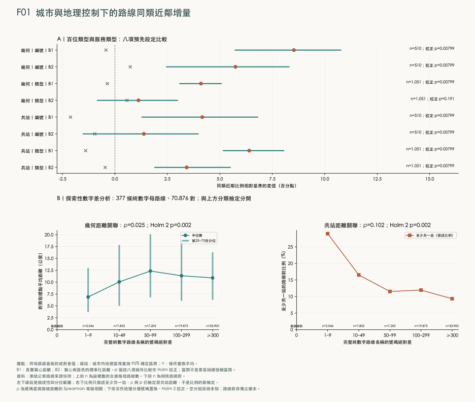
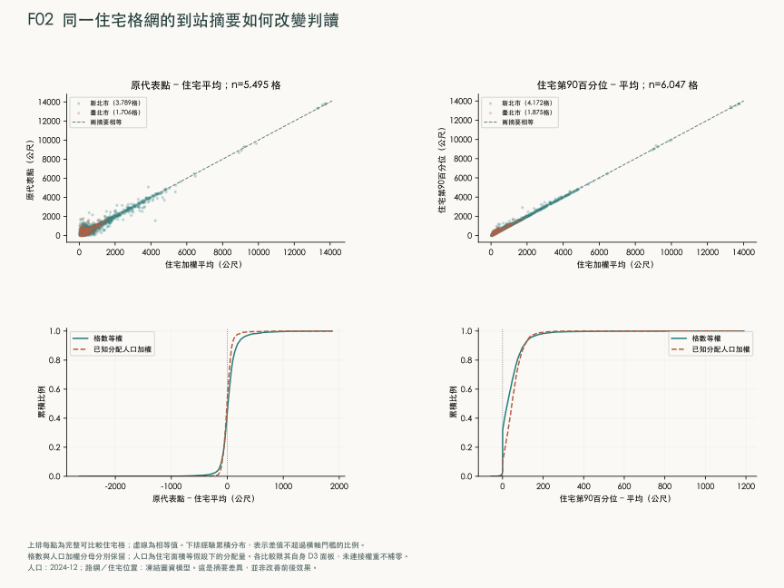
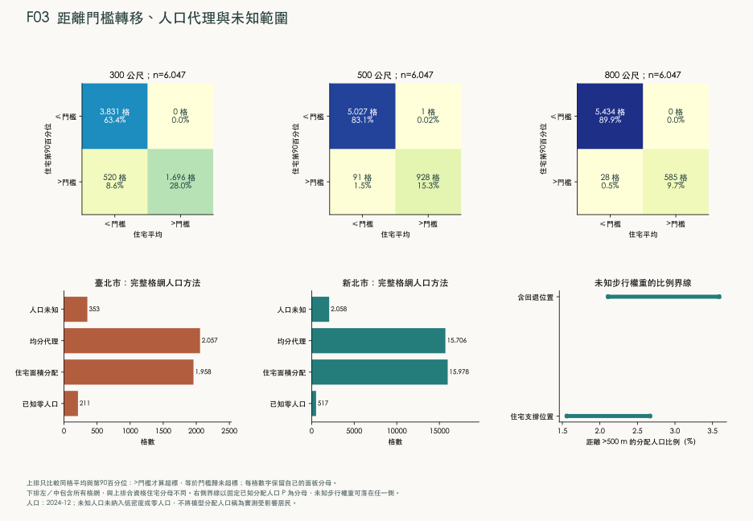
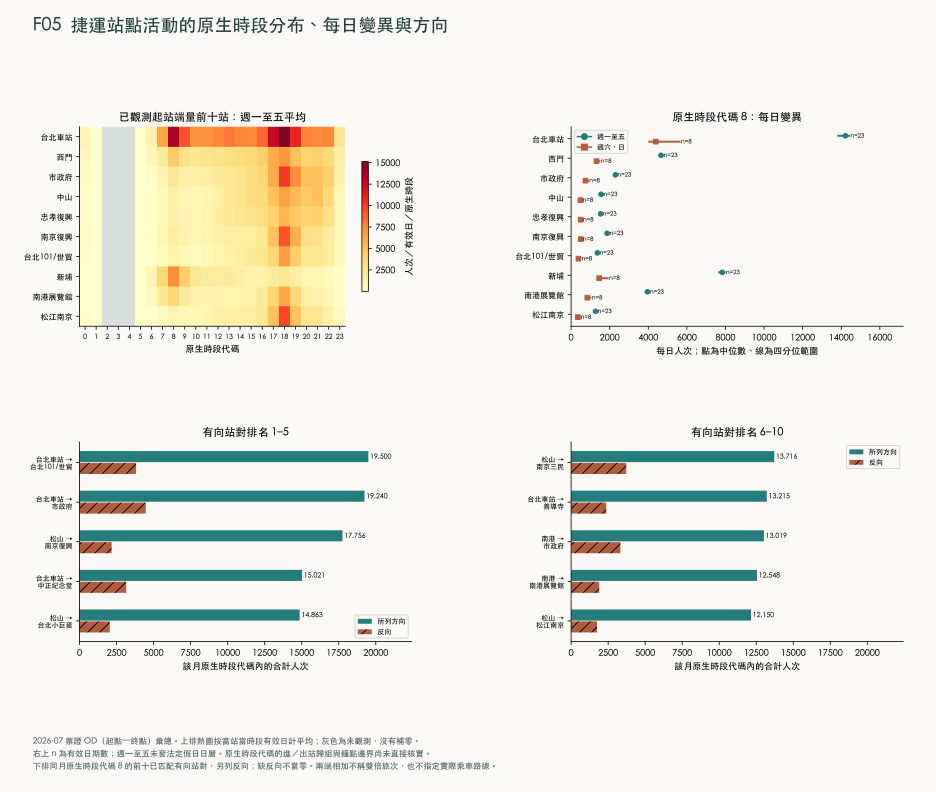
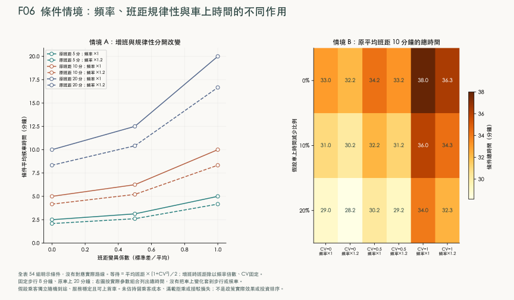
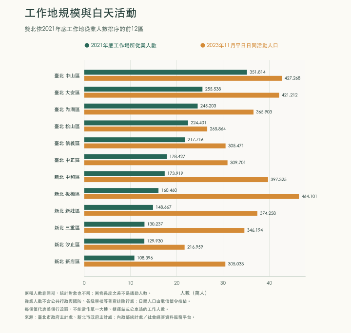
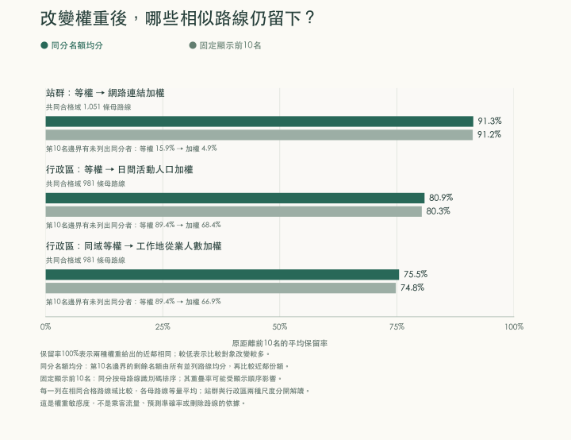

# 流動的雙北：公車、捷運與日常可達性的時空研究

## 摘要
公車號碼相近是否表示路線相近，以及站牌在住家附近是否足以代表交通便利，是兩個需要不同證據的問題。本研究把來源識別碼所對應的一條命名服務稱為母路線，並分開保留其去回程與支線紀錄；整合臺北與新北1,051條母路線、2,568筆行駛紀錄、住宅位置、人口及捷運旅次資料，分別比較路線命名、路線空間關係與住宅到站負擔。分析先定義行經位置及共用站點的差異，再以二維表示檢查局部關係，並在邊長250公尺的住宅格網內比較出發位置、道路與距離摘要。

結果顯示，編號家族保留部分配置資訊，但377條純數字母路線的號碼差與幾何距離幾乎沒有一致的增減關係，因此數字接近不足以可靠推測行經地區。住宅方面，各取樣位置按其代表的住宅面積占比加權；第90百分位數表示把取樣位置由近到遠排列後，至少涵蓋90%住宅面積權重所需的距離。在6,047格完整可比住宅格網中，道路與直線第90百分位數的差值排序居中者為94.85公尺，509格因納入道路連接而跨越500公尺門檻；另91格雖平均未超過門檻，較遠位置卻超過。住宅面積取樣域內，未知步行資訊使超過500公尺的已知分配人口權重比例介於1.56%至2.67%，該範圍不涵蓋人口來源本身未知的格網。

目的地比較另以不同母路線停靠數衡量站群連結，並以2021年工作地從業人數及2023年11月平日白天活動人口衡量區域規模。將等權改為相應加權後，站群比較的近鄰名額保留91.33%；981條區級共同合格路線的活動及工作地比較分別保留80.92%與75.48%，均已處理第十名同分。目的地權重會改變路線比較組，但共同重要節點不代表相同旅程：藍26與藍7從不同地點出發，仍共用部分內湖路段並到達市政府。

2026年7月捷運起訖資料可描述站間活動與方向差異，尚不足以換算接駁公車需求。營運條件比較另指出，每小時班數所表示的服務頻率、前後兩車抵達間隔所表示的班距，以及車上時間具有不同改善機制。本文建議將上述509格住宅區域列為步行連接與站位改善的優先調查範圍，並將共同活動節點周邊的路線列為班表與轉乘動線協調對象；核實後比較過街、住宅出口、站位調整與增班方案在相同成本下可減少的完整旅行時間。這將服務缺口轉為具體、可回查的住宅繞行問題，而非直接由公車號碼或地圖空白決定投資。

關鍵詞：公共運輸規劃；路線命名；路線相似性；住宅到站距離；班距規律性；臺北與新北。

## 1 緒論

### 1.1 路線命名、空間配置與日常出行
公車路線名稱是乘客辨認服務的入口，但名稱能傳達多少地理資訊，仍須與路線實際經過的位置比較。兩條公車的號碼差一號，可能服務不同地區；兩條名稱毫不相似的公車，也可能沿同一道路行駛。因此，「屬於同一編號家族」與「號碼的數值彼此接近」是兩個不同命題。前者詢問某類命名是否較常出現在相似路線上，後者詢問數字差增大時，路線在空間上是否也逐漸相離。本研究分別檢驗兩者，不以編號沿革代替現況的空間證據。

路線相似性也不能直接回答居民搭車是否方便。地圖上有站牌，仍可能因住宅出口、道路穿越或河川阻隔而必須繞行；步行容易到站，仍可能因班次稀少、到站間隔不穩定或行車遭遇道路壅塞而付出很長的旅程時間。這些差異要求研究分開處理「路線如何組織」、「人從哪裡走到站牌」以及「服務在什麼時間到達」。以附近路線數或站點圓形範圍概括三者，會將不同的改善對象混在一起。

公共運輸網路研究已把路線組合與運輸效率作為可分析的結構問題，例如 Mittal、Timme 與 Schröder 的研究討論非正式運輸網路的組織機制；其研究城市與運輸制度並非雙北，本文借用的是將網路結構轉為可檢驗量的研究取向。[相關研究](https://www.nature.com/articles/s41467-024-49193-1) 營運表現則需要另一類資料。美國運輸研究委員會的研究報告，討論如何利用歷史車輛定位與乘客計數紀錄分析服務表現，說明路線配置與實際運行情形需要不同的量測基礎。[歷史營運資料研究](https://www.trb.org/publications/tcrp/tcrp_rpt_113.pdf)

交通目的地的重要性也不能由戶籍人口單獨衡量。戶籍人口描述登記居住的人口存量；工作地從業人數則依工作場所所在地統計工作者；平日白天活動人口利用電信信令估計白天在區域內活動的人口。信義計畫區、市政府與台北101周邊集中了辦公、行政、商業及休閒活動，即使鄰近住宅人口較少，也不能由此推論出行需求較低。這三種資料描述不同對象，區級工作或活動人數也不能直接分配成單一站牌的乘客數。

### 1.2 研究問題與比較設計
本文以臺北市與新北市為研究範圍，納入兩市提供的公車路線及跨市行駛紀錄。第一個研究問題是，編號家族與路線類型是否包含超出城市、位置及路線長度的相似性資訊，以及純數字路線的號碼差能否作為路線距離的線索。比較時讓每條母路線各自承擔一個觀測單位，避免同一路線的去回程或支線數量左右結果。

第二個問題是，將複雜路線放在二維圖上，能保留哪些局部關係。本文所稱「降維」，是用較少座標表示原本必須由許多位置或站點才能描述的對象；它的價值在於協助比較，能否把圖的方向解釋為東西向或中心與外圍，則是另須檢驗的問題。第三個問題轉向住宅到站：同一小區域採不同出發位置、道路距離及距離摘要時，會有多少分類改變。

第四個問題評估人口與住宅位置的估計方式，以及缺漏的步行資訊，如何影響上述判斷。本文將已知人口、估計人口與人口未知的區域分開，並計算未知路徑可能使結果落在哪個範圍。第五個問題結合軌道旅次及可取得的營運資料，判斷現有證據能支持哪些接駁與服務改善評估。當資料只能支持條件試算時，本文明列條件與作用機制，使它與觀測結果具有不同的推論地位。

第六個問題檢驗相似性是否受到重要節點與目的地規模影響：將共用站點由等權改為網路連結加權，或將服務行政區由等權改為活動及就業加權，哪些路線會成為新的比較對象？第七個問題進一步詢問，共同節點及公車與捷運的空間關係，能否區分來源地不同的接續服務與相同旅程的替代選項。本文以分尺度權重與明確的證據層次回答兩者，不將捷運進站量先驗地當成公車需求。

上述設計的貢獻，是將路線比較與地理服務條件接在同一套可追溯的分析中，同時保留各自的觀測單位。路線的相似性用來形成比較對象；住宅到站的分布用來辨認具體通行負擔；工作地與活動人口用來區分目的地規模；旅次與班距條件則用來判別可能的時間成本。研究結論據此提出應優先核對的規劃問題，而不以降維圖的空白位置直接指定新站，也不將空間重疊直接視為可刪除的服務。

## 2 研究區域與資料

### 2.1 雙北公共運輸網路與地理環境
本研究以臺北市與新北市為研究區域，涵蓋臺北市 12 個行政區及新北市 29 個行政區。公車分析保留兩市提供的路線及跨市行駛紀錄，避免把行政界線誤當成公共運輸服務的終點。道路、住宅、河川、山地與軌道設施則用來辨識路線所處環境，以及住宅與站牌之間的空間關係。河道兩岸在地圖上相距不遠，實際到站路徑仍可能必須經過特定橋梁；因此，位置鄰近與沿道路可到達是分別評估的研究對象。

本研究使用地理資訊系統（Geographic Information System，GIS）整合上述位置、線段及區域資料。GIS 在此指保存地物位置並計算地物之間空間關係的方法，而非某一張背景地圖。公車與站牌常以經緯度記錄位置，經度描述東西位置，緯度描述南北位置，兩者以角度表示。網頁展示採 1984 年世界大地測量系統（World Geodetic System 1984，WGS84）。距離及面積計算則使用臺灣 1997 大地基準（Taiwan Datum 1997，TWD97）的二度分帶橫麥卡托投影、中央經線東經 121 度；這個座標系在 EPSG 測地參數資料集中的代碼為 3826。EPSG 原為 European Petroleum Survey Group 的縮寫，現沿用為測地參數資料集的名稱；本文以該代碼明確指定運算使用的座標系。投影將曲面上的位置轉換為平面座標，使本研究的線長與面積分別以公尺、平方公尺計算；經緯度的角度差不直接當作公尺距離。[國土測繪中心座標系統說明](https://www.nlsc.gov.tw/en/cp.aspx?Create=1&n=2122)、[EPSG 資料集沿革](https://epsg.org/history.html)

公車的「母路線」指乘客通常以同一名稱辨認的一條路線。「方向與支線紀錄」則進一步區分去程、回程或分支的站序與行經形狀。因此，1,051 條母路線與 2,568 筆方向、支線紀錄代表不同層級的分析單位。住宅分析採邊長 250 公尺的方形格網；一格是空間彙整單元，不等同一個社區或一里。行政區、村里及人口統計區另依原始代碼保存，以免將不同空間尺度的數值混為一談。

### 2.2 資料來源、觀測期間與空間尺度
本研究結合的資料具有不同觀測期間。戶籍人口記錄 2024 年 12 月，既有活動背景記錄2020年11月，目的地比較另使用2023年11月活動人口及2021年底工作地從業人數，捷運起訖旅次記錄 2026 年 7 月，道路及公車速度則來自 2026 年 9 月 5 日取得的快照。這些資料用來回答彼此相關、但時間尺度不同的問題，並未構成同一時點的交通普查。原分析資料於2026年9月5日擷取，目的地比較的活動與工作地資料於9月7日擷取；表中的觀測期間、圖界版本與發布年份保留各自原意，不能由擷取日期替代。

地理環境主要採開放街圖（OpenStreetMap，OSM），即由共同協作者維護、具有地物位置及屬性標記的地圖資料。本研究使用 Geofabrik 提供的臺灣範圍資料檔，其保存版本的時間戳為 2026 年 9 月 4 日 20:21:21（協調世界時）。道路名稱、橋梁、水域、住宅用途與步行限制均依該版本辨識。圖上缺少一條道路或一處住宅標記，僅表示這份資料未提供相應紀錄，不能推論地物不存在。OSM 資料依開放資料庫授權（Open Database License，ODbL）提供，地圖及衍生地理資料保留來源署名。[OSM 授權說明](https://www.openstreetmap.org/copyright)

表 2-1　地理與人口資料來源。表內的「政府開放授權」指來源紀錄所列的[政府資料開放授權條款](https://data.gov.tw/license)；未載明的授權另行註明。

| 正式資料名稱與提供單位 | 原始定位 | 觀測期間或圖界版本 | 原始單位、處理與排除規則 |
| --- | --- | --- | --- |
| 公車動態資訊資料之 Route、PathDetail、Stop、StopLocation 與 BusShape；臺北市公共運輸處、新北市交通局所提供的兩市資料 | [臺北市資料介接說明 6.3 版](https://pto.gov.taipei/News_Content.aspx?n=A1DF07A86105B6BB&s=55E8ADD164E4F579&sms=2479B630A6BD8079)；[臺北市 Route](https://tcgbusfs.blob.core.windows.net/blobbus/GetRoute.gz)、[新北市 Route](https://tcgbusfs.blob.core.windows.net/ntpcbus/GetRoute.gz)，同目錄對應各項資料 | 2026-09-05 保存版本；資料未提供各條幾何的完整生效起訖日 | 每筆為路線、方向站序、站牌或路線形狀。依城市、路線及分支識別碼連接；經緯度轉為公尺座標。2,215 筆方向紀錄可核對官方形狀，其餘 353 筆以站序連線表示。形狀及站序一致性不等於現場行車軌跡量測。政府開放授權。 |
| 統計區人口統計之臺北市、新北市最小統計區；內政部社會經濟資料服務平臺 | 臺北市[資料集 18681](https://data.gov.tw/dataset/18681)；統計區類別 `U0200`，兩市資料表識別分別為 `3A1FA_A1C2_63000`、`3A1FA_A1C2_65000` | 人口為 2024-12；兩市均核對至 2015 年最小統計區圖界 | 每筆為統計區，原欄位 `CODEBASE` 為單元代碼、`INFO_TIME` 為統計期間、`P_CNT` 為人數。人口與圖界依完整代碼及版本對照，然後按住宅面積等規則分配至格網。新北市 12 個涉及圖界重疊的統計單元另行排除，不將其 1,557 人重新分配至鄰格。政府開放授權。 |
| 最小統計區圖界；內政部 | [統計區圖界目錄 25128](https://data.gov.tw/dataset/25128)；臺北市圖檔 `G97_63000_U0200_2015`，新北市圖檔 `G97_65000_U0200_2015` | 2015 圖界；透過兩市[臺北市](https://segisapi.moi.gov.tw/DBQuery/sSERVICE.aspx?SEARCHTYPE=TBTIME&DBNAME=U0200&TBNAME=3A1FA_A1C2_63000)與[新北市](https://segisapi.moi.gov.tw/DBQuery/sSERVICE.aspx?SEARCHTYPE=TBTIME&DBNAME=U0200&TBNAME=3A1FA_A1C2_65000)年月對照確認適用 2024-12 人口 | 每筆為統計區多邊形，即描述區域邊界的封閉圖形。保持原圖界與代碼，核對人口一對一連接及重疊情形；不以現行里界取代。圖界為政府開放授權；年月對照服務的保存紀錄未另載授權欄。 |
| 鄉鎮市區界線、村（里）界；內政部國土測繪中心 | [行政區界資料集 7441](https://data.gov.tw/dataset/7441)、[村里界資料集 7438](https://data.gov.tw/dataset/7438) | 行政區界 2023-03-17；村里界 2026-08-17 | 每筆為具行政代碼的多邊形；分別用於區級彙整與里名定位。研究範圍內有 456 個臺北具名里、1,039 個新北具名里，以及 17 個未具里名的圖界區域。未具名圖區不增加具名里數；此次沒有將人口資料直接連為官方里人口。政府開放授權。 |
| 臺灣 OSM 地理資料；OpenStreetMap 協作者、Geofabrik 下載服務 | [臺灣下載頁](https://download.geofabrik.de/asia/taiwan.html)及[原始範圍資料檔](https://download.geofabrik.de/asia/taiwan-latest.osm.pbf) | 保存時間戳 2026-09-04T20:21:21Z | 每筆為具有穩定地物編號及屬性的點、線或區域。依用途建立道路、住宅、水域等圖層，步行路網依原屬性排除禁止通行的道路連接。地物涵蓋與通行合法性未經逐一現場確認。ODbL。 |
| 20 公尺網格數值地形模型；內政部 | [資料集 35430](https://data.gov.tw/dataset/35430)，採 2025 年發布的臺北市及新北市分幅檔 | 2025 發布版；本範圍保存的測繪日期跨 2014、2021、2022 年 | 每筆高程格點以公尺表示地表高度。數值地形模型（Digital Terrain Model，DTM）在本文提供地勢背景；原始間距 20 公尺，陰影圖以 80 公尺解析度展示。未將陰影圖轉為步行耗時或無障礙成本；格點數量與檔頭不符者保留該差異。政府開放授權。 |

人口資料的原始人數與格網內的分配量具有不同證據含義。統計區人數由來源提供；格網人數則以來源總量為核對基準，依空間分配規則估計。後者可出現小數，表示模型分配的份額。無法納入分配的統計單元，以及分配後仍落在分析範圍之外的份額，均另行記錄，不移入鄰格。住宅面積不能反映全部樓層、戶數與空置情形，因此人口總量的核對與居住位置的準確程度分別評估。活動人口另有時窗及估計口徑，保留為歷史背景，不以它與戶籍人口的差額推算當期通勤量。

交通部的運輸資料流通服務平臺（Transport Data eXchange，TDX）提供運輸資料服務目錄及程式存取介面。本研究的公車來源以兩市已取得的公開資料為主；TDX 歷史及站間旅行時間服務則納入來源可得性核對。目錄可以顯示某類服務的存在，只有取得相應日期、方向及欄位完整的資料，才足以進入營運分析。

捷運資料採起訖旅次（Origin–Destination，OD）：起點為進站站名，終點為出站站名，每筆是特定日期、時段代碼與站點組合的人次加總。OD 月檔沒有提供乘客個人身分或逐段行經軌跡。同一旅次的起站端與訖站端可各自彙整，但兩端相加會重複計算旅次。

表 2-2　旅次、活動與營運資料來源。各項資料均於 2026-09-05 擷取；正式觀測期間與單位另列。

| 正式資料名稱與提供單位 | 原始定位 | 觀測期間及每列意義 | 處理、排除、授權與缺漏 |
| --- | --- | --- | --- |
| 臺北捷運每日分時各站 OD 流量統計資料；臺北大眾捷運股份有限公司（Taipei Rapid Transit Corporation，TRTC） | [資料集 128506](https://data.gov.tw/dataset/128506)；臺北市對應資料識別碼 `63f31c7e-7fc3-418b-bd82-b95158755b4d`；月檔 `_202607.csv` | 2026-07-01 至 07-31；欄位為日期、時段、進站、出站、人次；每列是一個日期、原生時段代碼、起站與訖站組合 | 核對日期、整數時段及非負整數人次；站名正規化後與站點清冊對照。保存不能對照的旅次及端點數。原始時段代碼的進／出站時間歸屬與鐘點邊界未獲直接文件確認。來源保存紀錄未載明授權，不由其他政府資料集的授權代填。 |
| 臺北市捷運車站位置與臺北捷運車站出入口；臺北市政府公開地理資料、臺北大眾捷運股份有限公司 | [車站位置目錄](https://data.taipei/dataset/detail?id=758e5ae0-e6ee-448b-81f5-316eb68a5ba7)、[出入口資料集 128428](https://data.gov.tw/dataset/128428) | 2026-09-05 保存版；原資料未提供所有設施共同有效日期。每筆為站位或出入口，位置以座標表示 | 站名、站碼與位置分開核對；同一換乘站的多個站位可保留不同原始點。站位只供站名對照與展示；住宅到捷運的步行評估使用已收錄出入口。保存紀錄未載授權者保持未載明。各軌道系統清冊涵蓋不同，不將缺少清冊的系統視為不存在。 |
| 日間活動人口統計、夜間活動人口統計；內政部統計處 | [日間資料集 162907](https://data.gov.tw/dataset/162907)、[夜間資料集 162908](https://data.gov.tw/dataset/162908) | `INFO_TIME=109Y11M`，即 2020-11；每筆為行政區與來源活動時窗的人數估計 | 日間保留 07–13、13–19 及 07–19 的來源欄位，整段值不以兩子時窗加總替代；夜間精確時窗未確認。日間不同發布檔間無法釐清的修訂差異不混成單一值，也不外推為 2026 年逐時需求。政府開放授權。 |
| 臺北市公車客運概況按月別；臺北市政府主計處 | [資料集 132091](https://data.gov.tw/dataset/132091)；主計處資料表 `a04002501` | 1998-01 至 2026-06，共 342 個連續月份；每列為臺北市月統計，含平均每日客運人次與平均每車車次客運人次 | 民國年月轉西元年月，同時保留原文字。平均每日人次以人次／日解讀，每車車次平均以人次／車次解讀，不改成月總量，不分配至路線或小時。此來源沒有提供相同涵蓋的新北市比較系列。政府開放授權。 |
| 公車 TimeTable、SemiTimeTable 與 Route 營運欄位；雙北公車動態資訊系統 | 兩市公車資料介接說明 6.3 版及相應 `GetTimeTable.gz`、`GetSemiTimeTable.gz` | 2026-09-05 保存版；每列為發車、班距或路線營運描述，更新日期不等於完整週期日曆的適用日期 | 共取得 79,555 列，其中 732 筆研究方向紀錄可對照來源；共同有效服務日、方向完整性與假日例外仍不足，故未形成可用的日期頻率比較。政府開放授權。 |
| 臺北市即時交通資訊之分區車輛偵測資料；臺北市交通控制中心 | [GetVD 原始資料](https://tcgbusfs.blob.core.windows.net/blobtisv/GetVD.xml.gz)及[介接說明文件](https://www-ws.gov.taipei/001/Upload/public/mmo/dot/臺北市交通控制中心資料庫介接說明文件.pdf) | 2026-09-05 單次取得；616 個分區。每列含分區平均速度、占有率、偵測器加總輛次、交通狀態與資料交換時間 | 車輛偵測器（Vehicle Detector，VD）資料中的 `AvgSpd`、`AvgOcc`、`TotalVol` 分別保留公里／小時、百分比、來源加總輛次。`-1` 表示缺值。交換時間沒有補足計數時窗與車道口徑，故不換算每小時交通量。政府開放授權。 |
| 公車即時位置 GetBusData；雙北公車動態資訊系統 | [臺北市資料](https://tcgbusfs.blob.core.windows.net/blobbus/GetBusData.gz)、[新北市資料](https://tcgbusfs.blob.core.windows.net/ntpcbus/GetBusData.gz) | 2026-09-05 快照；每列為一車的來源路線、方向、座標、速度及 `DataTime` | 臺北市 1,366 列、新北市 1,069 列，與道路分區合計 3,051 列狀態資料。缺少跨時點同趟車的到站或路段進出事件，無法形成完整班距與穿越時間；發布結果不含車輛識別碼。政府開放授權。 |

來源可得性另核對臺北市 2024 年交通流量調查、TDX 公車歷史與站間服務目錄，以及新北市已下架的車輛偵測資料目錄。[臺北交通調查](https://data.gov.tw/dataset/128230)保留其年度、調查車種及調查位置口徑；[TDX 服務目錄](https://tdx.transportdata.tw/api-service/swagger/advanced/b1b2b02c-b5f3-405f-aff5-7b912b3e8623)與[新北 VD 歷史目錄](https://data.gov.tw/dataset/30858)均未提供本研究取得且符合目標期間的完整公車事件序列。因此，這些資料的時間與事件粒度不足以支持 2026 年的逐段公車運行估計。具體事件資料的納入條件見[附錄 B.3](#appendix-operational-qualification)。

### 2.3 分析單位、資料涵蓋與缺失處理
資料是否有值，與現象是否為零，是兩個不同問題。來源明確記錄零旅次時保留零；未取得班表、無法對照站名、未確認住宅或道路不連通時，保留相應的未知原因。空間分配的分母依城市、統計區及可分配範圍分別核對，不能藉由將未知部分補成零，讓不同資料表看似具有相同涵蓋。

捷運月檔包含 8,366,652 列聚合紀錄，合計 63,379,613 旅次。可以對照到站點的起站端量為 62,119,668，訖站端量為 60,769,076；兩端皆可對照的旅次為 59,520,185。已知起站的旅次即使訖站尚未對照，仍保留在該起站端量中，反向情況亦同。因此，各站分時分布、兩端都已對照的 OD 比較，以及全月旅次總量各自使用不同且明示的分母。完整來源的起站端總量與訖站端總量均須等於全月旅次數；不能只檢查已配站的子集。

人口分析則區分來源人數、面積分配的人口量及住宅取樣位置。行政區人口可按原人口單元彙整，格網值是空間估計，里界提供位置名稱。三種尺度各自保留其統計意義與命名。道路資料同樣保留圖資可辨識的連接範圍：模型能找到的路徑表示這份道路圖提供了連接，尚不等同路面品質、無障礙條件與實地通行狀況均已確認。

### 2.4 工作地與白天活動人口的資料資格
目的地比較取得雙北41個行政區的兩種獨立統計。內政部「112年11月行政區電信信令人口統計資料」以民國112年、即2023年11月為觀測期間，本研究保留平日整體白天欄位 DAY_WORK 與夜間欄位 NIGHT_WORK；DAY_WORK 是來源欄位名稱，不表示從業人口。日間總值不由上午與下午相加，以免同一人在不同時窗出現而重複累計。夜間人口保留作活動背景，不作主要路線權重。[內政部區級電信信令資料](https://segis.moi.gov.tw/STATCloud/QueryInterfaceView?COL=zVTg8Fn91RUFg2R9uBdHTA%3D%3D)

工作地資料取自110年、即2021年工商及服務業普查的行政區場所單位統計。場所單位是實際從事經濟活動的工作場所，統計時點為2021年12月31日；因此，員工歸入工作場所所在行政區，而非其居住地。從業員工包括受僱員工，以及參與營運的雇主、自營作業者與無酬家屬，不能把此數值狹義稱為一般受薪職缺數。臺北市取主計處研究報告表5，新北市取110年工商及服務業普查報告表2-3，兩者共涵蓋41區。

普查範圍不含公共行政與國防機關、各級學校、人民團體，以及家事、文學與藝術等部分個人服務業。這項排除對市政府周邊尤其重要：行政機關工作者未完整包含在區級工商從業人數中。因此，本文以工作地統計辨認工商活動的空間集中，以白天活動人口補充不同活動對象，並不宣稱兩者相加便得到完整通勤需求。[工商及服務業普查統計定義](https://www.stat.gov.tw/News_NoticeCalendar_Content_temp.aspx?MetaI_D=1994&n=3717)

兩份區級資料均依八碼行政區代碼連接，不以名稱相似或管理城市填補缺值。41區的主要活動及工作地數值均可取得，但路線若在區界範圍外設站，仍不符合完整區域集合的比較條件。資料年份不同，也意味著加權分析是在既定路線清冊下比較兩種目的地配置，不能解讀為2026年的同步需求估計或兩時期間的人口增減。臺北101、市政府及其他具名節點的站級重要性，仍需較細的工作場所位置、出入口活動或上下車資料辨識。

## 3 研究方法

### 3.1 空間座標、分析對象與符號定義
路線相似性首先取決於比較的對象。兩條公車可能行經相近的道路，卻停靠不同站牌；也可能共享若干轉運站，但大部分路段相隔甚遠。因此，本文分別建立保留位置的幾何距離，以及根據共站關係計算的距離。前者比較沿線位置與排列，後者比較站點集合。這兩種距離提供不同的路網描述，均未直接量得乘客的替代選擇、轉乘時間或實際服務頻率。

資料中的母路線，是來源路線識別碼所指的命名服務；同一母路線之下，可能包含去程、回程及不同支線紀錄。一筆方向或支線紀錄描述一組有順序的停靠位置與沿線幾何，不等於某日實際開出的單一班車。本文以 $i$ 表示這類紀錄，以 $p(i)$ 表示它所屬的母路線。研究共納入 1,051 條母路線、2,568 筆方向及支線紀錄。兩市資料合併後共同建立相似關係，行政區或城市篩選只改變展示範圍，不重新估計降維座標。

地圖採世界大地測量系統 1984（World Geodetic System 1984，WGS84）的經度與緯度呈現位置，其座標參照識別碼為 EPSG:4326。經緯度以角度表示，不能直接當作公尺計算路長。本文先將座標轉入臺灣大地基準 1997（Taiwan Datum 1997，TWD97）的二度分帶橫麥卡托投影，採中央經線 121 度的 EPSG:3826；其中東向座標 $E$ 與北向座標 $N$ 的單位都是公尺。EPSG 編碼在此用來指定完整的座標參照系統，不是分析變項。路線長度、點間距離、50 公尺站點分組及 500 公尺捷運鄰近判斷，均在這個公尺座標系中計算。

將第 $i$ 筆路線紀錄寫成折線 $\gamma_i$，總長記為 $L_i>0$。折線是由相鄰頂點連成的線段序列，頂點可來自道路形狀，不一定是站牌。用 $\gamma_i(s)$ 表示沿折線自起點前進 $s$ 公尺的位置，則 $0\leq s\leq L_i$。本文的 $\|a-b\|_2$ 表示兩個公尺座標 $a,b$ 之間的平面直線距離，也稱歐氏距離；下標 2 表示先將兩個座標差平方相加，再取平方根。這個符號只規定點間距離，尚未定義整條路線之間的差異。

路線幾何優先採用來源線形與站序相容的官方圖形，共 2,215 筆；其餘 353 筆以站序連線表示。站序連線可以保留停靠位置及大致排列，但兩站之間的線段未必沿實際道路轉彎。本文保留這個來源區分，因此幾何相似度及沿線長度都應理解為已收錄路線表示的計算結果，不能一律視為實地量得的行駛軌跡。

### 3.2 路線表示與幾何及共站距離

#### 3.2.1 等距取樣與動態時間校整距離
不同路線的長度、站數及圖形頂點數不同，直接把第十個站牌彼此配對，會把資料記錄密度當成路線特徵。本文沿每條折線的累積長度等距取樣，包含兩端點，共取 $K=64$ 個位置。第 $a$ 個位置記為 $x_{ia}$，其中 $a=1,\ldots,K$：

$$
x_{ia}=\gamma_i\!\left(\frac{a-1}{K-1}L_i\right).
$$

每條路線因而成為依行進順序排列的 64 組公尺座標。這種表示保留實際地理位置：沒有先把路線移到同一中心，也沒有將長短路線縮成同一長度。因此，外形相同但位於城市不同位置的兩條路線，仍會具有較大的幾何距離。64 點只統一描述密度，不保證長路線上每一處道路轉折均被保留。

動態時間校整（Dynamic Time Warping，DTW）原本用於對齊長度或進展速度不同的序列；本文將序列的進展解釋為沿路線前進的位置，而非鐘錶時間。它允許一個取樣位置對應另一條路線上的多個相鄰位置，並維持配對順序，以容納站距及局部繞行差異。方法的序列對齊概念可追溯至 [Sakoe 與 Chiba 的動態規劃研究](https://jeffe.cs.illinois.edu/teaching/compgeom/refs/Sakoe-Chiba-DTW.pdf)；本文的點距離、反向比較及最後正規化方式，則由以下規則明確指定。

設 $c_{ab}=\|x_{ia}-x_{jb}\|_2$，為兩條路線取樣點 $a,b$ 的配對成本。以 $C_{ab}$ 表示到達這組配對時最小的累積成本，起始條件為 $C_{00}=0$，其餘第零列及第零行設為正無限大，避免路徑從中途開始。遞迴式為

$$
C_{ab}=c_{ab}+\min\{C_{a-1,b-1},C_{a-1,b},C_{a,b-1}\}.
$$

式中的 $\min$ 表示選擇最小值。三個前項依序代表兩條序列一起前進、只讓第一條前進，以及只讓第二條前進。所有配對路徑都從兩條路線的起點走到終點，且不向後跳越；主分析沒有額外限制配對必須落在對角線附近。若累積成本完全相同，依上述順序選擇前項，使結果可重現。

令 $\ell_{ij}^{*}$ 為上述最小累積成本路徑所包含的配對數，單一方向比較值為 $C_{KK}/\ell_{ij}^{*}$。再把第二條路線的序列反向，重算一次，取兩次結果較小者，得到幾何距離 $d^{G}_{ij}$。因此，相同道路序列反向行駛不會只因方向相反而被判為不同；去回程若走不同道路，仍保留差異。必須區分的是，演算法先找最小「累積」成本路徑，再除以該路徑長度，並未在所有路徑中直接尋找最小「平均」成本。$d^{G}_{ij}$ 的單位為公尺，可以解釋為依本配對規則得到的平均位置差異；它不是道路之間最短步行距離，也不是每一段道路實際重疊的比例。

#### 3.2.2 站點分組與 Jaccard 共站距離
共站比較先處理同一站點可能具有多個站牌紀錄的情形。來源站名先經 Unicode 相容正規化，例如將相容的全形與半形字元轉成一致形式，再去除首尾空白，以減少字元形式造成的假差異。在同名站牌內，資料若提供官方站點群組識別碼，先保留該群組；缺少有效識別碼時，先以站牌本身為一組。跨發布來源的合併另使用空間代理規則：只有站名相同且非空白，候選群組與既有群組之間每一對站牌的公尺距離均不超過 50 公尺，才允許合併。這是完整連結條件；不能因為甲距乙近、乙距丙近，就在甲距丙超過門檻時把三者串成一組。原有官方群組作為合併單位，其內部並未依 50 公尺門檻重新切開。同名群組依固定識別碼順序處理，若可加入多組，選擇第一組，並保存最終站牌與群組的對照。

對第 $i$ 筆方向紀錄，令 $A_i$ 為其停靠序列所包含的站點群組集合。集合中每一群組只計一次，重複停靠次數及先後順序不增加權重。以 $|A|$ 表示集合 $A$ 的元素數；$A_i\cap A_j$ 為兩路線共有的群組，$A_i\cup A_j$ 為至少被其中一條路線使用的群組。Jaccard 相似度是共站數占聯集數的比例，本文再以 1 減去相似度，定義共站距離

$$
d^{T}_{ij}=1-\frac{|A_i\cap A_j|}{|A_i\cup A_j|}.
$$

$d^{T}_{ij}$ 沒有物理單位，介於 0 與 1：0 表示群組集合相同，1 表示沒有共站。本研究納入計算的有效路線皆有非空站點集合。此處使用資料記錄的停靠集合，未再依可上車或只供下車的標記篩選。因此，共站距離接近只支持「使用相近的站點集合」，還不足以證明同一方向可以互相替代，或跨道路轉乘已具備安全通道。以 $T$ 作為上標，是指本研究的共站關係表示，並不涵蓋完整運輸網路的所有拓撲資訊。

#### 3.2.3 等價表示、母路線代表與地圖對照
避免相同資料重複進入降維，需要區分幾種不同的對照關係。第一種是跨市發布別名：只有名稱、業者、方向及完整有序站牌序列一致，且來自不同城市發布資料時，才併為同一筆紀錄，保留原識別碼與採用識別碼的關係。單純同名或大部分道路重疊不會觸發這項合併。

第二種是表示上的等價。幾何表示將 64 點座標取至小數點後六位公尺，分別記錄正向與反向序列，再選取固定排序較前者作為等價鍵。這個極小的數值容差用於辨識序列是否相同；實際距離仍由未取整的取樣座標計算。共站表示則以完整站點集合建立另一套等價鍵。每組選用固定識別碼排序中的第一筆已觀測紀錄作代表，形成 2,220 個幾何代表及 2,174 個站點集合代表。同一對原始紀錄可以在共站表示相同、在幾何表示不同，兩套代表表因此不能互換。

以 $m\in\{G,T\}$ 指定幾何或共站表示，令 $\pi_m(i)$ 為原紀錄 $i$ 對應的代表識別碼。降維只對各表示的代表計算，原紀錄再繼承相應代表的座標。圖上一點與地圖之間的對照，使用的是「原紀錄 $i$—表示代表 $\pi_m(i)$—已保存座標」及原紀錄的路線幾何，不是把二維座標代入反函數生成道路。不同紀錄落在同一點時，仍需保留可展開的路線身分；圖面沒有資料的空白位置，也沒有自動對應的經緯度。

第三種是統計比較使用的母路線代表。若去回程相近，同時讓兩者成為獨立鄰居，會放大同母路線的相似性。本文的補充驗證因而在每條母路線內，先去除重複幾何代表，再選出與其餘候選幾何距離總和最小的一筆實際紀錄，稱為中心代表（medoid）。設母路線 $r$ 的候選集合為 $I_r$，則代表 $i_r^{*}$ 滿足

$$
i_r^{*}\in\operatorname*{arg\,min}_{i\in I_r}\sum_{j\in I_r}d^{G}_{ij}.
$$

$\operatorname*{arg\,min}$ 指使後方數值最小的候選身分，$\sum$ 表示逐一加總；總和相同時取固定識別碼排序的第一筆。這個代表始終是存在於資料中的方向紀錄，因而可以直接回到地圖查看。選取過程只使用幾何距離，未參考號碼或類型。選定後，幾何、共站及地理基準比較都使用同一筆紀錄，建立共同的 1,051 條母路線樣本；本次沒有母路線因缺少這些共同欄位而被排除。這種選法讓比較條件一致，也使幾何中心代表的選擇可能影響共站結果，因此另以所有不同方向幾何進行敏感度核對。

### 3.3 低維嵌入與座標解釋
降維在本文的用途，是把大量路線的相似關係安排到可檢視的二維平面。若較少的連續變化即可描述原本複雜的關係，便可能觀察到低維結構；流形在此指整體可以彎曲，而小範圍仍可由少數連續座標描述的結構。這是待檢驗的表示假設，並不預先斷言雙北路網一定存在唯一的二維流形。以下以 $d_{ij}$ 表示所選表示的原始路線距離，以 $z_i=(z_{i1},z_{i2})$ 表示代表路線 $i$ 的模型座標。$z_{i1}$ 與 $z_{i2}$，或圖上簡寫的 Z1、Z2，只是同一點的第一及第二個座標值，尚未被賦予東西、南北、中心或郊區的意義。

#### 3.3.1 鄰域建構與 UMAP 的二維配置
統一流形近似與投影（Uniform Manifold Approximation and Projection，UMAP）先建立每個觀測與鄰近觀測的帶權關係，再尋找能表達這些關係的低維座標。將每兩條路線的距離排成方形表格，列與欄各對應一條路線，便得到距離矩陣。本文輸入預先計算的幾何或共站距離矩陣，而非把經緯度當成兩個欄位再次降維。UMAP 的方法基礎及局部尺度調整見 [McInnes、Healy 與 Melville 的原始論文](https://arxiv.org/abs/1802.03426)。

模型之前先建立一個連結圖以辨識不相通的部分。圖的節點是路線代表；每個節點連到原距離最近的 30 個其他節點，若任一端選到另一端便保留無向連結。共站距離等於 1 的配對沒有任何共站，不保留為連結。能沿連結互相到達的一組節點稱為連通分量；各分量分別估計座標，不同分量間沒有經模型支持的平面距離。少於四個代表的分量不估計二維配置，資料保留孤立或小分量的身分。

在每個可估計分量內，UMAP 再依其鄰域參數 $k_U$ 建立局部關係。對代表 $i$，令 $\rho_i$ 為最近的嚴格正距離，$\sigma_i>0$ 為局部尺度，則由 $i$ 指向鄰居 $j$ 的權重可寫為

$$
p_{j\mid i}=\exp\!\left[-\frac{\max(0,d_{ij}-\rho_i)}{\sigma_i}\right].
$$

$\exp$ 表示指數函數，$\max$ 選較大的值；自我連結的權重為零。局部尺度透過搜尋，使非自身近鄰權重之和接近 $\log_2 k_U$，其中 $\log_2$ 為以 2 為底的對數。實作的近鄰陣列通常包含自身，當 $k_U=30$ 時一般含 29 個其他近鄰；它與前一步明確排除自身的 30 鄰居分量圖，是兩個不同步驟。零距離平手及局部尺度下限依固定版本的實作處理，不能把參數 30 一概解讀為所有計算都恰好比較 30 條其他路線。

兩個方向的權重以模糊聯集合併，即 $p_{ij}=p_{j\mid i}+p_{i\mid j}-p_{j\mid i}p_{i\mid j}$。二維中另用

$$
q_{ij}=\frac{1}{1+a\|z_i-z_j\|_2^{2b}}
$$

描述接近程度，其中 $a,b>0$ 由指定的點群緊密程度參數與尺度參數擬合。配置希望高 $p_{ij}$ 的路線在二維也維持較高 $q_{ij}$，同時避免所有點塌縮在一起。其完整配對的交叉熵可用 $-\sum_{i<j}[p_{ij}\log q_{ij}+(1-p_{ij})\log(1-q_{ij})]$ 表達忽略常數後的目標方向；$i<j$ 表示每個不重複配對只加一次，$\log$ 為自然對數。交叉熵在此衡量原關係權重與二維關係權重的不一致；不一致越大，成本越高。實際計算採隨機更新及負樣本近似，負樣本是隨機抽取其他點作排斥比較，以近似處理大量點對的計算，不能宣稱精確求得所有配對目標的全域最小值。

主設定使用二維、$k_U=30$、最小距離參數 `min_dist` 為 0.1、亂數種子 42，並保留 $k_U=15,30,50$、`min_dist` 為 0.1 與 0.5、種子 17、42、73 的組合，每種原距離共 18 組。種子固定隨機計算的起始條件，供結果重現；它不是一筆新增的資料。採用的套件為 `umap-learn` 0.5.12，初始化方式為隨機配置，單執行緒；學習率控制每次座標更新的初始步幅，訓練輪數表示重複更新資料的次數。尺度參數 `spread` 為 1，局部連通參數為 1，吸引與排斥的初始學習率及排斥強度均為 1，每次更新使用 5 個負樣本。此研究的分量大小使預設訓練輪數為 500，$a,b$ 由套件根據 `min_dist` 與 `spread` 求得。這些參數的操作意義可核對 [UMAP 官方參數文件](https://umap-learn.readthedocs.io/en/latest/api.html)。`min_dist` 控制低維配置的緊密程度，並非公尺門檻，也不是保證任兩點距離都不得小於它的硬性限制。

#### 3.3.2 擴散映射與多維尺度法對照
擴散映射（Diffusion Maps）從鄰接關係出發，利用在圖上逐步移動的機率描述路線關聯。這裡的「擴散」是一種數學運算，不表示實際公車或乘客沿道路流動。本文先按前節的原距離近鄰規則建立連結。令 $A_{ij}$ 在兩代表相連時為 1，否則為 0；以已連結配對中嚴格正距離平方的中位數為 $\varepsilon$。中位數取排序後中間的值，偶數筆時取中間兩值平均；它用來決定距離衰減的共同尺度。定義

$$
W_{ij}=A_{ij}\exp(-d_{ij}^{2}/\varepsilon),\qquad
q_i=\sum_j W_{ij},\qquad
K_{ij}=\frac{W_{ij}}{q_iq_j}.
$$

$W$ 是相似權重矩陣；$q_i$ 是節點 $i$ 的權重總和，$K$ 則以兩端總和校正局部密度。這相當於密度校正指數 $\alpha=1$。若沒有正距離可取中位數，尺度暫設為 1，但退化或過小的分量仍依可估計條件處理。接著令 $\delta_i=\sum_jK_{ij}$，則 $P_{ij}=K_{ij}/\delta_i$ 為一步從 $i$ 移至 $j$ 的機率，每列加總為 1。

為穩定求解，實作使用與 $P$ 具有相同特徵值的對稱矩陣 $S_{ij}=K_{ij}/\sqrt{\delta_i\delta_j}$。特徵值與特徵向量滿足 $Sv=\lambda v$：矩陣作用後，向量 $v$ 只被放大或縮小 $\lambda$ 倍。令 $v_\ell$ 為依特徵值由大到小排列的第 $\ell$ 個向量，再將其第 $i$ 個分量除以 $\sqrt{\delta_i}$，得到 $P$ 的右特徵函數 $\psi_\ell(i)$。排除特徵值 1 所對應的常數解後，取兩個主要非平凡項，寫成

$$
z_i(t)=\bigl(\lambda_1^{t}\psi_1(i),\lambda_2^{t}\psi_2(i)\bigr),\qquad t\in\{1,3\}.
$$

$t$ 是沿圖累積關係的步數，沒有分鐘或小時的單位。本文主近鄰數為 30，另檢查 15 與 50；每個分量獨立計算，對稱特徵值求解以全 1 向量起始，容許誤差為 $10^{-10}$。各軸將絕對值最大位置的符號固定為正，只為使輸出方向可重現，沒有將它指定為地理方向。核函數、密度校正與擴散時間的關係，依循 [Coifman 與 Lafon 的擴散映射架構](https://www.math.wustl.edu/~victor/classes/pmf/Lafon06.pdf)。

若非平凡特徵值非常接近，個別向量可能容易旋轉或交換，較合理的解釋對象是它們共同張成的平面。本文記錄兩個主要特徵值之差是否小於其最大絕對值的 1%，並檢查軸的平方能量是否過度集中：先把各點的座標平方除以全體平方和，得到總和為 1 的能量權重；若最高 1% 點持有超過一半能量，或 $1/(n\sum_i e_i^2)<0.1$，便標示局部集中，其中 $e_i$ 是能量權重、$n$ 是分量內代表數。此外，$1-\lambda_1<10^{-6}$ 標示接近分裂的連通結構。這些診斷限制全域軸的解讀，不能用不同 $t$ 對同一特徵向量的縮放充作多次獨立方向驗證。

多維尺度法（Multidimensional Scaling，MDS）提供另一種對照：直接尋找二維點，使點間距離接近原始路線距離。本文使用度量式 MDS，只在依路線類型及長度四分位分層抽取的 500 個幾何代表上計算，沒有另行估計共站 MDS。抽樣先在各層用種子 42 打亂，再輪流從各層取值；長度四分位先對路長排序，再依名次大致分成四等份；相同長度依固定資料順序取得名次。其目標為

$$
\operatorname{Stress}(Z)=\sum_{i<j}\bigl(d^{G}_{ij}-\|z_i-z_j\|_2\bigr)^2.
$$

這個總和量出二維距離與原距離的差，值越小表示在此目標下配合得越好。採用 `scikit-learn` 1.9.0，預先計算的距離、二維、種子 42、四次初始化、最多 300 次迭代及 $10^{-6}$ 的收斂門檻，使用單執行緒。輸出的正規化 Stress-1，依該版本實作，是上述差平方總和除以二維擬合距離的平方總和後再開根號；其分母不是原距離平方總和。[MDS 官方定義與參數](https://scikit-learn.org/stable/modules/generated/sklearn.manifold.MDS.html)

原始幾何距離未先標準化，因此 MDS 的原始座標繼承公尺尺度。這不表示兩個嵌入點相距 1,000 就是兩個真實位置相距 1,000 公尺：原始比較對象是整條路線，而二維還存在擬合誤差。UMAP 與擴散座標則沒有公尺單位。三種座標都不能直接當作經緯度，也不能把第一軸稱為最大解釋變異的地理軸。

本文另以距離矩陣的雙重中心化檢查幾何距離是否完全適合歐氏空間表示。令 $H=I-\mathbf1\mathbf1^\mathsf{T}/n$，其中 $I$ 是對角線為 1、其餘元素為 0 的單位矩陣、$\mathbf1$ 是全 1 向量、上標 $\mathsf{T}$ 表示轉置（交換矩陣的列與欄）；形成 $B=-HD^{(2)}H/2$，其中 $D^{(2)}$ 是把距離矩陣各項分別平方。若 $B$ 出現負特徵值，便表示不能在歐氏空間精確保留所有輸入距離。報告的負特徵值比例，以負特徵值絕對值總和除以全部特徵值絕對值總和計算，用於說明 MDS 對照的限制。

#### 3.3.3 展示座標、鄰居保留與方向驗證
模型原始座標與展示座標分開保存。不同設定可能產生整體旋轉或鏡射，即使局部關係相近，直接重疊仍不方便比較。本文以相同方法、原距離及連通分量中至少三個共同代表，對齊到參照配置：

$$
Z_{\mathrm{display}}=(Z_{\mathrm{raw}}-c_{\mathrm{raw}})R\,s+c_{\mathrm{ref}}.
$$

$Z_{\mathrm{raw}}$ 每一列是一個原始二維點，$c_{\mathrm{raw}}$ 與 $c_{\mathrm{ref}}$ 分別是共同點的來源及參照中心。$R$ 是透過正交 Procrustes 配對求得的旋轉或反射矩陣；正交表示 $R^\mathsf{T}R=I$，不會扭斜形狀。$s$ 是兩軸共用的一個比例，並未分別拉長橫軸或縱軸。兩個中心分別由共同點的橫、縱座標等權平均取得。將兩組共同座標扣除各自平均後記為 $A,B$，正交矩陣 $R$ 使對應點的差平方總和最小；共同縮放取 $s=\langle AR,B\rangle/\langle A,A\rangle$，其中內積 $\langle A,B\rangle$ 表示兩矩陣對應元素相乘後全部加總。所有共同點重合、無法決定尺度時，不提供對齊結果。UMAP 以鄰域 30、`min_dist` 0.1、種子 42 為參照；擴散映射以鄰域 30、$t=1$ 為參照，MDS 對齊自身。這是對同模型座標的配對，沒有以經緯度擬合旋轉。共同縮放還會改變數值尺度，尤其 MDS 的展示座標須連同 $s$ 才能回到原始公尺尺度；最後畫到螢幕時另有等比例縮放。旋轉和平移保存距離，共同縮放只保存相對距離與近鄰次序，不能一概稱為固定 UMAP 核函數的目標不變性。

衡量降維是否保留關係，須先說清楚比較的是哪些鄰居。對相同的 $n$ 個有效代表，令 $N_i^D(k)$ 為路線 $i$ 在原距離下的前 $k$ 個其他鄰居，$N_i^Z(k)$ 為二維歐氏距離下的前 $k$ 個其他鄰居。原始嵌入診斷排除自己，距離相同時依固定資料順序決定名次；共同樣本足以提供 $k$ 個鄰居時，近鄰召回率為

$$
\operatorname{Recall}(k)=\frac1n\sum_{i=1}^{n}\frac{|N_i^D(k)\cap N_i^Z(k)|}{k}.
$$

本文原始品質摘要使用 $k=10$。召回率為 1 代表每個原近鄰都被保留，為 0 表示沒有交集。Jaccard 鄰居重疊率改以兩集合的聯集為分母，即 $|N_i^D(k)\cap N_i^Z(k)|/|N_i^D(k)\cup N_i^Z(k)|$，逐點平均；它與召回率數值不同。方向驗證使用 $k=15$ 的原距離與嵌入鄰居 Jaccard；跨種子穩定性則比較兩個種子的嵌入鄰居，使用 $k=10$，再對所有種子配對與有效代表平均。跨種子一致表示演算法在這些設定下可重現相近關係，並不驗證客流或服務功能。

可信度（trustworthiness）另外懲罰被嵌入錯放到附近的路線，而且在原空間越遠，懲罰越大。令 $r_i(j)$ 為路線 $j$ 在 $i$ 的原距離排序名次，最近者為 1；$U_i=N_i^Z(k)\setminus N_i^D(k)$ 表示進入二維近鄰、卻不在原近鄰的路線。其定義為

$$
T(k)=1-\frac{2}{nk(2n-3k-1)}
\sum_{i=1}^{n}\sum_{j\in U_i}\bigl(r_i(j)-k\bigr).
$$

在允許的 $k<n/2$ 範圍內，值介於 0 與 1，越高表示錯置近鄰的排序損失越小。高可信度不等於同樣比例的鄰居相同，也不能據此宣稱全域距離被保存。[可信度指標的正式定義](https://scikit-learn.org/stable/modules/generated/sklearn.manifold.trustworthiness.html)

母路線補充驗證另用分數權重處理第 $k$ 名的平手，定義見第 3.7 節。比較原距離與二維鄰居時，採加權 Jaccard，即每條候選路線取兩組權重的較小值後加總，再除以較大值之和，最後對有效母路線等權平均。其分母與上述依幾何或站點集合代表計算的原始摘要不同。補充驗證仍另列排序式可信度，因此不能將有分數平手修正的重疊率與沒有同樣修正的可信度視為同一指標。

若要為嵌入圖加上「往此方向，路線越長」的解釋，本文另以已知地理特徵作驗證，而不是直接替 Z1、Z2 命名。連續特徵包括路線按線長加權的平均位置，亦即質心的東向與北向座標；該位置距臺北車站及市政府的距離；路線長度；描述沿線偏向哪一條軸的主要延伸方向；以及沿線等距位置中，距已收錄捷運入口 500 公尺內的比例。延伸方向先按第 3.4 節的倍角公式轉為兩個方向分量，讓相差180度的去回程具有相同主軸表示，跨河分類另作二元特徵。這些地理摘要的完整運算與可用條件見第 3.4 節。連續特徵對二維座標擬合含截距的線性模型，二元特徵使用羅吉斯迴歸（logistic regression），以座標的線性組合估計屬於其中一類的機率；其迭代上限為 300，採類別平衡權重及種子 42；兩者均依母路線分組，採五折交叉驗證。同一母路線的所有支線只會出現在其中一折，並以支線數倒數加權，使各母路線總權重為 1。

交叉驗證每次以四折估計，再預測未參與估計的一折，重複五次。座標與連續結果均使用訓練折的加權平均及標準差作標準化，不使用待預測折的資訊。此處標準差是各值與加權平均的差先平方，再取加權平均並開根號，表示數值偏離平均的典型幅度；標準化則將原值減去平均後除以此幅度，使不同單位的欄位都以訓練樣本的標準差為尺度。連續結果的折外決定係數 $R^2$，以每折分別標準化後、合併的預測與結果計算：$R^2=1-\sum_iw_i(y_i-\hat y_i)^2/\sum_iw_i(y_i-\bar y_w)^2$。此處 $y_i$ 為折別標準化的結果，$\hat y_i$ 為折外預測，$w_i$ 為母路線權重，$\bar y_w$ 為合併結果的加權平均；$R^2$ 可以小於零，表示預測甚至不及這個基準平均。它不是直接在公里或經度單位計算的係數。二元結果以平衡準確率評估，即兩類各自正確辨識比例的平均，並要求兩類各至少有 20 條母路線。所有五折均能產生有效預測時才提供分數。

方向向量來自完整樣本擬合後、換回座標尺度的兩個迴歸係數，指向特徵增加較快的方向。其角度以圖面向右為零、逆時針增加；這與第 3.4 節以北為零、順時針增加的地圖方位角不同。主要設定另以 500 次母路線重抽：每次從母路線名單有放回抽取原來的條數，同一路線可被重複抽到，且其所有方向紀錄共同取得相應次數的權重。各次重新擬合方向後，報告相對完整擬合方向的圓周角度區間；兩端取排序分布的第 2.5 與第 97.5 百分位，約涵蓋中間 95% 的重抽方向。跨設定一致性以圓周中位方向為中心，計算落在正負 30 度內的比例；圓周中位方向是使總角度差最小的已觀測方向，角度差先折回正負 180 度內。

全域箭頭須同時滿足：至少 20 條母路線；連續特徵 $R^2\geq0.20$，或二元特徵平衡準確率至少 0.65；原距離與二維的 15 鄰居 Jaccard 至少 0.50；至少三組合格設定；至少 80% 的方向落在圓周中位方向正負 30 度內。這些是研究事先明定的展示門檻，並非文獻保證的通用標準。本次 369 個特徵擬合沒有任何一項通過完整規則，因此結果以局部路線比較及地圖對照為主要解讀方式。這項結果限制的是此資料與設定下的全域方向命名，沒有推論所有低維表示都不可能具有可解釋方向。

### 3.4 地理特徵、分類規則與視覺映射

#### 3.4.1 路線質心與主要延伸方向
路線質心用一個位置摘要整條折線分布。本文採線長加權質心：假想每一公尺路線具有相同重量，求其平均位置。設路線頂點依序為 $v_0,\ldots,v_M$，第 $h$ 段長度為 $\ell_h=\|v_h-v_{h-1}\|_2$，總長為 $L=\sum_{h=1}^{M}\ell_h$，則

$$
c=\frac1L\sum_{h=1}^{M}\ell_h\frac{v_{h-1}+v_h}{2}.
$$

第 $h$ 段的中點乘上段長，使長路段取得相應權重；不會因為某段畫了較多頂點，或站牌較密集，就增加其地理權重。這個質心可能落在路線外部，不是站牌、轉運站或可供乘車的中心點。多邊形的面積質心、住宅內部代表點及路線的線長質心，使用不同幾何對象與權重，不能僅因名稱都含「中心」而互換。

主要延伸方向描述道路沿線較偏向哪一條軸，而非公車由何處開往何處。令第 $h$ 段東向、北向座標差為 $\Delta E_h,\Delta N_h$，以 $\theta_h=\operatorname{atan2}(\Delta E_h,\Delta N_h)$ 取得北為零、順時針增加的角度。$\operatorname{atan2}$ 使用兩個座標差共同決定所在象限。因南北往返應屬同一延伸軸，先把角度加倍，再依段長平均：

$$
C_2=\frac1L\sum_h\ell_h\cos(2\theta_h),\qquad
S_2=\frac1L\sum_h\ell_h\sin(2\theta_h),\qquad
R=\sqrt{C_2^2+S_2^2}.
$$

$\cos$ 與 $\sin$ 是把方向分成兩個分量的餘弦及正弦；倍角使相差 180 度的同軸方向重合。$R$ 介於 0 與 1，表示沿線方向集中程度。$R$ 越大，表示較多線長沿相近的軸延伸；$R$ 小則可能有多向轉折或環繞，不宜強制給一個方向。當 $R\geq0.30$ 時，主要延伸方向定義為 $\theta_{\mathrm{axis}}=\tfrac12\operatorname{atan2}(S_2,C_2)$，取回 $[0,180)$ 度；小於門檻時保留未指定。這個值不含班車前進的箭頭。

起訖方位另以有序站牌的第一站與最後一站計算，北、東、南、西分別為 0、90、180、270 度。兩站的公尺距離至少 200 公尺才給值，低於門檻的環線或近接端點不強制判方向。主要延伸方向對相同道路序列反向不變；起訖方位則會反轉。兩者都不能直接給 UMAP 的橫軸或縱軸命名。

跨河特徵使用路線線形與已繪製水域、橋梁的相交關係。與水域相交長度不超過 1 公尺時，記為未辨識到相交；超過時，要求除不超過 1 公尺的容差外，水域內線形皆位在已收錄橋梁的 20 公尺範圍內，才歸為幾何上可由橋梁說明的跨河。水域或橋梁證據不足時另列未知或未確認，不以此證明實際道路必然跨河可通行。這項分類適合挑出需要回到地圖檢視的路線，與河川兩岸住宅的到站可達性仍是不同分析。

#### 3.4.2 捷運入口鄰近比例與分類顏色
捷運鄰近比例衡量沿線有多大比例接近已收錄的捷運入口。它另使用 64 個等長區間的中點，位置為 $u_{ia}=\gamma_i((a-\tfrac12)L_i/64)$，$a=1,\ldots,64$。這與 DTW 的 64 點不同：DTW 包含兩端點，此處取區間中點，使每點代表相同的路線長度。令 $E_{\mathrm{rail}}$ 為已收錄入口位置集合，則

$$
P_i^{\mathrm{rail}}=\frac1{64}\sum_{a=1}^{64}
\mathbf1\!\left\{\min_{e\in E_{\mathrm{rail}}}\|u_{ia}-e\|_2\leq500\right\}.
$$

$\mathbf1\{\cdot\}$ 是指示函數，括號條件成立取 1，否則取 0。分母固定為 64 個等長中點，$P_i^{\mathrm{rail}}$ 是沒有單位的比例，而不是站牌比例、乘客比例或班次比例；距離恰好 500 公尺仍列為鄰近。本次主要入口集合有 390 個位置，反映該來源的收錄範圍，不能推定新北與機場捷運所有入口均完整。沒有入口證據時保持未知；已知比例為零只表示所有取樣中點皆不在這組已收錄入口的門檻內。另用補充軌道參考位置進行分層診斷，只能說明與該參考集合的空間鄰近，不能據此驗證入口完整性。

此指標使用平面距離，不納入出入口高差、道路過街、捷運付費區位置或入口開放時間。因此，本文稱其為「距已收錄捷運入口 500 公尺內的沿線比例」，並以較短名稱「捷運入口鄰近比例」在圖例中呈現。高比例未必表示公車與捷運在乘客用途上重複，低比例也未必表示沒有轉乘價值；這些判斷還需要路線方向、站點連接及旅次資料。

顏色分類在降維之前由上述特徵決定，再以原紀錄識別碼連到地圖及嵌入座標。它是特徵到視覺符號的對照（visual mapping），不等於從 UMAP 圖形自動辨識群集。主分類以 15 公里及 0.50 為描述門檻，分成表中四組；等於門檻時均納入較高一側。門檻用於組織比較，未被宣稱為官方的短程、長程或接駁服務標準。

| 主分類 | 長度及入口鄰近條件 | 顏色識別 | 全部方向與支線紀錄數 |
| --- | --- | --- | ---: |
| 較短、較少鄰近捷運入口 | $L<15$ 公里，$P^{\mathrm{rail}}<0.50$ | 赭黃 | 1,056 |
| 較短、較多鄰近捷運入口 | $L<15$ 公里，$P^{\mathrm{rail}}\geq0.50$ | 藍 | 340 |
| 較長、較少鄰近捷運入口 | $L\geq15$ 公里，$P^{\mathrm{rail}}<0.50$ | 赤褐 | 834 |
| 較長、較多鄰近捷運入口 | $L\geq15$ 公里，$P^{\mathrm{rail}}\geq0.50$ | 紫 | 338 |

此表合計 2,568 筆紀錄，反映去回程及支線的幾何分類；母路線的長度—鄰近關係分析則先對同母路線各方向取中位數，分母為 1,051 條，不能拿上表的筆數代替。母路線中位數可能由中間兩筆方向值平均而來；第 3.2 節的中心代表則一定選取一筆真實路線，兩者不能混用。當圖面篩選城市、行政區或路線時，圖例計數跟隨當前紀錄集合，標示的單位仍須是方向與支線紀錄。

為分別查看組成因素，長度另分為小於 8、8 至未滿 15、15 至未滿 25，以及至少 25 公里；入口鄰近比例另分為小於 0.25、0.25 至未滿 0.50、0.50 至未滿 0.75，以及至少 0.75。每組缺值均使用灰色，不列入最低組。主要延伸方向依 $[0,22.5)\cup[157.5,180)$ 度列為南北，$[22.5,67.5)$ 為東北—西南，$[67.5,112.5)$ 為東西，$[112.5,157.5)$ 為西北—東南；區間左界包含、右界不含，方向不集中者另用灰色。起訖方位採完整 0 至 360 度循環色相，不能與不分正反向的四類延伸軸混讀。

資料來源城市以臺北與新北兩色表示，指的是發布來源，不能據此判斷所有行經路段的管轄。編號及路線類型則依正規化名稱建立：先辨識開頭數字，再辨識紅、藍、綠、棕、橘、市民小巴、小字頭、幹線及通勤相關名稱，其他保留其他類別。百位編號組包含「兩位數以下、1xx、2xx、3xx、5xx、6xx、7xx、8xx、9xx、17xx」等資料中出現的類別；兩位數以下的來源欄名雖為 `1–99`，實際也含 0 字頭附加名稱。這是一套從現存名稱得到的分類，沒有據此驗證票價年代或官方編碼起源。

以質心經緯度連續著色時，經度使用 121.30 至 121.95 度、緯度使用 24.75 至 25.30 度的色階範圍；超出範圍只固定在端點顏色，並未刪除路線。兩者都使用由低至高改變色相的連續尺度。質心顏色可以呈現局部鄰域內的空間差異，但圖中出現同色帶，仍不等於座標軸已具有地理方向。

### 3.5 住宅位置、到站距離與人口估計

#### 3.5.1 格網人口與住宅出發位置
評估住家到站的負擔，首先必須決定從哪裡出發。本文以邊長250公尺的方格切分研究區域，每一格稱為格網單元。格網是比較位置的共同尺度，不表示每格住戶均勻分布。人口原始資料的統計區域與格網並不重合，因而需要空間分配：將來源區域的人口總量，依區域內可辨識住宅面積在各格所占的比例分配；住宅資訊不足時，按來源區域內非水域土地面積比例作均勻配置代理，並保留方法標記。這些數字是人口的空間估計，不是逐棟建物的住戶登錄數，也不隨里界切割便成為官方里人口。

住宅取樣另從格內住宅多邊形取得位置。多邊形是以邊界圍成的面狀地物；先與格網相交，再扣除已繪製的水域，只保留面積大於百萬分之一平方公尺的有效部分。為使取樣可重現，住宅部分依其面積質心的東向座標、北向座標、面積及固定幾何編碼排序。此處的面積質心把面內每一小塊面積等量加權，與第3.4節按線段長度計算的路線質心不同。

一格至多保留五組住宅位置。若格內有$m$個住宅部分，第$j$部分的面積為$a_j$，總面積為$A=\sum_{j=1}^{m}a_j$，預定組數為$g=\min(5,m)$。用各部分在累積面積中的中點決定所屬組別：

$$
b_j=\min\left(\left\lfloor g\frac{\sum_{r=1}^{j}a_r-a_j/2}{A}\right\rfloor,g-1\right).
$$

$b_j$是從0開始的組別整數，$\lfloor\cdot\rfloor$表示向下取整數；$r$是累加住宅部分的索引。各組可能含多個互不相連的住宅部分，實際非空組數也可能少於$g$。每組以面積最大的部分之內部代表點作出發位置，權重為該組住宅面積除以$A$。內部代表點是幾何演算法選出的面內位置，必定位於該部分內，但未經核實時不能稱為住宅大門。將多個部分歸在同組只是一種取樣近似，不在它們之間增加步行通道。

資料共形成51,123筆取樣位置，其中18,867筆來自住宅面積，另32,256筆是在沒有住宅圖形時採用的格網內部代表點；後者各自權重為1，住宅用途未經確認，必須與住宅取樣分開。另有38,838筆原格網代表點供同格比較，合計評估89,961個出發位置。這種分法使住宅位置的估計與人口總量的分配各自保有方法身分，避免把所有計算位置稱為實際住戶。

#### 3.5.2 道路距離與到站連接
直線距離是同一投影座標系下，出發位置與站點之間的最短線段長度，不考慮道路是否允許穿越。步行路網距離則沿已收錄且可供步行的道路連接計算。路網以圖表示：節點是道路端點或交會位置，邊是可沿指定方向通行的道路段，邊的成本是段長，單位為公尺。本文保留道路方向及同一對節點間的不同道路，不把相近道路自動接在一起。

出發點與站點通常不恰好落在道路節點，須先接到道路上的最近位置。主設定只允許長度不超過100公尺的新增連接線，且連接線不能穿越已繪製的水域或限制區；最近連接受阻時，才在同一距離上限內尋找其他道路候選。道路本身已記錄的橋梁仍可通行，因為水域規則約束的是新增加的連接線。連接點位於道路中段時，將該段分割並按長度分配成本，因而不必繞到原有節點後才開始行走。

設住宅取樣位置為$p$，可上車的公車站點集合為$S$。令$\mathcal P(p,s)$為連接$p$至站點$s$的所有可行道路路徑，$\ell_e$為路徑上每條邊$e$的長度，則到站距離為

$$
d_{\mathrm{walk}}(p)=\min_{s\in S}\;\min_{\pi\in\mathcal P(p,s)}\sum_{e\in\pi}\ell_e.
$$

這個式子同時選擇站點與路徑；距離包含起點及站點的新增連接成本。計算使用最短路徑搜尋，把各站點作為終點向路網反向搜尋，找出每個出發位置能到達的最近站點。道路圖跨越行政區界並保留研究範圍外4公里的道路，以減少在邊界被截斷的路徑。另以2公里範圍及25、50、100公尺連接上限核對敏感度。

資料不足以接到路網、所在道路分量沒有可達站點或相關道路未收錄時，步行結果保留未知或不連通狀態。式中的理論路徑集合若為空，不能據此把公開資料中的距離寫成已證實的無限遠，更不能以零代入平均。本文計算的是指定道路圖上的可達路徑；土地權屬、出入口開放時間、階梯與無障礙條件仍會影響實際可走性。

#### 3.5.3 加權平均與第90百分位數
同一格內的住宅位置可能距站牌很不一樣。加權平均將每個取樣位置的距離乘上其住宅面積權重，再除以權重總和，表示在這個空間配置假設下的平均到站距離。若有$n$個已知距離$d_j$及正權重$w_j$，則

$$
\bar d_w=\frac{\sum_{j=1}^{n}w_jd_j}{\sum_{j=1}^{n}w_j}.
$$

$j$指向取樣位置，$n$是納入計算的位置數；距離$d_j$與平均$\bar d_w$的單位均為公尺，權重沒有單位。面積權重是住宅位置分布的近似，並不是對每一位居民到站距離的量測機率。

第90百分位數則回答另一個問題：把距離由近到遠排列後，至少涵蓋90%取樣權重，需要走到多遠。它特別用來呈現平均值容易掩蓋的較遠位置。將排序後距離記為$d_{(1)}\leq\cdots\leq d_{(n)}$，相應權重為$w_{(j)}$，則本文使用的加權經驗第90百分位數為

$$
Q_{0.9}=\min\left\{d_{(k)}:\sum_{j=1}^{k}w_{(j)}\geq0.9\sum_{j=1}^{n}w_{(j)}\right\}.
$$

$k$是累積位置的停止索引，$Q_{0.9}$取第一個使累積權重達到或超過90%的已觀測距離，等號包含在內，兩個距離之間不作內插。若兩個位置距站100與300公尺，權重分別為0.9與0.1，平均為120公尺，第90百分位數為100公尺；若權重改成0.89與0.11，第90百分位數便為300公尺。因此，它不是最遠10%位置的平均，也未必大於平均距離。這種取樣點較少時的跳動，正是本文另檢查面積權重與等權重的理由。[加權經驗分位數定義](https://numpy.org/doc/2.2/reference/generated/numpy.quantile.html)

完整格網摘要要求所有住宅權重均有連通且非缺漏的距離：已知權重總和與1的差必須小於$10^{-8}$。否則完整平均及完整第90百分位數均不給值；已知部分可以另行摘要，但其分母只含已知權重。即使已知部分恰好占90%，也不能將其結果稱為全格的第90百分位數。直線距離摘要同樣要求該組位置的所有直線距離可得。

#### 3.5.4 成對比較、分布與未知範圍
同格成對比較是在相同格網上相減兩種距離，以隔離位置選擇、道路繞行與摘要方式的差異。例如「路網第90百分位數減直線第90百分位數」固定取樣位置及權重，改變的是可通行路徑；「第90百分位數減平均」固定路徑資料，改變的是如何摘要格內分布。這些差值都屬同一資料截面的估計差異，不是工程完成前後的改善量。

比較母體依序篩選。全部格網記為D0，共38,838格；人口來源完整度至少為 $1-10^{-8}$ 且估計人口大於零的D1為20,793格；其中確有住宅面積取樣的D2為6,368格；D3再要求該項比較的兩個距離有限，並具完整步行權重。住宅平均與第90百分位數、路網與直線的比較各有6,047格；另需原格網代表點距離的比較為5,495格。D0至D3只是明確指出分母的集合代號，不表示品質分數；不同D3樣本不相同，不能把各項比例任意合併。

經驗累積分布函數（empirical cumulative distribution function，ECDF）用來顯示差值不超過某一數字的比例。設某項比較共有$N$格，差值為$\Delta_i$，則在橫軸$t$處的曲線高度為$N^{-1}\sum_{i=1}^{N}\mathbf1(\Delta_i\leq t)$，其中$\mathbf1$是條件成立取1、否則取0的指示函數。圖中另以各格已知分配人口加權，分母改成這些格的分配人口總和。格數等權曲線回答多少格，人口加權曲線則回答模型配置下多少人口權重；兩者不是同一問題。中位數是排序中間的數值；偶數筆時取中間兩筆的平均。本文另報告第25至第75百分位數所界定的四分位區間，表示中間一半資料所在的範圍。四分位距（interquartile range，IQR）則是兩端數值相減所得的寬度，兩者不能混稱。跨格摘要採一般線性內插分位數，算法見[附錄A.1](#appendix-quantiles)，與格內住宅權重採第一個達標距離的規則不同。

分類比較以300、500及800公尺為描述性門檻，距離嚴格大於門檻才列為超過，等於門檻歸在未超過一側。每種比較建立四格轉移表，記錄兩者皆未超過、只有第一種超過、只有第二種超過與兩者皆超過的數量及人口權重。門檻用於檢查判斷對距離標準的敏感度，沒有被宣稱為所有居民均適用的服務標準。

步行距離未知的權重會擴大可以辨識的結果範圍。在固定且已知的分配人口總量$P$內，令$C$為已確認超過門檻的人口權重，$M$為步行結果未知的人口權重；則超過門檻的比例必介於$C/P$與$(C+M)/P$之間。下界把未知部分全放在門檻內，上界把它全放在門檻外。這是依缺漏可能取值計算的界線，不是抽樣誤差的信賴區間；它只適用於固定分配人口域。來源人口本身未知的格網不能藉這個式子補出人口，也不納入低人口密度組。

最後，本文將格網按城市及基準分類分層，各層用固定亂數種子抽取至多三格，共24格，核對住宅位置、道路、水域及站點。這是為了在不同空間機制下檢查道路圖是否一致，均衡抽取不代表各機制在雙北的發生比例。另以1公里及2公里空間區塊重抽，評估相鄰格網共同變動時估計是否穩定；區塊重抽是整批重新抽取相鄰格網，避免把每格都當成互不相關的獨立資訊。文中的95%穩定區間取1,000次重抽結果的第2.5與第97.5百分位數，描述這套重抽規則下的變動，不冒充居民抽樣調查的誤差範圍。

### 3.6 交通流量、運輸供給與時間可靠度

#### 3.6.1 車輛通過量、服務頻率與乘客旅次
公共運輸的服務頻率、車輛速度與乘客使用量具有不同的計量單位。區分這些數量，才能分析路線覆蓋是否轉化為居民實際可使用的運輸供給。存量（stock）描述指定時點或來源統計口徑中的數量，例如某地登記居住的人口 $P$，單位為人。流量（flow）描述指定期間中發生的通過或移動事件；本文以事件數除以完整時間窗所得的量稱為流率。速度則描述行駛距離除以經過時間，單位為公里／小時。活動人口並未提供這段時間發生幾次移動，因此不能將人數直接除以時窗長度，當成每小時公車客流。

公共運輸的服務頻率使用的是班數分母。令 $T>0$ 為指定時間窗的長度，以小時計；$N_{\mathrm{sched}}$ 是有效班表在固定方向、固定起站安排的去重發車數，$N_{\mathrm{obs}}$ 是同一指定位置實際觀測到的去重公車通過數。排定頻率與觀測頻率分別定義為

$$
f_{\mathrm{sched}}=\frac{N_{\mathrm{sched}}}{T},\qquad
f_{\mathrm{obs}}=\frac{N_{\mathrm{obs}}}{T}.
$$

兩者雖然都以班／小時表示，前者反映班表供給，後者反映指定位置的實際服務。將起站發車數沿路線複製至各路段，可以描述排定供給的空間分布，但尚未觀察到每一路段在相同鐘點的實際過車數。道路斷面的車輛流率則寫為 $q_{\mathrm{veh}}=N_{\mathrm{cross}}/T$，其中 $N_{\mathrm{cross}}$ 是固定方向與車道口徑下通過該斷面的車輛數。它可以包含多種車輛，車群必須與公車頻率分開說明。美國聯邦公共運輸管理局（Federal Transit Administration，FTA）的[頻率定義](https://www.transit.dot.gov/regulations-and-guidance/civil-rights-ada/title-vi-fixed-route-transit-requirements-video-transcript)及美國聯邦公路管理局（Federal Highway Administration，FHWA）的[《Traffic Flow Theory》第二章](https://www.fhwa.dot.gov/publications/research/operations/tft/chap2.pdf)分別提供上述班距、頻率及斷面流率的尺度依據。

車輛供給還涉及容量。令 $c_j$ 為第 $j$ 趟車按所採容量標準可容納的人數，$n$ 為時窗內的合格班次數；將每趟容量加總，所得名目運能率為

$$
C_{\mathrm{rate}}=\frac{\sum_{j=1}^{n}c_j}{T}.
$$

求和符號 $\sum$ 表示依序將所列各班的容量相加。只有各班容量均為同一數值 $c$ 時，才可簡寫為頻率乘容量，即 $C_{\mathrm{rate}}=fc$，其中 $f=n/T$。運能率以可提供的乘坐名額／小時表示，包含所採標準容許的座位與站位。實際乘客數須另行觀察；某站可以新上車的人數還取決於車內既有乘客及下車人數。車輛容量未知時，本研究不以單一假設車型補足。

實際乘客流率依事件再分為上車人次率與車上乘客通過率。前者為固定站點在時窗內的上車人次 $B$ 除以 $T$，即 $q_{\mathrm{board}}=B/T$；後者為各車通過指定斷面時的載客數 $\ell_j$ 加總後除以 $T$，即 $q_{\mathrm{onboard}}=\sum_j\ell_j/T$。一位乘客轉乘後可能產生另一次上車事件，所以人次並非去重後的人數。美國聯邦公共運輸管理局以每次上車計算未連結乘客旅次（Unlinked Passenger Trips），提供了這項計數差別的明確定義。[美國國家公共運輸資料庫（National Transit Database，NTD）詞彙表](https://www.transit.dot.gov/ntd/national-transit-database-ntd-glossary)

交通工程常用的 $q=kv_s$ 關係，也須使用一致的車群與時空範圍。此處 $q$ 為車輛流率，$k$ 是同方向路段每公里的車輛密度，$v_s$ 是與該車群相容的空間平均速度（space-mean speed）。本文採用的速度平均為同一時空範圍內行駛距離總和除以停留時間總和；當所有納入車輛均完整穿越同一固定長度路段時，它也等於路長除以平均穿越時間。這項定義保留車輛花在慢速及停止狀態的時間，與將個別速度數字等權平均不同。行政區的人／平方公里不能代入車輛／公里的 $k$。[FHWA 的速度定義與量測範圍說明](https://www.fhwa.dot.gov/publications/research/operations/tft/chap2.pdf)在[附錄 B.1](#appendix-flow-domain)進一步以共同時空範圍的分母展開。

本研究保留道路原始欄位的意義。`AvgOcc` 是分區偵測器的平均時間占有率，即偵測區被車輛占用的時間比例；它不是乘客滿載率，也不是車輛密度。`TotalVol` 是來源文件所述的分區偵測器加總輛次；由於現有分區資料缺少明確計數時窗、各車道分母及重複計數範圍，本文保留其原始輛次單位，未換算為每小時車流。`MOELevel` 按來源定義以 0、1、2 分別表示順暢、車多與壅塞，-1 則表示缺值；這些類別描述取得資料當時的交通狀態。這些欄位可補充路段環境，但不提供公車整段延誤或乘客旅程時間。

#### 3.6.2 捷運旅次的時段彙整與日期間差異
捷運分時資料先保留來源實際提供的時段代碼，再進行加總。令 $n_{o,d,t,b}$ 表示起站 $o$、訖站 $d$、日期 $t$ 與來源時段代碼 $b$ 的旅次人次。固定日期及代碼後，對所有訖站加總得到起站端量 $I_{o,t,b}=\sum_d n_{o,d,t,b}$；對所有起站加總則得到訖站端量 $D_{d,t,b}=\sum_o n_{o,d,t,b}$。這兩個量分別描述同一批旅次的起訖端，未包含新的獨立旅次。

站名對照採明確的文字規則：去除名稱前後空白，將「臺」統一為「台」，去除名稱開頭的「捷運」，並在名稱不以「車站」結尾時移除末尾的「站」。保留「車站」是為了維持「台北車站」的正式名稱。正規化後的名稱必須能與站點清冊對照；站點識別碼以系統前綴 TRTC 及該名稱組成。未對照的起站、訖站分別保留其旅次量，因此一端未知不會抹除另一端已有的空間資訊。

本文將代碼 8 作為來源時段的比較條件。官方資料目錄尚未直接說明這個代碼依進站或出站時間歸組，也未明確界定其鐘點起訖。因此，本文以「來源時段代碼 8」稱之，詮釋為該代碼下旅次起訖位置的分布。訖站端量的所屬旅次與實際出閘時間是不同資訊；即使採進站時間歸組，仍須結合旅行時間，才能換算到達鐘點或評估同一鐘點的公車轉乘需求。[OD 原始目錄](https://data.gov.tw/dataset/128506)

日期間的比較將星期一至五及星期六、日分組；未套用法定假日日曆，因此前一組不等同法定工作日。對每個站、來源代碼及端點類型，平均數的分母為該組實際有資料的日期數；2026 年 7 月共有 23 個星期一至五及 8 個週末日，但個別站點與時段仍依實際涵蓋計數。另以中位數及四分位距描述每日差異。分位數先將每日數值由小至大排序，再取給定比例所對應的位置；例如第 25 百分位位在排序前四分之一的位置，中位數則位在中間。當所取位置落在兩個日值之間時，依兩者的相對位置計算線性插值。四分位距（interquartile range，IQR）是第 75 百分位減第 25 百分位，描述中間一半觀測值的跨度。完整排序與插值規則見[附錄 B.4](#appendix-rail-coverage)；住宅到站距離使用的面積加權分位數則具有不同權重與取值規則。

為呈現日期選取對各站時段平均量的影響，本研究在同一星期類型內，以日為群組進行 1,000 次有放回重抽。有放回表示一日被抽到後仍可再次抽到，因此每次重抽都會改變各日期在平均數中的權重。每次抽取的日期數與原組相同，同一日期所有站點與時段一起進入該次重抽；缺少的站點、時段組合仍保持缺值。各次平均數的第 2.5 與 97.5 百分位構成日重抽穩定區間。這個區間量化本月觀測日重組時結果的變化，推論單位是日期；數百萬筆 OD 聚合列並未被視為獨立乘客樣本。單月重抽的涵蓋也不延伸至其他月份。

單站時段占比以同一站、同一端點類型、同一日期的已觀測時段總量為分母。當某日只有部分時段有紀錄時，所得占比表示已觀測時段內的分布；其餘時段不補成零。全月有向 OD 比較則將代碼 8 的同一起訖組合跨日加總，依人次選取前十組，另列反向量。只有正反向具有相同日期及原生時段覆蓋，且兩方向總和大於零時，才計算方向不對稱比例。這種比較描述起訖量的偏向，沒有辨識乘客實際使用的鐵路線路或公車接駁方式。

站點展示位置另外依相同且已核對的站點識別碼整理。若原始清冊在轉乘站保留多個站位，先將官方點轉至 TWD97 公尺座標，在同站內移除完全相同的投影座標，再取等權平均並轉回經緯度。假設第 $s$ 站有 $m_s$ 個不同位置，其公尺座標為 $p_{s1},\ldots,p_{sm_s}$，展示點便是 $c_s=m_s^{-1}\sum_{j=1}^{m_s}p_{sj}$。每個 $p_{sj}$ 包含東西及南北兩個座標分量；等權平均表示兩個分量各自加總，再各除以不同位置的數量 $m_s$，每個原始位置的權重相同。所得位置用於將旅次量連回站名與地圖；住宅到捷運的步行距離仍以收錄的出入口計算。

#### 3.6.3 班距變異與候車時間的條件比較
服務頻率尚未描述車與車之間是否均勻到站。固定站牌、方向及乘客願意搭乘的服務集合後，相鄰兩次實際到站之間的時間差稱為班距（headway），以 $H$ 表示，單位為分鐘；乘客到站後，等至下一班可搭車輛的時間則以 $W$ 表示。若乘客獨立於車輛時間線、以固定到站率隨機到站，而且能搭上第一班合適的車，較長班距會被更多乘客遇到。因此，班距不規則時，平均候車時間通常不能直接以平均班距除以二估計。

令 $\mu=\operatorname{E}[H]>0$ 為平均班距，$\sigma^2=\operatorname{E}[(H-\mu)^2]$ 為班距變異數。期望符號 $\operatorname{E}$ 表示依模型機率計算的平均；$\sigma$ 為變異數的平方根，即標準差。班距的變異係數（coefficient of variation，$CV_H$）定義為 $\sigma/\mu$，表示波動相對平均的大小，沒有單位。在模型假設服務的統計特性於分析時窗內維持不變、長期時間平均可對應模型平均，且 $\operatorname{E}[H^2]<\infty$ 的條件下，上述隨機到站與可上車假設給出

$$
\operatorname{E}[W]
=\frac{\operatorname{E}[H^2]}{2\operatorname{E}[H]}
=\frac{\mu}{2}\left(1+CV_H^2\right).
$$

這裡的有限二階矩 $\operatorname{E}[H^2]<\infty$，意指班距平方的模型平均必須有限，才能得到有限的平均候車時間。上述統計特性不隨共同時間平移而改變的條件稱為平穩；它本身尚不保證有限觀測可代表長期分布，仍須有使時間平均收斂的條件。公式可由每段班距內的候車三角面積推導，詳見[附錄 B.2](#appendix-waiting-derivation)。以相互獨立、同分布的正班距作為一組充分條件時，這也對應更新過程的平均剩餘壽命結果。更新過程在此指每次到站後，下一段間隔依同一分布重新開始；剩餘壽命則是任一觀察時刻距離下一次到站的時間，也就是模型中的候車時間。[Gallager，第 11 講，投影片 12–15](https://ocw.mit.edu/courses/6-262-discrete-stochastic-processes-spring-2011/f3987f27eae61cd3ef84b1068f16073f_MIT6_262S11_lec11.pdf)

[平均候車公式](#eq-conditional-waiting)將候車分為完全規律時的 $\mu/2$ 與班距波動增加的 $\mu CV_H^2/2$。它支持在平均班距相同時比較規律性，沒有證明某項調度措施必然能達成指定的變異係數。看時刻表到站、列車出站後成批到達，或滿載而無法搭上第一班車，都會改變乘客遇到班距的方式。此時，候車估計需要乘客到站與可上車資料，不能僅靠[平均候車公式](#eq-conditional-waiting)。

本研究沒有取得符合[事件品質條件](#appendix-operational-qualification)的公車到站序列，故候車式用於明示的條件情境，而非雙北現有路線候車時間的估計。情境交叉設定三種平均班距、三種變異係數、兩種頻率倍數與三種車上時間減少比例，共 54 組；步行及車上初始時間同樣是給定假設。各項設定、時間成分與比較基準於[附錄 B.5](#appendix-conditional-scenarios)完整列出。實際路段時間的可靠度則須由同一路段、方向及服務期間的完整穿越事件評估，現有速度快照不提供該項統計。

### 3.7 路線比較的統計驗證與敏感度分析

#### 3.7.1 母路線鄰居與地理基準比較
路線編號若在地理上聚集，可能只是同一地區的路線一起取得某類名稱。為判斷完整路線形狀或共站關係是否提供超過簡單位置摘要的資訊，本文在共同母路線樣本上設置兩個基準。基準 B1 只使用線長質心的公尺距離。基準 B2 使用質心東向、北向座標及 $\log(1+L)$ 三個特徵，其中 $L$ 是以公尺表達的路線長度數值，$\log$ 為自然對數；先各自扣除全體 1,051 條母路線的平均，再除以以樣本數為分母的標準差，最後計算三維歐氏距離。標準化使三欄轉為可比較的無量綱偏差，避免公尺座標因數值大就支配距離；若某欄標準差為零，以 1 替代，讓該欄不產生差異。這些尺度固定在共同樣本上，沒有為某種標籤重新調整。

主要比較取 $k=10$ 個不同母路線的有效近鄰，自己及同母路線不進入候選。若第 $k$ 名存在距離平手，固定識別碼選取可能讓名稱排序影響分類結果，因此採等分剩餘名額的權重。對母路線 $r$，令 $k_r$ 為 $k$ 與有限候選數的較小者；$a_r$ 為嚴格近於第 $k_r$ 個距離的候選數，$b_r$ 為恰好位於該距離的候選數。更近者的權重為 1，門檻平手者為 $(k_r-a_r)/b_r$，其餘為 0。所有權重加總為 $k_r$，使平手群組中的每一條路線具有相同機會，而不依識別碼決定誰被看見。

令 $w_{rs}^{m}$ 為按方法 $m$ 選出的上述鄰居權重，$g_r$ 為待比較的路線標籤。方法 $m$ 可以是幾何距離 $G$、共站距離 $T$ 或基準 B1、B2。母路線 $r$ 的同類鄰居比例為

$$
A_r^{m}=\frac{\sum_{s\ne r}w_{rs}^{m}\mathbf1(g_s=g_r)}{k_r}.
$$

它回答有效鄰居權重有多少與這條路線同類，沒有測試路線名稱是否能預測某個未見地點。若某標籤未知、同母路線內不一致，或某類少於五條母路線，該類同時從查詢與候選集合移除；不能只移除查詢端而讓稀少類別仍改變別人的鄰居分母。數字編號家族分析納入 510 條，包含名稱帶附加文字者；17xx 因只有一條被排除。它與第 3.7.2 節只接受完整數字名稱的分析不同。

對相同的 $n_g$ 條有效母路線，計算逐條的同類比例差，再等權平均，得到相對基準 $b$ 的增量 $\Delta_{m,g,b}$：

$$
\Delta_{m,g,b}=\frac1{n_g}\sum_{r=1}^{n_g}\bigl(A_r^{m}-A_r^{b}\bigr).
$$

增量為正，表示採用完整幾何或共站關係的鄰居，比所比較基準更常同類；乘以 100 後可用百分點報告。幾何及共站兩種距離、編號家族及名稱類型兩種標籤、B1 與 B2 兩種基準，共形成八個事先設定的主要比較。這些比較不依二維圖上看起來分得多開來判斷。

置換檢驗用來評估這個增量是否超出指定條件下打亂標籤的結果。本文先在每個來源城市內，以母路線質心建立八組地理分群；採 K 平均分群（K-means），即反覆分配至最近中心並更新中心，以縮小組內平方距離，種子為 20260905、十次初始配置。此處分群只用座標，不用路線名稱。少於 20 條母路線的小組，依與其他組中心的距離逐次合併，保存最後分層。分群及合併在各標籤的有效樣本上進行，不把不同有效樣本的分層名稱當成相同地理區域。

每次在同一城市與地理層內重排母路線標籤，所有路線距離與鄰居權重保持不變；同一個重排結果同時用在方法及基準，以保留成對比較。這保留了各層的標籤數量，用來檢驗層內關聯，沒有排除所有可能的地理與歷史混雜。只含一種標籤或沒有可交換標籤的層，另列可交換範圍。全體不分層的重排只作診斷，不取代主要條件檢驗。

令 $\Delta^{(b)}$ 為第 $b$ 次置換的增量，$B=1,000$ 為置換次數，則正增量假設使用右尾機率

$$
p=\frac{1+\sum_{b=1}^{B}\mathbf1\{\Delta^{(b)}\geq\Delta_{\mathrm{obs}}\}}{B+1}.
$$

$\Delta_{\mathrm{obs}}$ 是觀測增量，包含等號的右尾規則把與觀測相同的重排也計入；分子與分母各加 1，避免有限次重排產生零機率。這裡的 $p$ 是在指定交換規則下得到至少同樣大增量的機率摘要，並不是研究假設為真的機率。這裡的虛無假設以指定地理分層內的標籤交換作參照，檢查觀測增量是否超出這種重新分配所能產生的結果。主要八項條件 $p$ 值一起使用 Holm 多重比較校正：將 $M=8$ 個值由小至大排序為 $p_{(1)},\ldots,p_{(M)}$，第 $j$ 項校正值為 $\min[1,\max_{h\leq j}(M-h+1)p_{(h)}]$，再回填原比較身分。這種逐步規則控制一組檢驗中誤拒至少一個虛無假設的機率，方法來源為 [Holm 的序列拒絕程序](https://www.ime.usp.br/~abe/lista/pdf4R8xPVzCnX.pdf)。

另以 1,000 次母路線重抽，及 1,000 次城市內地理區塊重抽評估結果變動。母路線重抽從逐條增量中有放回抽取；地理區塊重抽則在每個城市內整組抽取前述地理層，先按所抽路線數計算該市平均，再維持原樣本的城市占比合成雙北平均。95% 區間取重抽分布第 2.5 與第 97.5 百分位數，使用一般線性內插分位數；與住宅位置採不內插的加權經驗第 90 百分位數是不同估計規則。這些區間描述固定路網在所定重抽規則下的穩定性，不是居民、乘客或未來路線的機率抽樣信賴區間。較強的正向證據要求增量為正、Holm 校正 $p\leq0.05$、地理區塊區間下界大於零，且五與二十鄰居的增量方向仍為正；無法同時滿足時，依結果縮小結論。

#### 3.7.2 完整數字編號差與路線距離的關聯
百位家族回答的是同一編號組是否共享地理或共站特徵，尚未直接回答「307 與 308 是否比 307 與 907 相近」。本文因此另設探索性分析，在同一母路線中心代表樣本中，只接受去除首尾空白後完整符合 `[0-9]+` 的名稱，即每個字元都是 0 至 9 的十進位數字，不能帶「區」「副」或其他文字。保留原始名稱，再轉成十進位整數 $n_r$；不套用前一分析的稀少百位類別排除規則。有效樣本為 377 條母路線，134 條開頭為數字但附加文字的家族成員另列排除，其餘不符合完整數字名稱者也不進入這個分析。這個分析保留純數字路線1717，未沿用百位家族檢驗對單一路線類別的排除，因此377條不是由前述510條直接扣除134條所得。

每兩條不同母路線只建立一次配對。對 $r<s$，編號差定義為 $g_{rs}=|n_r-n_s|$，共有 $377\times376/2=70,876$ 個配對；其中 $r<s$ 只為避免把同一對反覆計數，不表示城市或方向先後。編號差與兩種原始路線距離分別計算 Spearman 等級相關係數。具體而言，將全部配對的編號差與路線距離各自排序，相同值給平均名次，再求兩組名次的 Pearson 相關，即平均中心化後名次乘積的總和，除以兩組名次離差平方和乘積的平方根。[Spearman 等級相關的定義](https://docs.scipy.org/doc/scipy/reference/generated/scipy.stats.spearmanr.html)

相關係數 $\rho$ 介於 $-1$ 與 1。正值表示號碼差越大時，路線距離的名次也傾向越大；這符合號碼越相近、路線可能越相近的方向性假設。接近零表示整體單調關係弱，不能只靠很小的 $p$ 值把它稱為良好的地理辨識方式。此處的「距離」仍是第 3.2 節的 DTW 公尺差異或 Jaccard 共站差異，不是兩條路線質心的地面距離，也不是 UMAP 圖面上的點距離。

70,876 個配對並非獨立樣本，一條路線會同時出現在許多配對。推論因此在 377 條母路線層級操作：在這個完整數字樣本內，重新建立每市八組、最少 20 條的地理分層，每次只在層內重排整條母路線的編號，再重新計算所有編號差與相關係數；路線距離矩陣保持固定。使用 1,000 次、種子 20260905 的重排，以 $\rho$ 取代前節公式中的 $\Delta$，採同樣包含等號及加 1 的右尾規則。幾何及共站兩個檢驗另用 $M=2$ 的 Holm 校正，清楚標示為探索性比較，不混入八項主要家族。重排相關係數的第 2.5 至第 97.5 百分位只表示虛無參照範圍，並非相關係數的抽樣信賴區間。

為使微小相關的實質差異可讀，編號差分成 0、1–9、10–49、50–99、100–299 及至少 300，分別呈現配對數、中位距離與中間一半的距離範圍。中間一半範圍以第 25 與第 75 百分位界定。另分城市內、跨城市，以及是否跨越整百位邊界；百位界線以 $\lfloor n_r/100\rfloor=\lfloor n_s/100\rfloor$ 判斷，$\lfloor\cdot\rfloor$ 表示向下取整數。不同母路線若同號，編號差 0 仍保留，不能因為名稱相同而合併；本次沒有這類配對，該組仍報零配對及距離未知。這些診斷承認跨市同號、整百位界線與歷史編號可能中斷，沒有假設號碼遵循連續的地理編碼。層內仍可能存在未控制的經緯度差異，因此結論限於已觀測路網的條件關聯。

本文另以第3.8.1節定義的網路連結加權站群集合重做上述檢驗：站群權重為 $\log(1+d_u)$，相異度取1減第3.8.2節的加權相似度，矩陣列序沿用同一1,051條母路線代表面板，並逐筆核對它能重現第4.6節公布的網路連結加權前十近鄰相似度。在同一377條純數字母路線與70,876個配對上重算號碼差的Spearman相關，並在同一編號家族與路線類型面板上重算相對B1與B2基準的同類近鄰增量；地理分層、置換次數、種子、近鄰數與同分規則全部沿用。這五項條件檢驗（一項號碼差、四項標籤對比）自成一個 $M=5$ 的Holm家族，明示為探索性補充，不併入既有八項主要檢驗或二項探索檢驗；等權共站與幾何的既有值只從封存結果並列，不重算。加權距離描述既有供給的連結，不是乘客需求。

#### 3.7.3 距離、代表選取與模型設定的敏感度
穩定性檢查分別改變表示密度、代表選取、近鄰範圍及模型設定。原始距離分析在按路線類型與長度四分位分層抽取的 200 個幾何代表上，將含端點等距取樣由 64 改為 32 或 128，重算距離，再以全部不重複配對的 Spearman 相關與 64 點結果比較。這是距離排序一致性診斷，沒有把配對視為獨立樣本進行新的顯著性檢驗。

同一子樣本另以離散 Fréchet 距離核對。它同樣沿兩條序列保持配對順序，但每條配對路徑的成本取最遠一組點的距離，再在所有合法配對路徑中選最小者；遞迴上以 $F_{ab}=\max[c_{ab},\min(F_{a-1,b-1},F_{a-1,b},F_{a,b-1})]$ 取代 DTW 的累加，並同樣比較正向與反向。它因此較注意最難對齊的位置，而 DTW 摘要累積路徑上的平均差異。這項對照不是主模型的距離，也沒有直接測得道路重疊率。

起訖接近的環線還可能因記錄起點不同而產生額外差異。本文在子樣本中辨識端點間距不超過 100 公尺的折線，先取 65 點再去除最後端點，對剩餘 64 點移動 16 個位置，以比較固定起始相位與允許循環位移的 DTW。循環位移只作這項診斷，不把一般路線的起點任意移動，也未用它重建主距離矩陣。

母路線比較另將鄰居數由主設定 10 改為 5 及 20，並將城市內地理分群數由 8 改為 4 及 12，保持小組合併及標籤交換規則。代表選取的敏感度則讓每條母路線所有不同方向幾何依序作查詢，候選仍固定為共同中心代表，排除同母路線；先在母路線內平均，再讓每條母路線等權平均，以免支線較多者取得更多統計權重。

模型敏感度重用既有的 36 組 UMAP 配置，分別在共有且座標有效的母路線代表上，比較原距離及圖面鄰居，並計算不同設定的分類增量。這項分析沒有重新配適 UMAP，也不會因為某次顏色看起來較整齊就選它作主要結果。不同母路線在原始嵌入可能繼承同一等價代表座標，平手以本節的分數權重處理。主鄰域與兩種敏感度鄰域的加權 Jaccard、跨種子一致性、可信度及有效母路線數分別報告；不能把原始代表樣本與補充母路線樣本數值的差別解釋為模型改善。

長度與捷運鄰近比例的關聯，另使用同母路線各方向的中位數，計算 Spearman 係數與 1,000 次母路線重抽區間，同時列出城市內結果及補充軌道參考位置的分層結果。分類門檻再檢查長度 10、15、20 公里與鄰近比例 0.25、0.50、0.75 的九種組合。這些母路線摘要回答不同服務在已收錄地理特徵上如何分布；它們不產生班次、客流或轉乘意願，也不因分類具有統計關聯，就直接構成增班、整併或捷運投資的效益估計。

### 3.8 重要節點、活動目的地與運具分工

#### 3.8.1 比較尺度與節點重要性的操作化
路線共同停靠的地點具有不同交通功能。只共用一處住宅站，與共同停靠大型轉運節點，可能對旅程組織產生不同作用；然而，重要性的來源必須先予區分。本研究把「網路連結」定義為一個站群可直接接觸多少條母路線，把「區域活動規模」定義為一個行政區的平日白天活動人口或工作地從業人數。前者描述既有供給，後者描述人與活動所在的區域，兩者都不是站牌實際上下車量。使用較高權重，只表示分析給予某類共同地點較大影響，並未證明該處乘客較多。

本分析沿用1,051條母路線的代表行駛紀錄，從站序取出實際可上下車的站牌，排除名稱已標為「虛擬」或「不停靠」的節點，以及同時不許上下車的紀錄；只下車的站仍保留。這項辨識不只依賴上下車旗標，因為來源中的虛擬節點也可能被標為可上下車。站點重複出現時保留其行駛順序，集合比較則以站群去重，避免繞行或重複停靠增加相似度。

區級比較將實際站牌位置與行政區多邊形相交，有站牌落在區內才認定該代表路線服務此區，不以線段穿越或路線主管機關代替停靠。若站點位於雙北範圍外、座標未知或同時落在不只一個行政區邊界，該路線不進入完整區級比較。這個規則會縮小區級分析的路線數，卻保留了「此路線的所有服務區域都具有可用權重」的一致條件。

令 $u$ 表示一個比較單元，在站點分析中為站群，在區級分析中為行政區；$w_u$ 為該單元的非負權重。表3-1列出五種實質比較。不同列的權重具有不同單位，不能相加成單一需求分數。

表3-1　路線相似性的比較單元、權重與推論對象。

| 比較方式 | 單元與權重 | 能回答的問題 | 不能據此判定的現象 |
| --- | --- | --- | --- |
| 站群等權 | 每個站群權重為1 | 兩路線共用多少服務站群 | 實際客流、站點需求差異 |
| 網路連結加權 | 站群權重為 $\log(1+d_u)$，$d_u$ 為停靠此站群的不同代表母路線數 | 共同停靠多路線節點，對相似度貢獻多少 | 節點流量或新增服務的必要性 |
| 行政區等權 | 每個服務行政區權重為1 | 兩路線服務的區域是否一致 | 區內街道、站位與旅客是否相同 |
| 白天活動人口加權 | 行政區權重為2023年11月平日白天活動人口，人 | 共同服務活動人口較多的區域，是否改變比較對象 | 站級客流、通勤旅次或當期需求 |
| 工作地從業人數加權 | 行政區權重為2021年底普查範圍內工作場所的從業人數，人 | 共同服務工作機會較集中的區域，是否改變比較對象 | 戶籍就業人口、公部門全體就業或站級工作人數 |

其中 $\log$ 表示自然對數，以數學常數 $e$ 為底；這個轉換使權重隨停靠路線數增加，但增加速度逐漸降低，減緩高連結站群與其他站群之間的權重差距。它是公開的分析選擇，因此保留站群等權結果作對照。工作地加權另設一個完全相同合格路線域的行政區等權基準；此基準不構成第六種需求概念，而是排除資料涵蓋改變造成的比較差異。各權重分開使用，保留了供給、活動與就業的區別。

#### 3.8.2 加權相似度、共同地點貢獻與同分近鄰
令 $A_i$ 與 $A_j$ 分別為母路線 $i$、$j$ 服務的單元集合。交集 $A_i\cap A_j$ 包含兩者共同服務的單元；聯集 $A_i\cup A_j$ 包含任一路線服務的單元，每個單元只計一次。加權Jaccard相似度 $S_{ij}^{(w)}$ 定義為共同部分的權重占合計服務範圍權重的比例，對應相異度為 $D_{ij}^{(w)}$：

$$
S_{ij}^{(w)}=\frac{\sum_{u\in A_i\cap A_j}w_u}{\sum_{u\in A_i\cup A_j}w_u},\qquad
D_{ij}^{(w)}=1-S_{ij}^{(w)}.
$$

兩者均無單位，介於0與1。相似度為1表示這個尺度下的正權重服務範圍相同，相異度為0；相似度為0表示沒有共同的正權重單元，相異度為1。若任一路線沒有單元、必要權重未知，或聯集的總權重為0，則結果無法定義，不能補為0。負值與非有限數值視為無效輸入。

為說明權重的作用，可考慮兩條假想路線分別服務站群 $\{a,b\}$ 與 $\{a,c\}$。等權時只有站群 $a$ 共用，相似度為 $1/3$；若三個站群權重依次為4、1、1，相似度則為 $4/(4+1+1)=4/6$。這個改變來自共同節點在聯集中占比較高，不是增加了一段重疊道路，也不是觀測到更多乘客。

共同地點 $u$ 對一對路線的貢獻記為 $c_{u,ij}$，即該地點權重除以聯集總權重：

$$
c_{u,ij}=\frac{w_u}{\sum_{v\in A_i\cup A_j}w_v},\qquad
\sum_{u\in A_i\cap A_j}c_{u,ij}=S_{ij}^{(w)}.
$$

式中 $v$ 與 $u$ 同為單元索引，$c_{u,ij}$ 無單位。這項分解讓相似度可回到具名站群或行政區：共同停靠哪裡、每個地點權重多少，以及它占總相似度的多少部分，均能逐項查核。行政區貢獻仍只解釋區域集合，不能將信義區整體權重改稱市政府站或台北101站的貢獻。

相似路線依原相異度由小到大排序，排除自身，取前十條；二維圖的位置不參與排序。顯示清單遇同分時使用固定母路線識別碼排列，並報告第十名的同分總數與未列出的數量。因區域集合粗略，同分可能很多，主要敏感度比較因此不直接把固定清單的名次差當作關係改變。

令 $q_{ij}^{(w)}$ 表示在權重方式 $w$ 下，路線 $j$ 分得的路線 $i$ 近鄰名額。比第十名距離更近者各占1份；假設已有 $h$ 條嚴格較近的路線，第十名所在距離共有 $t$ 條並列，則每條並列路線分得 $(10-h)/t$ 份，其餘為0。因此每條路線合計仍有10份近鄰名額。在兩種方式 $a$、$b$ 下，同分均分後的近鄰保留比例為：

$$
R_i^{(a,b)}=\frac{1}{10}\sum_{j\ne i}\min\{q_{ij}^{(a)},q_{ij}^{(b)}\}.
$$

此比例介於0與1；1表示兩方式給各路線的近鄰名額完全相同，0表示完全不重疊。全體結果是同一合格路線域內各 $R_i^{(a,b)}$ 的算術平均，即各母路線等量計入。另列固定前十清單的重疊比例，供理解實際展示會如何變動。兩種摘要皆為權重敏感度描述，不是乘客抽樣檢定，也不是某種權重預測需求較準的證據。

#### 3.8.3 多維尺度法的呈現與誤差
本節使用第3.3.2節定義的經典多維尺度法（MDS），將每種原相異度矩陣分別配置成二維座標。具體而言，先對各路線對的平方相異度作雙中心化，再取最大的兩個正特徵值及其特徵向量形成座標。這些座標只在同一比較方式中有意義；切換權重後座標重新求得，軸的正負和整體旋轉也不代表地理方向。若正特徵值不足兩個，缺少的維度以0表示並註明退化，不能把它解讀為發現一條城市方向軸。

以 $\widehat D_{ij}^{(2)}$ 表示兩路線在二維圖中的歐氏距離，即以平面兩點距離公式算得的圖上距離。標準化距離重建誤差 $E_2$ 為圖上距離與原相異度差的平方和，相對原相異度平方和後開根號：

$$
E_2=\sqrt{\frac{\sum_{i<j}(D_{ij}^{(w)}-\widehat D_{ij}^{(2)})^2}{\sum_{i<j}(D_{ij}^{(w)})^2}}.
$$

下標 $i<j$ 表示每個不同路線配對只算一次。$E_2$ 無單位，0代表距離完全重建；值越大，表示二維配置遺失的距離資訊越多。它不是「分類錯誤的路線比例」，也不保證小於1。若所有原距離都是0，分母為0，誤差保持未定義。另報正特徵值總量中前兩軸所占比例，以及負特徵值的數量與總量；負特徵值指出原相異度無法完全由相應的歐氏座標重現。這些檢查使二維圖的視覺分群不能取代原始距離的結論。

#### 3.8.4 軌道鄰近、旅程連接與替代效果
公車與捷運的角色先從可辨識的站位關係描述。本研究將公車實際站牌與390筆官方捷運出入口轉為公尺座標，計算兩點間的平面距離；在300、500與800公尺三個門檻下，辨認每條代表路線鄰近的捷運站。主比較採500公尺，同一捷運站的多個入口只計一站，並依公車站序記錄首次匹配順序。路線依此分為沒有匹配、匹配一站與匹配兩站以上三類，以下稱捷運鄰近類別。另以不重複實體站牌為分母，計算離所有已收錄入口皆超過門檻的比例；若有站牌位置未知，完整比例亦保持未知。這與站群相似度的分母不同，前者保留道路兩側不同站牌的位置。

這些類別描述公車與已知軌道設施的空間關係。沒有匹配的路線可能服務軌道清冊範圍外的地區；匹配一站者可作接駁調查對象；匹配多站者可能連接軌道節點，也可能在部分旅程中提供另一條路徑。平面距離尚未包含實際步行、出入口開放或過街成本，因此不把類別直接命名為已實現的接駁、替代或互補。

替代與互補須進一步區分分析層次。在旅程層次，兩種服務若能完成相同起點、終點及時段的出行，才構成可比較的替代選項；若同一旅程先搭公車再搭捷運，則具有接續使用的功能。在政策效果層次，問題是捷運服務改變後，公車使用或整體公共運輸使用因而增加還是減少。前者需要可串接的旅次紀錄，後者還需要服務變動前後及適當比較對象，不能由一張截面地圖識別。

本研究因此同時列出相似公車的共同站點、捷運節點、代表行駛方向及起訖行政區。起站行政區不同是一個服務來源地不同的線索，並非乘客居住地觀測；同一路線另一方向也可能交換起訖位置。即使兩條公車都到市政府，只要服務的住宅來源或時段不同，就不能僅因共用重要節點而推論刪除其中一條不影響便利性。

## 4 研究結果

### 4.1 編號家族資訊與數字差的解釋力
相同編號家族在幾何相近路線中較常同時出現，但這項結果不能轉寫成「號碼差越小，行經地區就越近」。在510條符合編號家族比較條件的母路線中，以幾何距離選擇近鄰，相對於只使用質心位置的B1基準，同家族比例平均增加8.53個百分點；改以同時納入位置與路線長度的B2基準，增加5.75個百分點。城市與地理分層置換後的八項校正檢定仍支持這兩項差值，地理區塊重抽的95%穩定區間分別為5.73至10.77、2.46至8.30個百分點。編號家族因此保留了一部分路線配置資訊，並非完全隨機分散於研究路網。

共站關係的結果較弱。相對B1的同編號家族比例增加4.16個百分點，相對B2則只增加1.38個百分點；後者區塊穩定區間為−1.51至3.97個百分點，跨越零。條件置換與區塊重抽分別回答標籤分配與空間重抽的問題，因此即使置換檢定的校正值較小，仍須保留地理區塊變動下效果不穩定的結果。

路線類型比較涵蓋全部1,051條母路線。使用共站距離時，同類型近鄰比例相對B1增加6.40個百分點，相對B2增加3.42個百分點；幾何距離相對B2僅增加1.12個百分點，其條件校正檢定值為0.191。這說明「命名類型有地理意義」必須進一步指出所比較的關係：在本資料中，類型與服務站點集合的對應，比在控制位置及長度後的幾何近鄰增量更穩定。

直接號碼差的補充檢定採377條完整名稱為純數字的母路線，形成70,876個不重複路線對；帶有附加文字的134個數字家族名稱不納入。數字家族原有511條，主要家族檢驗排除單獨一類的1717，純數字分析則保留它，故兩項分母不是直接相減的關係。號碼絕對差與幾何距離的Spearman等級相關為0.0248，與共站距離的相關為0.1020。兩者在分層號碼置換及二項校正後的檢定值均約0.002，但幾何關聯的量級極弱。幾何距離的分組中位數在號碼差1至9、10至49、50至99時分別約6.88、10.05、12.34公里，之後在100至299及300以上下降至11.35及10.89公里，未呈現全範圍一致增加。

以第3.8.1節的網路連結加權站群重做同一組檢驗，結果幾乎不變。在同一377條純數字母路線、70,876個配對上，號碼絕對差與加權共站距離的Spearman等級相關為0.1019，等權共站為0.1020；五項一組的Holm校正檢定值為0.005。兩種共站距離在全部配對上的等級相關達0.9991，表示給高連結站群較大權重並未改變號碼差關聯的量級。在8,250個至少共用一個站群的配對中，等權與加權距離的相關分別為0.1470與0.1618；其餘62,626個配對沒有共站，兩種距離皆為1，各號碼差分組的共站距離中位數因此都是1，關聯只來自共站的少數配對。編號家族的同家族近鄰增量在加權後為相對B1增加3.45個百分點，區塊穩定區間1.10至5.71個百分點；相對B2增加0.66個百分點，區間−2.21至3.28個百分點且校正檢定值為0.037。路線類型的增量為相對B1增加6.20個百分點、相對B2增加3.22個百分點，區塊穩定區間分別為4.83至7.94與1.64至5.35個百分點。這些數值與等權共站的4.16、1.38、6.40、3.42個百分點方向一致而略低。加權距離描述既有供給網路的連結，因此這項比較只說明：以重要節點加權後，號碼相近仍不是路線相近的可靠依據，也不能讀成乘客需求。

綜合而言，編號家族具有可辨識的分類資訊，號碼數值本身卻不足以作為可靠的地理導航規則。統計檢定顯示偏離特定置換參照，與能否據號碼預測一條路線，並不是同一個標準。對乘客資訊設計而言，行經道路、端點及轉乘站仍比單純數值的接近程度更有必要。

<figure id="figure-F01">

<figcaption>圖1　路線命名資訊的兩種檢驗。上方每個點是原距離近鄰相對地理基準的同類比例差，線段是空間區塊重抽的95%穩定區間；編號家族與路線類型的分母分別為510與1,051條母路線。下方另以377條純數字母路線的70,876個相依配對檢查號碼差；左圖為幾何距離中位數與四分位範圍，右圖為至少共一站的描述比例。兩組檢定分別作八項與二項校正，不共用推論家族。<a href="research.html#F01">數據表與路線位置</a></figcaption>
</figure>

### 4.2 二維表示保留的局部關係
在同一1,051條母路線面板上，主要UMAP展示的原距離近鄰與二維近鄰之加權Jaccard相似度，幾何模型為0.5329，共站模型為0.3571。這些數字按第3.3節的平手權重及相同母路線分母計算，顯示二維圖保留了一部分局部組合，也失去了一部分原有關係。它們不是圖上每一對路線相似的機率，更不能與不同觀測單位的鄰域指標直接混用。

以原模型代表紀錄計算時，幾何模型的近鄰可信度為0.9966，但近鄰召回比例為0.6677；共站模型則分別為0.9434及0.4655。可信度採用誤入近鄰的原排序懲罰，召回則直接計算相同近鄰數，二者差異說明高可信度並不等於幾乎所有近鄰完全一致。實際選取相似路線時，仍應以原距離排序產生候選，再由地圖檢視行經位置。

全域方向檢驗的369項特徵擬合，沒有一項通過完整的預測、鄰域保留及跨設定方向一致性條件。因此，本設定的兩軸沒有足夠證據被命名為「市中心至郊區」或「東西向至南北向」。這項結果限制的是全圖共同方向的命名，不否認局部路線組合可供比較。經緯度、主要延伸方向、路線長度與軌道鄰近比例等地理特徵，應保留為可切換的外部解釋，而不直接當成降維軸的意義。

軌道鄰近性另有一項描述結果：路線長度與入口鄰近比例的母路線中位數相關約−0.0665，整體關係很弱，而且臺北市內的分層相關方向為正。長路線不必然遠離軌道，短路線也不必然具有良好接駁條件。將長度與軌道鄰近比例交叉呈現，因而比用路線長短單獨判斷服務角色更合適；入口清冊的涵蓋及實際步行連接仍須另行核對。

### 4.3 住宅位置、道路繞行與距離摘要
在6,047格具有完整可比住宅距離的格網中，路網平均距離減去同位置直線平均距離的差值中位數為78.14公尺，中間一半格網的差值為48.50至137.09公尺。以第90百分位數比較時，路網與直線的差值中位數為94.85公尺，四分位範圍為56.15至165.03公尺。在這個可比住宅範圍內，沿道路計算所增加的到站距離並不限於少數個案；其政策意義在於量化繞行幅度，並辨認因此跨越門檻的住宅格網。

這種差異也會改變門檻判斷。以500公尺為界，6,047格中有509格的直線第90百分位數未超過門檻，但路網第90百分位數超過；另510格兩者皆超過，5,028格兩者皆未超過。單用直線摘要會漏掉一批因道路連接而需要較長步行的住宅格網。不過，這些格網被辨認出的問題是目前模型中的通行負擔，不能未經入口及道路核實便全部歸為公車路線不足。

這509格分布於兩市的多個行政區。候選格數較多者包括淡水66格、汐止46格、士林44格，以及新店、樹林各38格；各區完整可比格數不同，候選數量不等於交通不便的程度或投資優先序。表4-1同時列出兩種格數，以保留比較分母。區里定位採格網代表點所在圖界，跨界格不重複計數；完整[住宅繞行清冊](research.html#access-priority)另列里名、位置、兩種距離及人口估計方法，便於回查具體街廓。

表4-1　住宅繞行調查候選的行政區分布。候選指直線第90百分位數不超過500公尺、路網第90百分位數超過500公尺；完整可比格指同一比較中符合人口與住宅資料條件且兩種距離完整者。零候選只表示此條件下沒有入選，不等於該區沒有其他服務問題。

| 城市 | 行政區 | 候選格數 | 完整可比格數 |
| --- | --- | ---: | ---: |
| 臺北市 | 松山區 | 0 | 84 |
| 臺北市 | 信義區 | 1 | 123 |
| 臺北市 | 大安區 | 0 | 132 |
| 臺北市 | 中山區 | 2 | 145 |
| 臺北市 | 中正區 | 2 | 91 |
| 臺北市 | 大同區 | 0 | 63 |
| 臺北市 | 萬華區 | 0 | 79 |
| 臺北市 | 文山區 | 27 | 198 |
| 臺北市 | 南港區 | 4 | 119 |
| 臺北市 | 內湖區 | 18 | 229 |
| 臺北市 | 士林區 | 44 | 343 |
| 臺北市 | 北投區 | 20 | 269 |
| 新北市 | 板橋區 | 2 | 238 |
| 新北市 | 三重區 | 2 | 192 |
| 新北市 | 中和區 | 5 | 200 |
| 新北市 | 永和區 | 0 | 80 |
| 新北市 | 新莊區 | 2 | 216 |
| 新北市 | 新店區 | 38 | 401 |
| 新北市 | 樹林區 | 38 | 256 |
| 新北市 | 鶯歌區 | 11 | 149 |
| 新北市 | 三峽區 | 26 | 368 |
| 新北市 | 淡水區 | 66 | 423 |
| 新北市 | 汐止區 | 46 | 273 |
| 新北市 | 瑞芳區 | 5 | 76 |
| 新北市 | 土城區 | 20 | 175 |
| 新北市 | 蘆洲區 | 0 | 76 |
| 新北市 | 五股區 | 6 | 144 |
| 新北市 | 泰山區 | 0 | 55 |
| 新北市 | 林口區 | 14 | 169 |
| 新北市 | 深坑區 | 10 | 40 |
| 新北市 | 石碇區 | 13 | 40 |
| 新北市 | 坪林區 | 1 | 24 |
| 新北市 | 三芝區 | 19 | 79 |
| 新北市 | 石門區 | 0 | 9 |
| 新北市 | 八里區 | 5 | 73 |
| 新北市 | 平溪區 | 25 | 94 |
| 新北市 | 雙溪區 | 10 | 124 |
| 新北市 | 貢寮區 | 7 | 65 |
| 新北市 | 金山區 | 5 | 47 |
| 新北市 | 萬里區 | 10 | 42 |
| 新北市 | 烏來區 | 5 | 44 |
| 合計 | 41區 | 509 | 6,047 |

平均與較遠位置的差異有另一個量級。第90百分位數減平均的中位數為24.15公尺，四分位範圍為0至63.30公尺；在500公尺門檻下，91格只有第90百分位數超過，928格兩者皆超過。另有一格平均超過而第90百分位數未超過，符合少量高距離權重可以把平均拉高的性質。將平均與第90百分位數並列，可辨認格內較遠住宅的負擔，但不能把第90百分位數一概視為平均的上界。

原格網代表點與住宅平均的比較則有5,495格，差值中位數只有12.34公尺，四分位範圍為−44.57至79.90公尺。南港花園所屬格的原代表點距離為779.5公尺，而兩個住宅面積取樣點的加權平均為81.3公尺，差約698.2公尺，屬於比典型差異大得多的取樣敏感個案。這是同格採不同出發位置得到的估計差異，並非已改善698公尺。新店及林口個案則顯示另一種機制：住宅平均分別為184.8與393.1公尺，第90百分位數卻為510.5與686.9公尺；站牌對格內多數位置尚近，仍可能留有較遠的住宅組合。

<figure id="figure-F02">

<figcaption>圖2　同格距離估計的差異。上方虛線表示兩種估計相等，每點是一格；左側需原代表點距離，分母5,495格，右側住宅摘要比較為6,047格。下方實線按格數等權，虛線按同一批格網的已知分配人口加權，縱軸表示差值不超過橫軸數值的累積比例。人口權重採2024年12月人口及空間配置假設，未接通的步行結果不補零。<a href="research.html#F02">數據表與格網位置</a></figcaption>
</figure>

<figure id="figure-F03">

<figcaption>圖3　距離摘要的分類差異與未知範圍。上方三表皆使用6,047格，橫軸為平均、縱軸為第90百分位數；各表四格數量相加等於同一分母。下方人口方法涵蓋全部格網，不能與上方直接共用分母；右圖在固定已知分配人口域中，將未知步行權重全置於門檻內或外，得到500公尺比例的上下界。<a href="research.html#F03">完整門檻與人口底表</a></figcaption>
</figure>

### 4.4 人口配置、缺漏與空間機制的適用範圍
固定住宅位置及人口配置後，未知步行資訊仍使超過500公尺的人口權重比例保有範圍。在住宅面積取樣的位置域內，已知分配人口總量約629.44萬，比例界線為1.56%至2.67%；若納入未經住宅核實的回退位置，分母約647.57萬，界線為2.11%至3.59%。前者較能對應已繪製住宅的位置，後者涵蓋較廣但位置假設也較強。這些範圍衡量固定人口配置下的未知路徑，不是全體雙北居民的實測比例。

此外，2,411格的人口來源不完整，無法由上述已知人口域推得其受影響人數。圖4顯示這些資訊缺漏與步行資料不完整的比例在行政區間並不一致。因此，比較行政區服務負擔時，必須同步比較分母及涵蓋；資料較少的行政區，不能因確定超過門檻的格數較少就被判為服務較好。

住宅面積權重也會改變較遠位置的判斷。在6,047格完整可比的住宅格網中，改用同點等權重後，第90百分位數有508格改變，500公尺分類有19格改變。這個量級小於路網與直線比較的509格分類差異，但足以影響個別街廓。每格至多五點的取樣方式適合初步辨識，尚不能取代建物入口與居住人口的細部資料。

24格分層核對涵蓋78個原代表點及取樣位置，在25、50、100公尺連接上限下，分別重建41、54、65條到站路徑。這些數量顯示是否允許較長的點至道路連接會改變資料可計算範圍；它不表示增加連接上限就實際修建了人行道。100公尺設定與原有格網距離一致，支持這套空間計算的內部一致性。

跨河與非住宅位置進一步說明人口和路徑證據的不同。文和橋附近選定位置距最近站點的直線距離為327.4公尺，道路距離為1,276.3公尺，約為前者3.90倍；所屬格的已知居住人口估計為零，因此可以辨認河川及橋梁造成的路徑差異，卻不能據此計算居民需求。大安森林公園附近也有零居住人口的格網，但選定位置可沿道路走約146.8公尺到公車站、276.8公尺到已收錄捷運入口。兩者共同指出，居住人口不能完整代表白天、遊憩或就業活動；零居住人口也不等於沒有公共運輸用途。

軌道清冊的缺漏同樣會影響結論。萬隆選定位置到公車站約547.7公尺、到已收錄捷運入口約773.1公尺，不能只因地名鄰近捷運站就認定到站容易。林口格網的住宅到已收錄入口距離偏高，但補充站位資料中另有附近的機場捷運A9林口站；車站位置的直線鄰近，尚不等同核實入口及可行步行路徑。這類差異要求先補齊站位與入口對照，再討論公車接駁分工。

<figure id="figure-F04">

<figcaption>圖4　資訊涵蓋的地理差異。地圖以各行政區全部格網為分母，顏色表示人口來源不完整的比例；圓形與三角形標示臺北及新北分層抽中格。長條圖則以各區已知正人口格網為分母，表示步行權重不完整的比例，兩市共用相同橫軸尺度。兩種比例的未知內容不同，都不是實測交通不便人口比例。<a href="research.html#F04">行政區資料與抽樣位置</a></figcaption>
</figure>

### 4.5 軌道站間活動與營運改善的條件比較
2026年7月的票證起訖資料共8,366,652列，合計63,379,613旅次人次。起站端能對照至本研究站位清冊的旅次為62,119,668人次，訖站端為60,769,076人次，雙端皆能對照的為59,520,185人次。這些總量採不同的對照條件，一個旅次也同時具有兩端，不能把兩端人次相加解讀為更多乘客。

在資料時段代碼8的23個週一至週五，台北車站、新埔與頂溪的起站端旅次日平均約為13,671、7,515與6,709人次。這些數值可以指認該資料月份中值得進一步調查站外接駁的節點，但來源目錄尚未確證時段代碼的鐘點起訖及進出站歸屬，本文不據此判定已量得某一確切晨間小時的到站需求。缺少代碼2至4的觀測也未補為零。

方向比較保留了相同月份、時段代碼及有效日期。代碼8內，台北車站至台北101／世貿的月合計為19,500人次，反向3,817人次；台北車站至市政府為19,240與4,466人次。差異反映站間起訖活動在所列方向上的不對稱，不能由此還原乘客的公車接駁方式、住址或列車實際行經路段。圖5因此把站點每日變異及有向站對分開，並保留缺漏時段及有效日分母。

公車來源的資格核對則未取得足以估計連續班距及路段旅行時間的事件序列。現有位置快照與道路偵測欄位能提供某次擷取的狀態，全市月統計能描述整體營運背景；兩者均無法取代特定路線、方向、日期與時段的完整到離站紀錄。因此，本研究尚無法估計各路線在指定時段的實際到站頻率、班距變異與路段旅行時間；全市客運人次的月統計也不能直接分配為各路線的客流。

在可明確推導的條件下，平均頻率與到站規律性具有不同作用。假設平均班距10分鐘、乘客獨立隨機到站且可搭上第一班車，班距變異係數由1降至0，條件平均候車由10分鐘降至5分鐘。若保持變異係數1而只將頻率提高20%，候車則由10分鐘降至約8.33分鐘。前者不表示毋須成本即可達成均勻到站，後者也未估計增加車輛及駕駛的資源需求；這個比較的意義是，增班與降低到站間隔的變異不能被視為同一項措施。

<figure id="figure-F05">

<figcaption>圖5　2026年7月捷運起訖活動。熱圖依每站每個來源時段的有效日平均，灰色表示無觀測；星期比較的點為中位數，線段為四分位範圍，週一至週五23日、週六日8日，未另扣國定假日。下方站對採代碼8內的月合計及匹配反向日期，單位為旅次人次。資料時段的進出站歸屬與鐘點起訖未獲來源目錄確認。<a href="research.html#F05">站點、站對與有效日數據</a></figcaption>
</figure>

<figure id="figure-F06">

<figcaption>圖6　候車與車上時間的條件比較。全表含54組假設，沒有對應實測路線；左側在原平均班距5、10、20分鐘下分別改變頻率及班距變異係數，右側固定原平均班距10分鐘、步行8分鐘與原車上時間20分鐘，再比較車上時間減少0%、10%、20%的結果。數值是模型條件下的分鐘數，未納入滿載拒乘、轉乘損失及調度持留成本，不能直接排序政策效益。<a href="research.html#F06">完整情境條件表</a></figcaption>
</figure>

### 4.6 重要節點與活動目的地對路線相似性的影響

#### 4.6.1 工作地集中與比較範圍
工作地統計為路線分析補上了住宅人口以外的目的地尺度。2021年底普查範圍內，臺北市從業員工合計1,888,029人，新北市為1,413,606人。信義區有217,716人，足以顯示其工商工作活動的規模；但雙北最高者為中山區351,814人，其次為大安區255,538人與內湖區245,203人。這個分布說明，目的地比較不能只選地標知名度最高的地區，也需要辨認不同型態的工作場所集中。

白天活動人口則呈現另一種區域分布。2023年11月平日，信義區的白天活動人口為305,471人；板橋區為464,101人，高於信義區，但其2021年普查從業員工為160,460人，低於信義區。兩項統計對板橋與信義的排序不同，符合其觀測對象不同的事實：活動人口包括不只工作者的區域活動，工作地統計則受普查產業範圍約束。因年份與涵蓋不同，不能將兩數相減後稱為淨流入、訪客量或通勤人口。

<figure id="figure-D01">

<figcaption>圖7　工作地與白天活動人口的區域差異。工作地為2021年底工商及服務業普查範圍，活動人口為2023年11月平日白天電信信令估計；兩數不相加，也不以差值表示通勤。<a href="destinations.html#districts">41區資料表與來源</a></figcaption>
</figure>

站群比較涵蓋全部1,051條母路線。區級比較則有981條符合完整條件，其餘70條的代表紀錄含雙北區界範圍外站點，因此排除；這項縮減不是41區缺少就業或活動人口造成的。各項區級等權、活動及工作地比較使用相同981條路線，讓權重效果可以與分析域改變分開。

#### 4.6.2 加權改變的量級與共同節點的具體作用
表4-2顯示，將高連結站群給予較大權重後，相似路線的主要構成大致維持，但並非完全不變。在1,051條路線中，同分名額均分後的平均近鄰保留比例為91.33%，對應8.67%的近鄰名額改變。站群權重因而補充了既有共站關係，沒有將整個路網重新分成截然不同的比較組。這是指定對數權重的敏感度結果，不代表站群連結已經充分解釋乘客需求。

在981條區級共同合格路線中，改用白天活動人口後保留80.92%的近鄰名額，改用工作地從業人數後保留75.48%，分別有19.08%及24.52%的名額改變。工作地與活動人口因此會實質改變「哪些路線共同服務較重要區域」的比較，而單純行政區等權無法呈現此差異。不過，站群與行政區使用不同空間單元，不能把8.67%與24.52%的大小差直接解釋為就業比轉運更重要；同尺度內的等權與加權對照，才是此處的有效比較。

表4-2　加權後原始距離近鄰的保留比例。每條路線各有十份名額，主要結果將第十名同距離的剩餘名額均分；固定清單則以路線識別碼處理同分。

| 等權基準與加權方式 | 共同合格母路線 | 同分均分後保留比例 | 固定前十清單保留比例 |
| --- | ---: | ---: | ---: |
| 站群等權 → 網路連結加權 | 1,051 | 91.33% | 91.21% |
| 行政區等權 → 白天活動人口加權 | 981 | 80.92% | 80.33% |
| 同域行政區等權 → 工作地從業人數加權 | 981 | 75.48% | 74.78% |

<figure id="figure-D02">

<figcaption>圖8　共同地點的權重與近鄰比較。圖中比例來自原始相異度，與二維圖的點距離無關。<a href="destinations.html">逐條路線的相似比較</a></figcaption>
</figure>

同分問題在區級比較中特別明顯。行政區等權模式有877條路線在第十名處仍有未列入清單的同分者，占981條的89.40%；工作地加權後仍有656條，占66.87%。因此，即使權重增加了區域區辨，粗略的行政區集合仍無法提供細緻的站級排序。名次展示必須連同共同行政區與同分數量閱讀，不能將第十名與第十一名的差異自動解釋為服務功能的差異。

藍26與藍7提供了可回到地理位置核對的關係。所選代表行駛方向中，藍26由內湖區精技大樓起，藍7由士林區故宮博物院起，兩者最後停靠站皆為捷運市政府站。它們共同服務16個站群，等權相似度為0.3077，網路連結加權後為0.4048。瑞光路、公館山、美麗華等共同節點對加權分數的貢獻居前，顯示相似性來自共同的內湖行經路段及目的地關係，不能把全部相似度歸因於單一市政府站。

這組路線的起點不同，也說明共同重要節點與相同完整旅程是兩件事。現有站序支持它們從不同地點匯入部分共同路段與終點，但尚未觀測乘客從何處出發、在哪一站上車或是否接續捷運。這組具名路線是用來解釋共同節點機制的探索性對照，不是全體路線分工的代表樣本。[查看藍26及其共同地點](destinations.html?route=Taipei%3A10432&mode=network_stop)。

#### 4.6.3 軌道鄰近角色與二維呈現的界線
以500公尺平面距離辨認捷運鄰近關係時，1,051條代表路線中有230條未匹配已收錄入口所屬的捷運站，144條匹配一站，677條匹配兩站以上。多節點鄰近在此清冊中相當普遍，表示公車與軌道的空間關係不能只由「末端接駁」一種形態概括；同一公車可能沿途接近多座軌道站，同時保有入口範圍外的站牌。然而，多節點鄰近也不表示旅客實際使用這些轉乘機會。

表4-3　入口距離門檻與路線的捷運鄰近類別。每列分母均為1,051條代表母路線；入口清冊未完整涵蓋的系統不由未匹配類別推論其不存在。

| 站牌至入口平面距離門檻 | 未匹配 | 一座捷運站 | 兩座以上捷運站 |
| --- | ---: | ---: | ---: |
| 300公尺 | 240 | 193 | 618 |
| 500公尺 | 230 | 144 | 677 |
| 800公尺 | 223 | 100 | 728 |

門檻從300放寬至800公尺，匹配兩座以上捷運站的路線由618條增至728條，單站類別則由193條降至100條。這項敏感度表示類別依賴可接受的鄰近範圍，不能視為固定且天然的運輸功能。進一步評估接駁時，需要改用實際步行連接與時段條件；目前的結果適合用來選擇需要核對的站位與路線。[查看公車與捷運的關係圖](destinations.html#rail-roles)。

目的地比較的二維MDS圖也有明顯的距離壓縮。站群等權與網路連結加權的標準化距離重建誤差分別為0.8990與0.8958；行政區等權、活動與工作地加權則分別為0.6621、0.6496與0.6585。這些數值不支持把全體路線的二維圖當成原始距離的精確替身，更不支持替座標軸直接命名地理方向。新增權重的主要發現由原相異度、近鄰名額及共同地點貢獻支持；二維圖提供可點選的概覽，對具體路線仍應回看分數與地圖。

## 5 討論

### 5.1 從路線命名到服務分工的證據
本研究對號碼問題得到的是一個有層次的回答。相同編號家族在幾何近鄰中較常出現，而且在城市、位置及路線長度的比較下仍有增量；然而，直接號碼差與幾何距離的相關只有0.0248。這兩項結果可以同時成立：一個歷史命名家族可能保留某些路線配置特徵，卻不必依連續數值順序排列地理位置。因此，公車資訊若要降低陌生乘客的辨認負擔，應直接提供行經道路、主要端點、服務方向及轉乘站，不宜要求乘客從號碼的數值差推測地區。

幾何與共站相似性則提供路線分工的初步比較組。前者有助於辨認行經位置接近或末端分岔的路線，後者有助於辨認服務站點集合的相近程度。兩者的政策用途，是縮小需要檢查班表、方向與乘客目的地的範圍，而非單獨給出整併答案。一條密集服務路線與尖峰限定路線，即使行經位置相近，也可能承擔不同時段的出行；若刪除其中一條造成轉乘增加，路線公里數的減少未必換來乘客時間的減少。

同理，二維圖適合協助發現比較對象，但原距離近鄰與圖上近鄰並不完全相同，全域方向命名也未獲支持。政策分析應保留原路線與地圖的對照，針對特定路段及時段討論分工。路線長度與軌道鄰近比例的弱相關，進一步顯示兩種特徵應共同檢視：長路線可能串接多個軌道節點，短路線也可能服務入口清冊尚未完整涵蓋的地區。角色判斷需要站位、步行連接及服務時段，而不只是圖的顏色。

### 5.2 住宅到站評估與改善對象
住宅結果支持將「站點附近是否有路」轉為「特定住宅如何走到站點」的評估。在可比格網內，路網與直線第90百分位數差的中位數接近95公尺，且500公尺門檻下有509格因考慮路網而轉為超過。這為先檢查住宅出口、過街位置及既有人行連接提供了量化依據。若負擔主要來自繞行，連接改善可能比新增一條長路線更直接作用於到站路徑；是否可行仍取決於土地權屬、交通安全、坡度與無障礙條件，應以相同住宅起點比較可行方案。

第90百分位數另補上平均值未能呈現的分布差異。新店與林口個案的平均距離均低於500公尺，但較遠的取樣權重超過門檻，提示站位或接駁評估需要定位到格內住宅組合。全體6,047格中有91格呈現這種平均未超過而第90百分位數超過的情形，提供了比少數案例更明確的比較範圍。措施評估可以觀察較遠住宅的到站時間是否下降、不同住宅群的差距是否縮小，而不只追求全區平均值下降。

人口資料的層級決定了需求判斷可以走多遠。居住人口是特定日期的人口存量，票證旅次則是期間內發生的出行次數；公園、學校及就業地可能具有低居住人口與高白天活動。因而，文和橋的繞行與大安森林公園的零居住人口格網，都不宜用居住人口一項指標決定是否需要服務。對這些地點，更合適的後續量測是入口人流、出行目的與時段，再把可辨識的空間阻隔轉為具有需求基礎的方案比較。

### 5.3 班次、規律性與軌道接駁的改善途徑
將公車看成流動系統有助於思考，但班次應對應單位時間提供多少班服務，而不是車輛行駛速度。增班降低平均班距，班距控制降低間隔分散，道路優先措施主要改變車上時間；三者對旅程的作用位置不同。在平均班距10分鐘的明示條件下，將變異係數1降至0可使隨機到站者的條件候車時間少5分鐘，保持變異係數1而提高20%頻率則少約1.67分鐘。這個差異支持把到站規律性納入評估指標，而非只看發車總數。

候車改善也可能把成本轉移至車內。在站內延後發車以均勻班距，可能延長已上車乘客的時間；道路優先可能同時影響公車旅行時間及其他交通使用者；增加班次則需要車輛、駕駛及場站容量。方案比較因此應以乘客完整旅程的平均時間、變動程度、滿載未能登乘的比例及新增資源共同評估。現有資料未辨識這些實際效果，本文的54組情境用來分別比較平均班距、班距變異與車上時間的作用，不給出成本效益排序。

軌道票證資料提供另一個可用起點。站間方向差異和星期分布，可以協助界定接駁調查的站點及觀測日期，後續再核對站外步行、接駁方式與公車服務。台北車站至台北101／世貿與反向旅次的差異，提示調查應分別記錄兩方向的旅次量與接駁方式，不以雙向平均取代方向差異；但來源時段語義未確證前，不能直接把該組數值套入確定鐘點的班表。捷運擴建或公車轉乘投資也需要完整目的地、旅行時間及成本條件，進站量本身尚不足以排出投資順序。

### 5.4 推論範圍與研究限制
本研究使用不同時期的路線、道路、人口及票證資料，描述的是在明確資料版本下形成的空間與旅次關係，不是同一日的同步城市量測。住宅取樣每格至多五個位置，以面積近似居住分布；里界可辨識地名，但未取得完整官方里人口，故不能把格網估計改稱里統計。已知分配人口域內的上下界也無法涵蓋人口來源本身未知的格網。行政區比較必須同時保留這些覆蓋差異。

路線的置換與重抽結果反映指定城市、地理分層及路線清冊下的關聯，並非路線編號造成服務配置的因果估計。道路圖核對與分層位置抽查能檢查演算法的一致性，但未涵蓋現地入口、通行權與所有旅客能力差異。這些限制不妨礙目前的比較用途：辨認命名資訊的有限性、量化直線近站與道路到站的落差，以及區分住宅連接、班距規律與車上時間的改善對象；它們限制的是從初步辨識直接跳到工程投資或服務刪減的推論。

### 5.5 以住宅繞行街廓為對象的方案比較
最直接的延伸，是將509格「直線未超過500公尺、沿道路計算卻超過」的住宅格網，建立為[步行連接與站位改善的調查清冊](research.html#access-priority)。這個範圍來自6,047格完整可比住宅格網，具備一致的篩選定義，可由地理位置回查，因而比籠統主張增加公車服務更便於後續核對。清冊的用途是選擇調查對象，尚不是工程投資排名。首輪調查可按兩市、繞行距離及道路阻隔形式分層，確認住宅入口、可通行過街位置、實際步行路徑與受影響住戶，再剔除因圖資缺漏形成的候選。

下一階段的核心假說為：對已確認存在到站繞行的街廓，改善步行連接或調整站位，可能比單純提高班次更有效降低完整旅程的時間成本。完整旅程在此指由住宅出發至目的地到達的步行、候車、車上及轉乘時間總和。比較須固定出發住宅、目的地、日期類型與時段，為每一地點列出可行的過街或入口連接、站位調整及增班方案，並納入各自成本；不能把一個地點的步行改善與另一個地點的增班效果直接相減。

若有措施實施，應保留實施前後的相同時段量測，並同步觀察條件相近、未改變措施的街廓，檢查天候、學期或交通量變化是否也會造成時間差異。主要評估量可設為相同投入成本下減少的乘客總旅行時間，即將各受影響旅次減少的分鐘數相加；另報較遠住宅的到站距離、無障礙通行及候車變動。這個設計容許步行改善、增班或維持現況任一方案較佳，不預設目前的509格都適合工程介入。研究的延伸因而是一項有明確對象、競爭方案與量測終點的政策比較。

### 5.6 共同目的地、服務協調與公車—捷運關係的識別
目的地結果支持把公車便利性拆成住宅端與活動端的兩個相接問題。住宅端需要辨認到站繞行、過街及站位連接；活動端則需辨認哪些路線把不同來源地連到相同工作、商業或軌道節點。工作地加權相對同域等權使24.52%的近鄰名額改變，說明住宅分布或服務行政區數量不足以完整描述路線共同服務的活動地景。這項結果支持在路線協調評估中加入工作地與白天活動資料，但尚不能將某個加權分數當成增班優先順序。

藍26與藍7的關係提供了具體的協調對象。兩線共同服務內湖若干節點並到達市政府，卻從不同位置開始；因此可先檢查共同路段的班表是否互補、站位是否利於乘客選車，以及到達捷運節點後的步行與候車是否順暢。若考慮調整重疊路段，評估須同時保留非共同路段旅客的目的地與時段，觀察是否增加轉乘、延長步行或減少直達選項。相似性在此用來選定需要一起評估的路線，後續決策以各類旅客的完整旅程結果為準。

公車與捷運的互補可以先在實際旅程中識別。Lin與Zhu以可連結的票證紀錄辨認公車接續捷運旅次，展示如何將兩種運具的聯合使用與單一運具旅次分開；這類資料比站位鄰近更接近功能分工的直接證據，但聯合使用本身仍不是新增捷運使公車需求增加的因果估計。[Lin與Zhu，2019](https://doi.org/10.5194/ica-proc-2-74-2019) 本研究目前的捷運起訖資料只含聚合站對與旅次，不能串接同一旅客的公車段，因此以它辨認捷運活動方向，而不將其全數指定為接駁需求。

可執行的延伸設計，是以共同重要節點周邊的路線組為觀測對象，取得相容時段的公車上下車、捷運起訖及轉乘鏈，並補入工作場所或活動設施的位置。首先區分三類旅程：僅使用公車、僅使用捷運，以及同一旅程接續兩者；再按出發地、目的地和時段比較各類旅客的旅行時間與可選路徑。台北101或市政府周邊可作目的地候選，但需要細尺度工作與入口資料，不能由整個信義區的從業人數代替周邊需求。

若研究問題進一步指向捷運通車或公車重整的效果，則應比較措施實施前後，同時保留條件相近而未受到措施影響的路線或區域。比較組需檢查措施前趨勢是否相近，並記錄票價、轉乘優惠、班次重整、其他施工及就業變化；否則，公車量的增減可能來自這些同期因素。評估結果至少同時報告公車旅次、可辨識的公車—捷運接續旅程、整體公共運輸使用及完整旅行時間，才能區分替代某一公車旅程、增加聯合使用與提高整體便利性的不同效果。

由此形成的政策主張是：住宅端優先核對到站連接，目的地端優先協調共同節點與行經路段，再以完整旅程比較服務調整方案。這個分工既使用目前已辨識的509格住宅繞行區域，也利用重要節點及目的地權重建立路線比較組，使改善對象、作用位置與後續量測可以對應，而不是只由路線是否重疊或鄰近捷運決定投資。

## 6 結論
本研究最具體的應用結論是：雙北公車改善可先從「站牌看似近，住宅卻需繞行」的街廓著手，將辨認出的509格住宅區域列為步行連接與站位改善的優先調查範圍。這些格網在直線摘要下未超過500公尺，沿道路計算後卻超過；它們提供了可定位、可核實的服務負擔，而不是從地圖空白推測的需求。優先調查的判斷由現有資料支持，投資順序則須再比較實際受影響旅次、可行方案及成本。

雙北公車編號具有部分分類資訊，但數字接近不足以可靠推測行經地區。在510條符合編號家族比較條件的母路線中，幾何近鄰相對位置與長度基準仍增加5.75個百分點的同家族比例；另以377條純數字母路線直接檢驗號碼差，其與幾何距離的等級相關僅0.0248。改以重要節點加權的共站距離重驗，號碼差的等級相關為0.1019，與等權共站的0.1020幾乎相同。這個結果支持保留編號作為路線辨識，同時以道路、端點、方向與轉乘資訊補足地理說明，不能把命名家族的關聯解讀為連號的地理規則。

二維路線表示可協助建立局部比較組，但必須保留原距離及地圖核對。在1,051條母路線的共同面板上，主要幾何與共站展示的衡量原距離與二維近鄰重疊程度的加權近鄰重疊（加權 Jaccard）分別為0.5329及0.3571，全域方向則沒有特徵通過完整命名條件。因此，降維的實際貢獻是協助發現需要比較的路線關係；路線整併仍須核對時段、目的地與轉乘代價，不能由點的重疊直接決定。

住宅到站的服務負擔需要按實際道路及格內分布評估。在6,047格可比住宅格網中，路網第90百分位數減直線第90百分位數的各格差值中位數為94.85公尺，其中509格因考慮道路而跨越500公尺門檻；另有91格的住宅平均未超過門檻，較遠位置的第90百分位數卻超過。這兩類結果分別指向到站繞行與格內住宅差異，支持先核對出口、過街及站位連接，再評估是否需要新增路線。

人口配置與資訊缺漏會改變需求規模的解讀。在住宅面積取樣的位置域中，超過500公尺的已知分配人口權重比例介於1.56%與2.67%；這個範圍仍不包含2,411格人口來源不完整的未知人口，也不代表逐戶實測的雙北居民比例。公園等低居住人口地點同樣可能具有交通用途。規劃評估因此應把住宅人口、非住宅活動及資料涵蓋分開呈現，以具體位置和時段查明需求，避免把缺漏較多的區域判為負擔較低。

交通流動的改善也不能只追求較多班次。條件比較顯示，在平均班距10分鐘的給定條件下，變異係數由1降至0，隨機到站者的平均候車由10分鐘降至5分鐘；增班、班距控制與道路優先各自作用於平均間隔、間隔分散及車上時間。捷運票證的站間方向差異可提供接駁調查對象，卻不能直接換算公車需求或投資效益。政策評估應以乘客完整旅程及新增成本作共同終點，讓每項措施對應可量測的時間負擔。

重要節點與活動目的地的分析進一步表明，路線相似性取決於所要比較的服務內容。站群由等權改為網路連結加權後，同分均分的近鄰名額保留91.33%；在981條共同合格路線中，行政區改用白天活動人口與工作地從業人數加權後，分別保留80.92%與75.48%。目的地規模因而會改變路線比較組，但這種敏感度不能換算成乘客需求或整併效益。信義區217,716名普查從業員工與305,471名白天活動人口也應按各自年份及定義理解，不以戶籍人口或單一站點運量取代。

公車與捷運的空間關係具有多節點特徵：500公尺門檻下，677條代表路線鄰近兩座以上捷運站。藍26與藍7則顯示，不同起點的公車可以共用重要節點和部分行經路段，仍保有不同來源地的直達服務。現有證據支持將這些路線列為班表、站位及轉乘動線的共同評估對象，尚不能斷言其服務可相互替代。接續使用需由旅次鏈識別，捷運是否造成公車使用增減則需措施前後及相容比較組。

後續研究可直接檢驗：在經後續核實確有繞行的候選街廓中，改善過街、住宅出口或站位，能否比單純增班更有效降低完整旅行時間。以相同住宅、目的地、時段與成本比較方案，能把本研究的空間辨識推進為可評估的政策選擇。本研究建立可回查的住宅繞行清冊，並以相同成本下的完整旅程時間作為延伸比較的終點，使服務負擔的空間辨識能銜接具體方案評估。

本研究的整體結論是：住宅端改善到站連接，目的地端協調共同節點與服務時段，路線調整則以旅客完整旅程為判準。由可回查的住宅負擔與具名路線比較組出發，才能把交通便利轉為明確的改善對象及可驗證的政策效果。

## A 空間摘要與比較尺度的補充方法

### A.1 分位數、四分位區間與權重的差異
分位數描述排序後資料位於哪個位置，但不同估計規則可能給出不同數值。本文的格內住宅到站距離使用面積權重與經驗累積規則，跨格差值、每日旅次及重抽分布則使用等權的線性內插。前者保留第一個使累積權重達標的實際距離，後者允許在兩個排序值之間取值。因此，即使都稱第90百分位數，也須一併交代對象、權重及算法。

對一組已知數值，設筆數為 $n\geq1$，排序結果為 $x_{(1)}\leq\cdots\leq x_{(n)}$。欲求比例 $p\in[0,1]$ 的線性分位數，先求排序位置 $r=(n-1)p$，再令 $j=\lfloor r\rfloor+1$、$a=r-\lfloor r\rfloor$。$j$ 是從1開始的較低排序位置，$a$ 是介於0與1之間的內插比重；向下取整數符號 $\lfloor r\rfloor$ 已在住宅分組方法中定義。分位數為

$$
Q_p=(1-a)x_{(j)}+a x_{(\min(j+1,n))}.
$$

只有一筆時，所有分位數都是該值；沒有已知值時，分位數維持未知。中位數取 $p=0.5$，奇數筆時為中間一筆，偶數筆時為中間兩筆的平均。四分位區間為 $[Q_{0.25},Q_{0.75}]$，其兩端界定中間一半資料；四分位距則為 $Q_{0.75}-Q_{0.25}$，是寬度而不是區間。重抽分布的95%區間取 $Q_{0.025}$ 與 $Q_{0.975}$，它的推論範圍仍取決於抽樣單位及重抽方式。[NumPy 分位數文件](https://numpy.org/doc/2.2/reference/generated/numpy.quantile.html)分別列出線性內插及加權經驗分布的規則。

住宅格內的權重會產生不同結果。若到站距離為100與300公尺、住宅面積權重為0.9與0.1，第一個距離已涵蓋90%權重，所以加權第90百分位數為100公尺；等權線性第90百分位數則為280公尺。兩者差別來自對象及權重，不能將其中一個當成另一個的近似而不說明。住宅面積配置也不代表每位居民具有相同建物面積，格內第90百分位數因此不宜簡寫成「九成居民的實際步行距離」。

### A.2 路線質心與幾何代表點的核對
質心依幾何物件的維度採不同權重。點集合的等權平均、線段按長度加權的中點平均，以及面狀地物按面積加權的中心，是三種不同運算。本文的路線質心用來描述路線位置，採線長權重；住宅部分的排序採面積質心；實際出發取樣則採位於多邊形內部的代表點。這三者的用途與位置不能互換。[Shapely 的質心定義](https://shapely.readthedocs.io/en/stable/reference/shapely.centroid.html)依點、線及面給出相應權重。

以公尺座標的折線 $(0,0)\rightarrow(100,0)\rightarrow(100,300)$ 說明權重差異。兩段長度為100及300公尺，中點為 $(50,0)$ 及 $(100,150)$，按長度加權後的質心是 $(87.5,112.5)$。三個頂點的等權平均卻約為 $(66.67,100)$；後者會受到繪圖時增加多少頂點影響，沒有保留每段路長的權重。線長質心也不必落在線上，因此不能直接用作乘客上車位置或假想道路連接點。

### A.3 候選住宅格網的地理定位與清冊分母
住宅繞行調查清冊從第3.5節的完整同格比較中選取：同一格的直線第90百分位數不超過500公尺，而步行路網第90百分位數嚴格大於500公尺。比較分母是6,047格，符合條件者509格。清冊不按圖面空白、里人口高低或路線號碼增補地區，也不把人口來源不完整的格網當成低需求位置。

每格保留250公尺格網識別碼、地理代表位置及兩種距離。行政區與里名依格網代表點所在圖界定位，供讀者回查街廓；跨界格網歸入代表點所在區，不把同一格重複計入多區。里名只表示位置，並未將該格的距離外推至全里。人口欄是依最小統計區人口配置的格網估計；371格採住宅面積配置，138格採非水域土地面積的均勻配置代理。行政區彙整呈現候選格數及完整可比格數，不以單一候選數量判斷哪一區最不便利。

完整清冊及地圖定位見[住宅繞行調查範圍](research.html#access-priority)。這份清冊的用途是安排道路、入口、過街及站位連接的核實順序。後續工程方案應在核實出發位置與可通行道路後，再估計受影響旅次、時間效益及成本；目前的模型距離差不是已完成工程的改善量。

## B 交通流量與營運情境的補充方法

### B.1 共同時空域的車流定義
為檢查車流、密度及速度是否使用相容分母，固定一段長 $L>0$ 公里的有向道路及 $T>0$ 小時的觀測期間。方向固定表示只合計同一行進方向的車群。對域內第 $i$ 輛車的軌跡片段，記行駛距離為 $d_i$ 公里，停留時間為 $\tau_i$ 小時；兩者只計入該時空域內的部分。以相同車群與片段定義

$$
q_A=\frac{\sum_i d_i}{LT},\qquad
k_A=\frac{\sum_i \tau_i}{LT},\qquad
v_A=\frac{\sum_i d_i}{\sum_i \tau_i}.
$$

下標 $A$ 表示三個量都對同一時空域計算。其單位依次為車輛／小時、車輛／公里及公里／小時。只要停留時間總和大於零，乘積 $k_Av_A$ 的分子、分母即可約分為 $q_A$，所以 $q_A=k_Av_A$ 是這組相容定義下的恆等式。這項代數關係沒有指定密度增加時速度必須沿哪一條曲線改變，也沒有為任何道路校準壅塞模型。

若報告單位改為每車道，則車流與密度都必須使用相同車道口徑：以多車道域計算時，分母中的路長要相應表示車道公里。僅記錄部分探測車軌跡時，[共同時空域公式](#eq-space-time-flow)描述該批已觀測車輛；沒有車群涵蓋率及抽樣假設，就不能外推為全部道路交通。本研究現有快照不含所需完整軌跡，因此未用[共同時空域公式](#eq-space-time-flow)估算雙北車流或密度。[FHWA 交通分析方法文件](https://ops.fhwa.dot.gov/publications/fhwahop12009/sec4.htm)

### B.2 候車時間的面積推導與有限樣本公式
考慮一段已完整觀察的班距，長度為 $h_i$ 分鐘。在前一班車到站後經過 $u$ 分鐘時抵達站牌，等待下一班所需的時間為 $h_i-u$，其中 $0\leq u\leq h_i$。若所有到站時刻以相同時間權重計算，該段班距的候車時間總面積為

$$
\int_0^{h_i}(h_i-u)\,\mathrm du=\frac{h_i^2}{2}.
$$

積分符號表示把整段班距內各時刻的等待加總；橫軸與縱軸都是分鐘，面積單位為平方分鐘。對 $n$ 段完整班距加總面積，再除以總觀測分鐘數，得到給定時間線上的隨機到站平均等待：

$$
\widehat W_{\mathrm{time}}
=\frac{\sum_{i=1}^{n}h_i^2}{2\sum_{i=1}^{n}h_i}.
$$

這個有限時間線公式不需要先假設班距屬於某一特定分布，但要求納入的班距完整且總長為正。它對時刻採等權，沒有使用實際乘客抵達人數作權重。若要把它連到長期機率平均，一組充分條件是各班距相互獨立、具有相同分布，且為正、具有有限平均與有限二階矩。在這些條件下，班距及其平方的樣本平均各自收斂；兩者比值便收斂為[平均候車公式](#eq-conditional-waiting)。對可能相依的實際班距，需另有使時間平均收斂的條件，不能只用「平穩」一詞略過這項要求。

變異係數形式可由二階矩直接展開。因為 $\operatorname{E}[H^2]=\sigma^2+\mu^2$，除以 $2\mu$ 後就是 $\mu(1+\sigma^2/\mu^2)/2$。有限樣本若採同樣形式，先設樣本平均 $\bar h=n^{-1}\sum_i h_i$，再以 $s_n^2=n^{-1}\sum_i(h_i-\bar h)^2$ 計算分母為 $n$ 的變異數。此時 $\widehat W_{\mathrm{time}}=\bar h(1+s_n^2/\bar h^2)/2$ 與[有限時間線候車公式](#eq-finite-waiting)完全一致；若將變異數分母改為 $n-1$，便不再是相同算式。

以完整班距 5、15 分鐘檢查計算，總時間為 20 分鐘，平均班距為 10 分鐘。[有限時間線候車公式](#eq-finite-waiting)給出 $(5^2+15^2)/[2(5+15)]=6.25$ 分鐘。相同平均下，兩段均為 10 分鐘時則為 5 分鐘。前一組的 15 分鐘間隔占觀測時間四分之三，因此隨機到站者遇到它的權重也是四分之三。這個給定時間線的差異說明了不規律的時間成本，沒有使用任何雙北路線的實測班距。

### B.3 班表、到站及路段穿越的納入條件
排定供給、實際班距及路段旅行時間分別使用不同資料條件。排定供給須確認服務日期位於有效期間，方向與研究路線可明確對照，班表涵蓋該時窗所有班次，並有相應星期規則及假日例外。同一趟發車在不同來源重複出現時，只計一次。只有資料已明確涵蓋完整時窗而班次為零，才可報告零頻率；來源未取得或日期適用性未確認時，頻率維持未知。

實際班距以固定站牌、方向及明確列出的可替代服務集合為單位。先依事件識別碼移除重複紀錄，再以匿名且可跨觀測連接的車輛、趟次資訊辨識是否屬於同一次到站；同車多次位置回報不能各算一班。每一服務日先界定包含起點、不包含終點的觀測窗，只在窗內完整相鄰到站事件之間計算時間差。首班之前、末班之後及跨日的區間不補算；若窗內有未釐清的記錄中斷，該窗不供主要班距統計使用。真實短班距保留，不因過短而任意刪除。

本研究的主要納入門檻為至少 30 段完整班距、星期一至五至少 5 日或週末至少 2 日，且每一納入日窗口的記錄覆蓋率至少 95%，包含恰為 95% 的情形。記錄覆蓋率必須由觀測系統的完整性紀錄或可核對時間窗提供，不能由已收到的車輛列數自行推定。另比較 30 與 50 段班距，以及 90%、95%、99% 覆蓋門檻的組合。這些是本研究明示的資料品質選擇，並非足以保證乘客代表性或統計精度的普遍定理。

路段旅行時間須以同趟車的進入與離開時戳相減，並先固定路段及方向。目標窗至少需要 20 筆有效穿越，日期數須達 5 個星期一至五或 2 個週末日。旅行時間指數（Travel Time Index，TTI）在本研究定義為目標窗行駛時間中位數除以參考時間中位數；其中參考資料也須獨立通過相同筆數與日數門檻，對應同路段、同方向、相同目標日期集合，並標明非尖峰的參考時窗。參考不足時，指數保持未知，不能以瞬間速度比值補足。

### B.4 原始時段、日分母與方向比較的覆蓋規則
每個站、端點類型與原始時段代碼都保留日期索引。以起站端為例，若站 $s$、日期 $t$ 有觀測的代碼集合為 $\mathcal B_{s,t}$，則其中代碼 $b$ 的占比定義為

$$
p_{s,t,b}=\frac{I_{s,t,b}}{\sum_{a\in\mathcal B_{s,t}} I_{s,t,a}}.
$$

集合 $\mathcal B_{s,t}$ 列出該站該日實際有資料的代碼；求和下標 $a$ 逐一遍歷這些代碼。分母為零時，占比沒有定義；代碼缺值時，不以零人次納入。月檔可見的時段代碼包括 0、1 及 5 至 23，缺少的代碼 2 至 4 不因未出現在檔案中而判定零旅次。訖站端以同樣規則、自己的已觀測分母計算。彙整至星期類型時，先計算各日占比，再對具有已知占比的日期等權平均；因此，每一納入日的權重相同，不讓旅次較多的日期自動取得較高權重。

每日分布的等權分位數以線性插值計算。設某站與某時段共有 $n\geq1$ 個已知日值，排序為 $x_{(1)}\leq\cdots\leq x_{(n)}$；括號下標代表由小至大的排序位置。對比例 $p\in[0,1]$，令 $r=(n-1)p$、$j=\lfloor r\rfloor+1$，並令 $a=r-\lfloor r\rfloor$。符號 $\lfloor r\rfloor$ 表示不大於 $r$ 的最大整數。分位數為

$$
Q_p=(1-a)x_{(j)}+a x_{(\min(j+1,n))}.
$$

因此，落在兩個排序位置之間時依比例插值；只有一日資料時，各分位數均等於該日值。完全沒有已知日值時不計算分位數。每日中位數取 $p=0.5$，四分位數取 $p=0.25$ 及 $0.75$。日重抽亦保留同一組日期抽樣順序，對各站點與時段組合只使用抽中日期中的已知值；若某次重抽沒有該站點與時段組合的任何已知值，該次統計保持缺值，並另列有效重抽次數。重抽區間的端點沿用[線性分位數公式](#eq-daily-linear-quantile)，在各次已知的平均數中取 $p=0.025$ 與 $0.975$。抽樣使用可重現的隨機數序列，控制這段序列的起始值稱為種子。星期一至五及週末的種子分別固定為 20260905、20260906；種子只決定抽樣序列，不改變日期分組及機率規則。

有向 OD 的月窗總量記為 $N_{od}$，其中 $o,d$ 是已對照的起訖站，合計範圍為本月來源代碼 8 的觀測列。反向總量為 $N_{do}$。兩者須具有相同日期、代碼的觀測集合，才比較方向不對稱比例

$$
A_{od}=\frac{N_{od}-N_{do}}{N_{od}+N_{do}}.
$$

分母大於零時，$A_{od}$ 介於 $-1$ 與 $1$；正值表示 $o$ 至 $d$ 的量較大，零表示兩方向相同。反向紀錄缺少、兩方向覆蓋不同或總和為零時，比例均保持未知。排序用各有向組合的 $N_{od}$，同量時按站名固定次序；前十組不代表十條已確認的列車路徑。不能對照的起訖組合另行保留，使配站排除不改變全月來源總量。

### B.5 54 組頻率、規律性及車上時間情境
情境比較的目的，是在共同條件下區分增班、規律性與車上時間的數學作用。它沒有指派任何實際路線，也未假設這些改變可由同一項措施無成本完成。以下輸入均為研究者給定值，不填入缺少的公車班表或乘客調查。

表 B-1　條件情境的完整輸入。

| 輸入與符號 | 設定值 | 意義與比較規則 |
| --- | --- | --- |
| 初始平均班距 $\mu_0$ | 5、10、20 分鐘 | 分別代表不同假設服務間隔，未對應特定路線。 |
| 班距變異係數 $c$ | 0、0.5、1 | $c=0$ 為完全規律；在相同平均下改變相對波動。 |
| 頻率倍數 $a$ | 1、1.2 | $a=1.2$ 表示頻率增加 20%；平均班距改為 $\mu_0/a$，變異係數保持原設定。 |
| 車上時間減少比例 $r$ | 0、0.1、0.2 | 初始車上時間 20 分鐘，改為 $20(1-r)$ 分鐘；此項與班距設定獨立。 |
| 步行時間 $t_{\mathrm{walk}}$ | 8 分鐘 | 全部情境共同給定，未由住宅步行距離換算。 |
| 初始車上時間 | 20 分鐘 | 假設車上時間成分，未由道路速度快照估計。 |

共有 $3\times3\times2\times3=54$ 組交叉設定。在每一組中，班距以分鐘計，因此頻率為 $60a/\mu_0$ 班／小時；依[平均候車公式](#eq-conditional-waiting)，候車為 $\mu_0(1+c^2)/(2a)$ 分鐘。將三個已指定時間成分相加，得到條件時間合計

$$
J^*=8+\frac{\mu_0}{2a}(1+c^2)+20(1-r).
$$

星號表示這是給定假設下的時間合計，不是實測門到門旅程。每組相對於相同 $\mu_0,c$、但 $a=1,r=0$ 的情境比較。規律性則在 $\mu_0,a,r$ 相同時比較不同 $c$。如此可看出增班改變平均間隔、規律性改變額外等待、車上改善改變行駛成分，各項作用不互相代稱。

若取 $\mu_0=10$ 分鐘、$c=0$、$a=1$、$r=0$，[條件時間合計公式](#eq-scenario-components)為 $8+5+20=33$ 分鐘。此數值完全由表 B-1 的條件算出，沒有代表雙北某趟實際行程。車輛在站停留以均勻班距的調度措施可能增加既有乘客的車上時間，並改變轉乘銜接；這些成本在本研究未被估計。將它們留為未知，表示[條件時間合計公式](#eq-scenario-components)尚不能用來計算政策淨效益、成本效益或實際投資優先序。

## 參考文獻
以下列出研究方法與論證所依據的主要文獻。資料集提供單位、觀測期間、欄位、排除與授權已完整列於[第2節](#data-sources-periods)；軟體文件用於核對算法定義，實際參數及版本則以第3節的研究設定為準。

Coifman, R. R., & Lafon, S. (2006). Diffusion maps. *Applied and Computational Harmonic Analysis, 21*(1), 5–30. [原始論文](https://www.math.wustl.edu/~victor/classes/pmf/Lafon06.pdf)。

Federal Highway Administration. *Traffic Flow Theory: A State-of-the-Art Report*. Chapter 2, Traffic Stream Characteristics. [車流、密度及速度定義](https://www.fhwa.dot.gov/publications/research/operations/tft/chap2.pdf)。

Federal Highway Administration. *Traffic Analysis Toolbox Volume XII: Work Zone Traffic Analysis—Applications and Decision Framework*. Chapter 4. [空間平均速度、流率與密度](https://ops.fhwa.dot.gov/publications/fhwahop12009/sec4.htm)。

Federal Transit Administration. *Title VI Fixed Route Transit Requirements: Video Transcript*. [班距與服務頻率定義](https://www.transit.dot.gov/regulations-and-guidance/civil-rights-ada/title-vi-fixed-route-transit-requirements-video-transcript)；*National Transit Database Glossary*. [服務供給與未連結乘客旅次](https://www.transit.dot.gov/ntd/national-transit-database-ntd-glossary)。

Gallager, R. (2011). Renewals: Strong law and rewards. Lecture 11, *6.262 Discrete Stochastic Processes*. Massachusetts Institute of Technology. [課程原始投影片](https://ocw.mit.edu/courses/6-262-discrete-stochastic-processes-spring-2011/f3987f27eae61cd3ef84b1068f16073f_MIT6_262S11_lec11.pdf)。

Holm, S. (1979). A simple sequentially rejective multiple test procedure. *Scandinavian Journal of Statistics, 6*(2), 65–70. [原始論文](https://www.ime.usp.br/~abe/lista/pdf4R8xPVzCnX.pdf)。

Lin, D., & Zhu, R. (2019). Understanding the integration of buses and metro systems using smart card data. *Proceedings of the International Cartographic Association, 2*, 74. [原始論文](https://doi.org/10.5194/ica-proc-2-74-2019)。

McInnes, L., Healy, J., & Melville, J. (2018; revised 2020). *UMAP: Uniform Manifold Approximation and Projection for Dimension Reduction*. [原始論文](https://arxiv.org/abs/1802.03426)；[作者維護的參數文件](https://umap-learn.readthedocs.io/en/latest/api.html)、[方法限制](https://umap-learn.readthedocs.io/en/latest/faq.html)。

Mittal, K. M., Timme, M., & Schröder, M. (2024). Efficient self-organization of informal public transport networks. *Nature Communications, 15*, 4910. [原始研究](https://www.nature.com/articles/s41467-024-49193-1)。

NumPy Developers. *NumPy 2.2 Reference: Quantile*. [線性與加權經驗分位數](https://numpy.org/doc/2.2/reference/generated/numpy.quantile.html)。

Sakoe, H., & Chiba, S. (1978). Dynamic programming algorithm optimization for spoken word recognition. *IEEE Transactions on Acoustics, Speech, and Signal Processing, 26*(1), 43–49. [原始論文](https://jeffe.cs.illinois.edu/teaching/compgeom/refs/Sakoe-Chiba-DTW.pdf)。

Scikit-learn Developers. *MDS* and *Trustworthiness*. [多維尺度法及Stress定義](https://scikit-learn.org/stable/modules/generated/sklearn.manifold.MDS.html)；[近鄰可信度](https://scikit-learn.org/stable/modules/generated/sklearn.manifold.trustworthiness.html)。

SciPy Developers. *Spearmanr*. [Spearman 等級相關的操作定義](https://docs.scipy.org/doc/scipy/reference/generated/scipy.stats.spearmanr.html)。

Shapely Developers. *Centroid*. [點、線與面質心](https://shapely.readthedocs.io/en/stable/reference/shapely.centroid.html)；[幾何物件及內部代表點](https://shapely.readthedocs.io/en/stable/manual.html#object.representative_point)。

Transportation Research Board. (2006). *TCRP Report 113: Using Archived AVL-APC Data to Improve Transit Performance and Management*. [原始研究報告](https://www.trb.org/publications/tcrp/tcrp_rpt_113.pdf)。
