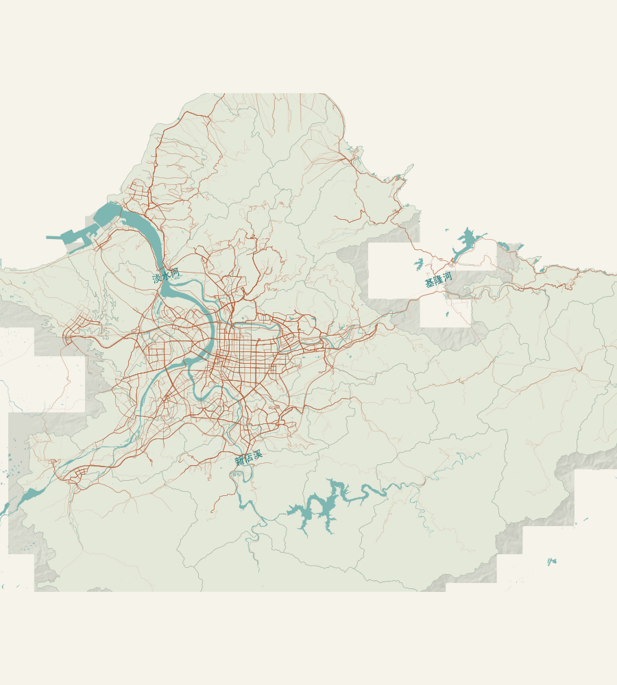
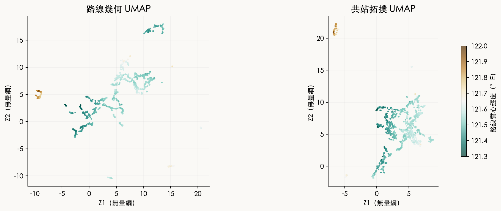
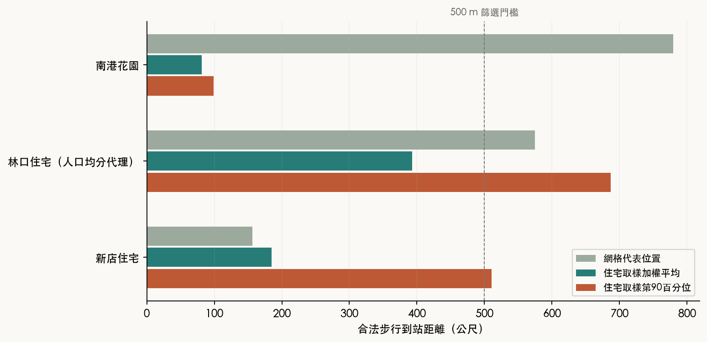
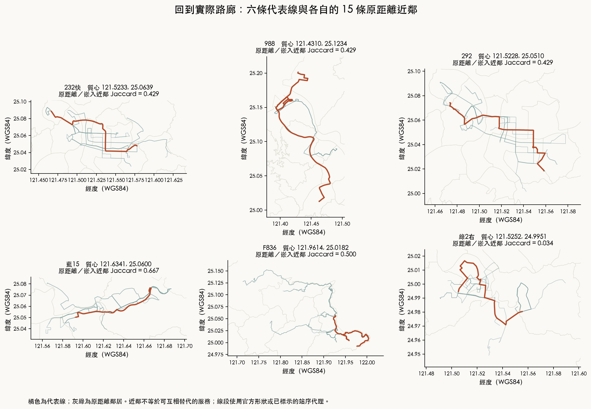

# 流動的雙北

## 公車、捷運與日常可達性的時空研究

臺北公共運輸研究專案 · 第一版 · 2026 年 9 月

### 中文摘要

公共運輸設施的空間接近性，與居民實際取得服務的條件之間，存在需要辨識的落差。本研究以臺北市及新北市 41 個行政區為範圍，整合 1,051 條公車路線的 2,568 筆去回程與支線紀錄、2024 年 12 月戶籍人口、步行路網及捷運入口資料，探討路線相似結構、軌道鄰近性與住宅到站距離之間的關係。路線分析採動態時間校正距離及共站拓撲距離，分別建立聯合降維；住宅分析則以 250 公尺網格及每格最多五個住宅取樣位置，估計加權平均與第 90 百分位到站距離。

結果顯示，幾何 UMAP 的局部保真度為 0.9966，跨種子鄰域 Jaccard 一致性為 0.6569，均高於共站拓撲模型的 0.9434 與 0.4911。然而，模型未呈現通過預設驗證條件的全域地理方向，顯示路線相似性適合在局部路線組合中解釋。路線長度與已收錄捷運入口鄰近比例的 Spearman 相關為 −0.065；以同一路線各方向的中位數彙整後為 −0.067。路線延伸距離因而不足以單獨辨識其與軌道系統的空間關係。

住宅尺度的結果呈現兩類差異。南港花園案例的網格代表點到站距離約為 780 公尺，住宅取樣加權平均則為 81 公尺，反映空間取樣方式對服務範圍判定的影響。新店案例的平均值為 185 公尺，第 90 百分位為 511 公尺，顯示平均接近性可能掩蓋格內較遠住宅的負擔。文和橋案例的路網距離約為直線距離的 3.90 倍，進一步說明河川及通行連接會改變站點服務範圍。

上述結果支持將公車規劃區分為路網覆蓋、住宅步行連接與營運可靠度三個層次。對平均距離較短、較遠住宅的距離較長的地區，政策評估宜先聚焦住宅入口、過街與步行連續性；對延伸至軌道較少地帶的路線，則應比較其直接服務與接駁功能。由於捷運入口涵蓋、當期班次及完整旅程時間仍有限，本研究所辨識的是空間機制與改善方向，尚不足以估計措施的因果效果或成本效益排序。

**關鍵詞：** 公共運輸；流形學習；住宅人口；步行接近性；軌道鄰近性；交通政策。

### Abstract

Spatial proximity to public transport infrastructure does not fully describe residents' access to services. This study examines route similarity, rail proximity, and residential walking access across 41 districts in Taipei and New Taipei. It integrates 2,568 directional and branch records from 1,051 bus routes, December 2024 registered population, a pedestrian network, and metro entrance data. Geometric and shared-stop distances are embedded separately, while residential access is evaluated in 250 m cells using up to five residential sampling locations.

Geometric UMAP achieves a trustworthiness of 0.9966 and a cross-seed neighborhood Jaccard score of 0.6569, compared with 0.9434 and 0.4911 for shared-stop topology. No global geographic direction satisfies all prespecified validation criteria. The Spearman correlation between route length and proximity to recorded metro entrances is −0.065, and remains weak at −0.067 after aggregation by route. Route length alone therefore provides limited information about spatial relations with rail infrastructure.

Residential cases reveal sensitivity to sampling location and within-cell variation. In Nangang, the cell representative has a walking distance of approximately 780 m, compared with a residential weighted mean of 81 m. In Xindian, the weighted mean is 185 m and the 90th percentile is 511 m. The Wenhe Bridge case has a network-to-straight-line distance ratio of 3.90. These findings support distinguishing network coverage from pedestrian connectivity and operational reliability. They motivate targeted evaluation of residential entrances, crossings, and bus–rail connections. Incomplete entrance coverage and journey-time evidence limit inference about intervention effects and investment priorities.

### 全書架構

第一、二章界定研究問題、資料與空間尺度；第三章分析路線相似性及其與捷運的關係；第四、五章說明人口活動、運輸供給與旅行時間的衡量。第六章以六個地理案例呈現住宅接近性的差異，第七章比較改善情境，第八章綜合研究發現並討論政策意涵。算例用於說明指標及反事實條件，與實證結果分列。詳細來源、分類門檻及資料使用說明見方法附錄。

# 第一章　研究問題與可達性的分析尺度

從住宅門口到目的地，公車站只是旅程的一個節點。一條街上可能有很多路線，居民卻必須繞過圍牆才能抵達站牌；也可能很快走到站，卻在錯過一班車後等待很久。若只把站牌畫成圓點，再以固定半徑畫圓，這些差異都會被藏起來。

本研究把可達性理解為：在已交代的出發位置、交通條件及時間限制下，可以抵達哪些地方。這個意思比「附近有交通設施」多了一層要求。地圖上的接近是可達性的線索；是否存在可走的連接、服務是否在需要的時段運行，才決定這個線索能否成立。

## 從一條路線到一個居民

路線分析以各行駛方向及支線為觀察單位。同一公車名稱之下，去程、回程及區間服務可能具有不同站序和道路幾何，故保留 2,568 筆紀錄進行比較。在模型驗證時，另以 1,051 條公車路線分組，使同一路線的不同方向不會分散於訓練與驗證樣本而高估外推能力。

住宅分析的觀察值則是地面上的位置。人口先保留來源統計區的數值，再分配到 250 公尺網格；接著在每格的住宅面內取最多五個取樣位置。這些點是住宅位置的代理，不是已核對的實際大門。若一個網格含有分離的住宅面，取樣權重只描述面積分配，不會憑空接通兩塊住宅之間的道路。

兩種觀察值回答的問題不同。兩條路線在降維圖很接近，只能提醒我們檢查它們的服務形狀；不能因此認定旁邊某個社區已獲得足夠服務。相反地，即使某條路線在嵌入中很孤立，也可能是山區不可缺少的唯一連接。研究需要在「線」與「人所在的位置」之間來回核對。

## 一個距離門檻如何改變判斷

本研究以住宅取樣位置到可上車站點的合法步行距離，檢查是否超過 500 公尺。這是篩選門檻，目的是找出需要細看之處；它不是所有年齡與地形條件都適用的舒適步行上限。時間換算另提供 3、4.5、6 公里／小時，讓讀者看出同一距離對不同步行速度的影響。

教學例一先固定平地速度為每小時 4.5 公里，也就是每分鐘 75 公尺。走 500 公尺需要 500 ÷ 75 ≈ 6.67 分鐘；若速度改為每小時 3 公里，就變成 10 分鐘。這個計算只轉換距離與時間，沒有包含紅綠燈、休息、輪椅坡道或雨天。它說明為何地圖上的同一圈半徑，不能代表每個人的同一段負擔。

教學例二假設同一網格的住宅取樣位置有 80% 權重距站 100 公尺、20% 權重距站 900 公尺。平均為 0.8 × 100 + 0.2 × 900 = 260 公尺，但加權 第 90 百分位數是 900 公尺。這裡的 第 90 百分位數，是累積權重至少達九成時的距離；它提醒我們，平均距離短仍可能掩蓋一部分較遠的位置。面積權重尚非住戶權重，因此不能進一步聲稱「兩成人口確實要走 900 公尺」。

反例只改變人口證據：若同樣的格子是河川或公園，來源已知居住人口為零，900 公尺的繞行仍是空間現象，卻不構成已證實的住宅服務缺口。遊客與工作者的需求可能存在，但必須由活動或到訪證據支持，不能從戶籍資料的零反推。

## 研究範圍與問題

研究範圍為臺北市及新北市 41 個行政區，包含新北境內運行而不進入臺北的公車。兩市路線使用共同距離矩陣及聯合嵌入，以維持跨市路線相似性的可比較性。住宅人口及步行路網亦依兩市共同範圍處理，行政區界用於彙整與定位，不作為步行路徑的截斷邊界。

本研究據此提出三個問題：公車的幾何及共站關係能否形成可重現的低維結構；路線長度、延伸方向及軌道鄰近性如何對應此結構；住宅位置和合法步行連接，又如何改變站點接近性的判定。前兩個問題以路線為單位，第三個問題以住宅取樣位置為單位；兩者的結合用於解釋空間機制，不將降維圖的空白區直接轉換為地理服務缺口。

<figure><figcaption>圖 1　盆地視野中的公車路線與水系。此圖為地理脈絡的裁切視野，完整研究範圍包括雙北全市。橘線的密集程度沒有加入班次或乘客量權重；地形缺測區保持缺測。資料：雙北公車、OpenStreetMap、內政部 DTM。</figcaption></figure>

# 第二章　資料來源、時間範圍與人口分配

把數字放到同一張地圖很容易，使它們可以比較卻需要先核對單位和日期。2026 年下載的檔案可能記錄 2020 年的人口活動；2025 年發布的高程資料，也可能來自多個較早的測繪年份。若把下載時間一律當成觀測時間，地圖會製造一個實際上不存在的「現在」。

## 六種資料，六個尺度

公車路線與站序描述服務幾何，住宅人口描述登記居住量，活動人口描述來源所定時段的估計存量，捷運 OD 描述旅次，道路與公車快照描述某一時刻的速度狀態，地形和圖界則提供地理背景。OD 是 origin–destination 的縮寫，本書指從進站到出站的一筆起迄旅次。進站與出站是同一旅次的兩端，不能相加成兩次出行。

| 資料層 | 本研究可用尺度與期間 | 能支持的判讀 | 主要限制 |
| --- | --- | --- | --- |
| 公車幾何 | 兩市 2,568 筆去回程／支線紀錄，保存取得版本 | 路線位置、站序、形狀相似性 | 不直接表示當期班次 |
| 住宅人口 | 2024-12；原統計區及 250 m 分配格 | 登記居住需求代理 | 分配位置是估計；非白天在場人數 |
| 活動人口 | 2020-11；行政區資料原定時段 | 歷史日夜活動脈絡 | 日間來源衝突；不適合當期排名 |
| 捷運 OD | 2026-07；月檔及入站小時 | 已涵蓋系統的進出旅次 | 部分站名未對照；部分系統未涵蓋 |
| 速度快照 | 2026-09-05；道路／公車瞬時資料 | 當次狀態分布 | 無法估計完整旅程及歷史壅塞 |
| 地形、區里界 | DTM 發布版 2025；里界 2026-08-17 | 河川、地勢、行政定位 | 高程測繪跨年；里人口未正式對接 |

各項分析保留來源統計年月、來源定義的時段和空間單元。缺值採用缺失標記，來源明確記錄的零值則保留為零；例如無有效班表的路線不估計頻率，避免將資料未取得等同停止服務。

## 人口守恆的用途與邊界

本研究臺北市來源已知人口合計 2,490,646 人，新北市為 4,045,396 人，兩者均為 2024 年 12 月。網格人口可以有小數，因為統計區的整數人口會依住宅面積等面積分配。因此，格網值應解釋為來源人口在空間上的估計分配，而非逐格實測人數。

教學例一假設某統計區有 1,000 人，兩個住宅用地的面積比為 3:1。按面積分配便得到 750 與 250 人，兩者仍合計 1,000。守恆檢查能發現重複分配或漏算，卻不能證明兩處真實人口比例確實是 3:1。若其中一處是高樓，單看面積就可能低估其住戶。

第二個算例使用新北市統計區資料。資料含 11 組微小重疊，涉及 12 個統計單元、合計 1,557 人。本研究沒有移動邊界或把人口重分給鄰格，而是將涉入單元隔離，保留原圖與原數值。可安全納入分配的來源小計因此為 4,045,396 − 1,557 = 4,043,839 人。落入研究網格的已知分配目標約為 4,042,898.38 人，兩者差約 940.62 人，另列空間裁切與未落入分配域的差額，不再重分配。

這個例子的反面是直接將每格人口四捨五入再加總。若很多格都帶小數，逐格取整會引入累積差異。因此地圖可以顯示一位小數供閱讀，運算仍保留原精度。守恆亦按縣市分開驗證，避免某市多算的量剛好抵銷另一市少算的量。

## 里界能回答什麼

本研究臺北有 456 個具名里，新北有 1,039 個具名里，另有 17 個未指派里名的行政界線圖區域。空間連接使用完整縣市、區與里代碼，以區分不同行政區的同名里；位於共享界線的點保留所有相交單元。未具名區域不被計算為新增的具名里。

人口來源採已核對的 2015 年統計區圖界與 2024-12 數值，現行里界的發布版本為 2026-08-17（民國 115 年）。兩套空間單元用途不同，不能只因地圖上看得到里名，就把旁邊的網格人口稱為官方里人口。分析因此區分行政區人口加總、250 公尺網格估計和里界定位。里界提供行政空間脈絡，人口估計則維持其原統計單元及分配方法。[村里界圖來源](https://data.gov.tw/dataset/7438)

不同來源的時間差異限制了聯合解釋。戶籍人口可作為住宅需求的空間代理，歷史活動人口則提供行政區日夜活動的背景；兩者不能直接構成當期逐時需求曲線。後續分析分別報告各資料的結果，僅在單位、時間及地理範圍相容時作數值比較。

# 第三章　公車路線的相似結構與軌道鄰近性

每個站牌原本只有經緯度，把這兩個數字再降成二維，通常沒有增加路線層次的理解。本研究改以整條路線作為觀察值：先沿路線等距取樣，再比較兩條完整路線的形狀與位置。這樣建立的距離，才有機會把數千條路線的相似關係壓縮成一張可讀的圖。

## 從路線距離到圖上鄰居

流形學習是尋找高維資料中較低維結構的方法。本研究採用 UMAP、Diffusion Maps，並以多維尺度法 MDS 作參照。UMAP 著重維持局部鄰近關係；Diffusion Maps 沿相似性圖上的多步連接建立座標；MDS 則以距離重建作為對照。它們都沒有承諾圖上座標可直接反算成新的公車地點。[UMAP 原始論文](https://arxiv.org/abs/1802.03426)

幾何距離的主設定以 64 個等距路線位置為表示，使用 DTW 比較位置與形狀；另以 Fréchet 型距離及不同取樣密度檢查敏感度。Fréchet 型比較在順序限制下衡量兩條曲線需要隔開多遠；DTW 則容許沿序列作不等速對應，累積位置差異。它們的尺度與對局部偏離的反應不同，不能混稱同一種距離。共站拓撲距離另檢查路線是否共享站點，讓幾何近似與網路功能的線索分開。

兩市共同母體中，幾何有 2,220 個不重複代表，共站拓撲有 2,174 個。具有相同幾何或站點表示的紀錄映回原路線身分，不把每個副本當成新的獨立證據。幾何與拓撲各檢查三個隨機種子、三個鄰居數及兩個 min_dist 設定；主 UMAP 的鄰居數為 30、min_dist 為 0.1、種子為 42。

## Z1、Z2 不是東西與南北

地圖座標使用 WGS84 的經度、緯度；公尺距離計算使用 TWD97／TM2 的 EPSG:3826。降維座標 Z1、Z2 則沒有公尺單位。相同局部關係可能被畫成旋轉、反射或整體縮放後的另一張圖。本研究只用正交變換、平移及單一尺度對齊展示，不拉伸某一軸使它更像地圖，原始座標也保留供核對。

要解釋方向，先區分三件事：路線質心代表位置；起點到終點的方位角代表淨行進方向；路廊軸向則描述主要延伸方向，去程與回程可以共用。方位角以北為零、順時針增加。端點相距小於 200 公尺時不估計起訖方位；方向集中程度低於 0.30 時不指定主要延伸方向，以避免近環線或方向分散路型被強制歸入單一軸向。

教學例一是一條起訖淨位移朝東的路線，方位角為 90°。將站序反轉後，方位角成為 270°；但它仍沿同一條東西路廊。用雙角表示時，cos(2 × 90°) 與 cos(2 × 270°) 都是 −1，兩者的 sin 雙角值都是 0，因此軸向保持相同。這個表示解決了去回程差異，不代表彎曲路線已被完整概括。

教學例二比較兩個 15 鄰居集合。若共有 10 個相同鄰居，聯集有 20 個，Jaccard 一致性便是 10 ÷ 20 = 0.5。這個比值越高，表示兩個集合越接近。研究同時報告跨種子與原距離對嵌入距離的鄰域一致性，兩者問法不同，不能只寫一個「穩定度」便混用。

## 實際診斷支持局部查詢

主幾何 UMAP 的局部保真度為 0.9966，共站拓撲為 0.9434。這項保真度檢查圖上鄰居在原距離排序中是否也是合理近鄰，越接近 1 越好。跨種子的十鄰居 Jaccard 均值，幾何約為 0.6569、拓撲約為 0.4911。幾何圖因此較適合用來找附近的路線紀錄，拓撲圖的群界則需要更審慎看待。[保真度指標定義](https://scikit-learn.org/stable/modules/generated/sklearn.manifold.trustworthiness.html)

但高保真度不等於每個地理特徵都沿單一軸變化。本研究以公車路線分成五折，以未參與該折擬合的路線評估特徵預測，再以 500 次路線分組重抽樣和多設定角度一致性檢查箭頭。連續特徵的預測 R² 至少須達 0.20；二元特徵採平衡正確率門檻 0.65，另要求鄰域與方向穩定。這些都是事先聲明的探索性顯示規則，不是統計定理。

結果沒有任何主模型全域箭頭通過全部條件。幾何主模型以座標預測質心東向位置的折外 R² 約為 0.002，北向位置約為 0.073；即使某些局部區域有清楚地理排序，也無法用一個全圖線性箭頭概括。拓撲模型部分地理預測較強，卻未通過鄰域穩定門檻。Diffusion Maps 另有特徵值接近或局部化問題，單一特徵軸同樣不命名。

<figure><figcaption>圖 2　共同研究母體的幾何與共站拓撲 UMAP。色彩標示路線質心經度，兩軸均為無量綱模型座標。局部顏色排序可回到地圖檢查，不代表整張圖都有同一東西方向。模型與種子固定為 n30、min_dist 0.1、seed 42。</figcaption></figure>

## 局部路線比較與不穩定鄰域

本研究挑選最多六條代表線，包括原距離中心、位置分位、較大特徵殘差，以及較嚴重的鄰域扭曲案例。232快位於依原始路線距離選出的中心代表；藍15的質心經度約 121.634146°；F836 約 121.961387°，則提醒讀者東側路線可能在全圖線性解釋中形成較大殘差。代表線依原始距離、位置分位和鄰域失真等明列條件選取，用於呈現模型可解釋性及其異質性。

反例是綠2右的其中一筆行駛紀錄：其原距離十五鄰居與圖上十五鄰居的一致性約為 0.034。把同一公車路線的其他方向，或圖上看起來最近的點，直接稱為最相似服務便可能出錯。路線比較因此以原始距離的近鄰為依據，並以實際幾何檢查模型鄰域與地理關係是否一致。

本研究可支持的洞見是：幾何相似性存在可用的局部結構，卻不自然收斂成簡單、穩定的全域地理軸。這也限定了缺口搜尋的方法。嵌入圖上的空洞不產生新增站點；候選位置仍必須從住宅、站點和合法步行網路獨立計算。由於幾何位置本身為模型輸入，嵌入中的地理排序應視為對原有空間關係的摘要，而非新的因果證據。

## 路線長度與捷運鄰近性的交叉比較

為了區分路線的延伸範圍及其與軌道設施的空間關係，本研究另以路線長度和捷運鄰近比例進行描述性比較。捷運鄰近比例定義為沿路線 64 個等距取樣位置中，距已收錄捷運入口直線 500 公尺以內的比例。這個指標表示沿線對入口的空間接近，並非公車與軌道的共線比例，亦非乘客實際轉乘率。主分析共使用 390 個入口；機捷及部分新北軌道入口的涵蓋較有限，解釋低值時需要同時參照各系統的資料範圍。

全部 2,568 筆紀錄的路線長度中位數為 13.92 公里，第一至第三四分位數為 9.28 至 19.66 公里；捷運鄰近比例中位數為 29.69%，第一至第三四分位數為 9.38% 至 50.00%。兩者的 Spearman 相關係數為 −0.065，表示本資料中的單調關係較弱。由於同一路線的去回程及支線並非獨立觀察，另以每條路線的中位數彙整，所得相關係數為 −0.067；以 2,220 個不重複幾何代表計算則為 −0.079。三種彙整方式均未支持以路線長度直接概括其軌道鄰近性；此結果為描述性關聯，未作因果或顯著性推論。

以 15 公里及 50% 作為固定比較門檻，可得到下表。門檻用於使圖例易於比較，並非由聚類模型估計，也不是交通主管機關訂定的服務標準。較長且鄰近較少的路線，可作為檢視軌道覆蓋外連接的起點；較長且鄰近較多者，則可比較直接公車服務與軌道轉乘之間的分工。分類本身不具有路線優劣的意義。

| 路線長度 | 捷運鄰近低於 50% | 捷運鄰近至少 50% | 合計 |
| --- | ---: | ---: | ---: |
| 未滿 15 公里 | 1,056 | 340 | 1,396 |
| 至少 15 公里 | 834 | 338 | 1,172 |
| 合計 | 1,890 | 678 | 2,568 |

單位為去回程與支線紀錄，各列不代表彼此獨立的路線或旅次。將 15 公里改為 10 或 20 公里、維持 50% 鄰近門檻時，較長且鄰近較少的紀錄數分別為 1,315 與 493；可見組別數量對門檻敏感，不能視為自然存在且數量固定的服務群。

個別路線進一步呈現了差異。232快的一筆方向紀錄全長約 16.26 公里，鄰近比例為 64.06%；988 的一筆紀錄約 43.83 公里，比例為 6.25%。兩者均屬較長路線，但與已收錄入口的空間關係不同。前者可檢視公車沿線停站與軌道轉乘的差異，後者則需回到沿線地區，確認公車在軌道較少地帶的連接範圍。這種解釋將降維鄰域、實際路型及外部特徵結合，比單憑散點圖左右位置推定運輸角色更具可核對性。

# 第四章　人口活動、軌道客流與公車供給

把公車想成水流，可以幫助我們看見道路上的方向與供給密度。這個比喻有用的前提是先把幾個量分開：車輛通過一個斷面的次數、車輛移動的速度、每車容量，以及實際乘客通過量。若全部用同一種「流量」表示，動畫越生動，誤解反而可能越大。

## 頻率決定多常有車，速度決定走得多快

班次頻率 f 的單位是車輛／小時；速度 v 的單位是公里／小時。容量 c 是每車可容納的人數；在很強的條件下，f × c 可以描述每小時的名義供給容量，卻不是實際載客量 q。乘客量需要票證、上下車或其他可信觀測，不能由路線條數補猜。

教學例一把路段速度固定為每小時 20 公里，路線 A 每小時 6 班、路線 B 每小時 12 班。兩者行駛一公里都需要 3 分鐘；B 只是較常有車通過。若用動畫呈現，兩條路的粒子移動速度應相同，線寬或粒子通過頻率才可以不同。再假設每車容量均為 60 人，名義容量分別為每小時 360 與 720 人，仍不能斷言 B 實際載了兩倍乘客。

教學例二固定每小時 6 班，將速度由 20 降為 10 公里／小時。一公里的車上時間便由 3 分鐘增為 6 分鐘。若發車仍維持原頻率，乘客面對的是較長車上時間；若車輛週轉受阻，實際班距又可能變動。後者需要調度與到站資料，不能只憑速度減半便假定班次也減半。

一個反例是兩個城市資料源同時列出同一班跨市公車。若直接把兩份紀錄加總，線寬會增加一倍，但道路上並沒有多出一輛車。本研究按可核對的服務日、方向及獨立班次身分去重；缺少足夠身分資訊時，只保留範圍或未知，不推成精確頻率。

## 活動人口是存量，不是旅次

人口活動資料估計某個行政區在資料原定時段中的在場規模。本研究讀到的資料期間是 109Y11M，即 2020 年 11 月。日間有兩份來源檔，許多相同區、日型與時窗的數值不同；本研究共有 245 組衝突鍵被保留，而沒有任選其中一份作為「正確版本」。資料目錄的更新日期與實際觀測期間分開記錄。[日間活動人口](https://data.gov.tw/dataset/162907) · [夜間停留人口](https://data.gov.tw/dataset/162908)

因此活動圖層只顯示行政區原資料的上午、下午或夜間時窗，以歷史脈絡閱讀。統計單元維持行政區，不進一步推估里級或逐時網格活動人口。若某區日間比夜間多，最多只能作為該資料方法與該期間下的活動集中線索，不能直接解釋當前尖峰公車缺口。

例如白天估計在場 10 萬人、夜間 8 萬人，兩者差 2 萬。這個教學數字是存量差，不能據此推論每天剛好有 2 萬人搭公車通勤進入。跨區出入可以同時發生，同一人也可能有多段旅次，且還有捷運、步行、汽機車等選擇。只有在明確的流量平衡條件和運具資料下，才有機會把兩者連起來。

## 捷運 OD 的守恆與時鐘

本研究完整讀取 2026 年 7 月捷運 OD 月檔，8,366,652 筆聚合紀錄中的旅次合計為 63,379,613。這些是聚合資料列與其計數，不代表取得了同數量的個人軌跡。將全部進站計數加總，以及將全部目的站計數加總，都應得到同一旅次總量；不能將兩端相加成 126,759,226 次出行。

站名對照仍有缺項。可定位進站端的小計為 62,119,668，目的站端小計為 60,769,076；兩端同時完成對照的子集為 59,520,185。不同分母各自保留，使地圖上的已知站點不會吃掉未匹配旅次。BL板橋與 Y板橋等來源站鍵也不因名字相似就直接混為同一閘口。

時間語義同樣重要。若來源記錄早上八點入站、目的地為某站，這筆旅次可以放入八點的出發統計，但不能當成八點抵達該目的地的人流。目的站統計亦依出發小時分組，並以資料涵蓋日數計算平均；平日平均是合計除以有涵蓋的平日天數，不以任意的固定天數當分母。

## 平日晨間入站分布的規劃意義

2026 年 7 月的 23 個平日中，08:00–09:00 台北車站的已對照入站量合計為 314,436 人次，平均每個觀測平日約 13,671 人次。新埔、頂溪、海山及江子翠則分別約為 7,515、6,709、6,094 及 5,843 人次，為該時窗已對照站點中的前五名。這些高入站量站點分布於臺北核心及新北的軌道沿線，顯示晨間軌道使用並非只集中於單一市中心站點。

對公車接駁而言，這些站點提供的是「需要檢視接近與轉乘條件的高使用量節點」，而不是已證實的公車接駁需求。入站者可能步行、騎乘、由其他鐵路轉乘或搭公車抵達；台北車站尤具多運具轉乘條件。因此，可據此選取站外過街、候車空間及公車抵達時段的調查節點，但無法直接以入站量推算應增加多少公車班次。政策比較需要再區分進站前運具與尖峰抵達的時間分布。

## 公車供給與壅塞的衡量範圍

本研究沒有取得可核對有效日期與方向的完整公車班表，也沒有足量的路段穿越時間。雖然有 616 筆臺北道路、1,366 筆臺北公車與 1,069 筆新北公車的速度快照，它們來自一次短時段擷取，不能替代長期旅行速度。

因此，現有速度資料的解釋範圍限於擷取時窗內的瞬時狀態，尚不能估計路廊的典型延誤、班距可靠度或每日供給。對公車優先措施的評估，頻率、車上時間和乘客量應各自建立觀測基線：頻率影響等待機會，車上時間反映道路及停站負擔，乘客量則決定效益所及的旅次規模。這些分量的區分，決定了後續措施比較的單位和資料需求。

# 第五章　住宅步行接近性與多運具旅行時間

一段完整旅程包含走到站牌、候車、搭車、轉乘，以及走到目的地。距離分析能夠仔細處理第一段，卻不能單獨證明整段旅程方便。尤其當研究把捷運視為替代方案時，不能只因地圖上有一個站名，就將公車缺口自動消除。

## 旅行時間的分解

本書以經過的分鐘數比較旅程，另將不便感或轉乘負擔保留為獨立分量。若要得到總旅行時間，需要以下各段都具備可用資訊：

T = 步行時間 + 候車時間 + 車上時間 + 轉乘步行 + 轉乘候車。

式中的 T 是經過時間。若再加上轉乘不便的懲罰分鐘，得到的是帶偏好的廣義成本，不再是碼表直接量到的時間。本研究最多評估兩次轉乘；超出限制或任一必要分量未知，總時間就保留未知，不能把缺失段填為零。

教學例一先假設乘客隨機到站、班距固定為 10 分鐘，步行 8 分鐘、車上 20 分鐘。平均候車時間為班距的一半，也就是 5 分鐘，總時間便是 8 + 5 + 20 = 33 分鐘。隨機到站與規則班距是這個算式的條件；若公車常常兩班一起來，平均候車就不一定仍是 5 分鐘。不能把這個教學結果移植成某條實際公車的 33 分鐘旅程。

教學例二加入一次轉乘，假設轉乘步行 3 分鐘、轉乘候車 4 分鐘，其他條件維持不變，則經過時間為 40 分鐘。若另設定 5 分鐘的不便懲罰，廣義成本會成為 45 分鐘，但實際經過時間仍是 40。分析分別記錄經過時間及廣義成本，保留可觀測時間與偏好設定的差異。

反例只拿掉班表有效期。即使仍看得到「班距 10 分鐘」的舊文字，若無法證明適用本次日期與方向，本研究就不採用它推估候車時間。地理上確實存在的路線，與指定時段確實有服務，是兩項不同證據。

## 合法步行比直線多了哪些約束

步行路網保留可通行道路與接點，並以水域、明示私人或禁止進入的地面避免捷徑。學校入口若尚未核實，也不自動從校園中央接通到另一條路。兩個圖形只要看起來靠近，不足以創造跨河連接；仍需圖上可走的橋梁或道路。

本研究分析含 51,123 個住宅取樣位置，加上網格代表位置，總計 89,961 個起點。主圖使用完整雙北步行網，不在每個行政區邊界截斷，因此不會把區界本身當作牆。兩公里與四公里研究區外緩衝的敏感度比較，有 59,240 個可比較起點，其中 4 個到站距離變化超過 1 公尺，最大差異約 932 公尺。在可比較起點中，緩衝範圍對大部分距離的影響有限；少數起點仍呈現較大差異，須於個案解釋中保留邊界敏感度。

網格內取樣位置的距離分布，會以權重計算平均與 第 90 百分位數。如果一部分取樣位置無法合法接到圖上，完整平均和分位數保持未知，另保留可連接子集的小計與比例。這個處理防止只留下較容易抵達的住宅，卻把結果當成整格居民都同樣方便。

## 捷運入口需要逐系統核對

主步行矩陣使用 390 個已取得官方入口。這個數目是資料子集的大小，並不是研究已證明雙北所有捷運入口都齊全。補核對時另取得機捷、環狀線、淡海及安坑等官方站位或歷史入口地標。站位是設施的位置參照，入口則是可能進入系統的地點；兩者仍須進一步核對合法步行接點與現況。

林口 A9 說明了入口資料需要逐系統核對。案例至官方歷史入口的最近直線距離約為 243 公尺，顯示機捷是當地運具選擇的重要一環。這些入口尚未與主步行圖建立核實的接點，因此入口步行時間保持未知。機捷旅程是否適合居民，還取決於目的地、候車、轉乘與末段步行。[桃園捷運 A9 林口站](https://www.tymetro.com.tw/tymetro-new/tw/_pages/travel-guide/A9)

主步行分析與補充站位資料分開處理。補充地標保留來源更新年月；其用途為設施定位及後續入口核對，不視為已驗證的通行接點或當期營運證據。各軌道系統的路網、入口、班表及旅次資料具有不同涵蓋程度，相關結果以各自的資料範圍解釋。

## 機會可達性與壅塞證據

機會可達性計算某段時間內可抵達多少目的地，例如學校、醫療或公共服務。本研究在六個案例提供 30／45 分鐘、三種步行速度下的圖資已收錄的 POI 可達下限。POI 是地圖上可辨識的設施點；醫療點數不是病床、學校點數不是學位或學生人數，各類不可直接相加成「總需求」。

南港案例在每小時 4.5 公里、30 分鐘門檻下，可以沿本圖走到 5 個圖資已收錄的醫療點與 7 個公共服務點；45 分鐘門檻下兩類各有 28 個。這些數字只指被資料辨識且可連接的設施，不保證現場開門，也不是包含搭車的完整多模式總量。學校因入口限制而得到零個可核對點時，更不能解釋成周圍沒有學校。

壅塞則需要跨時段的運行資料才能衡量。本研究沒有足量的公車實際穿越時間，也沒有可驗證的自由流參照，因此不能計算旅行時間指數或高分位延誤。一次速度快照能描述當時的數值分布，不能回答某路廊每天塞多久。未來要比較公車優先措施，應收集日期、方向和路段一致的行程樣本，再與相同條件的基線比較。

# 第六章　住宅、河川與軌道接駁的個案結果

六個案例用於比較住宅位置、河川阻隔、非居住活動及軌道接駁等不同空間條件。選樣依現象類型而非缺口排名，目的在於說明到站距離的形成機制及其政策含義。案例數量及選取方式不支持推估各類現象在雙北的總體發生率。

## 南港花園：代表點偏離住宅

案例位於東經 121.593350°、北緯 25.038066°，依里界資料位於臺北市南港區仁福里。所屬 250 公尺網格的 2024-12 人口分配約為 1,403.4 人，採住宅用地面積權重分配。網格代表點在目前路網上到站約 779.5 公尺；同格的兩個住宅取樣位置，加權平均約 81.3 公尺、第 90 百分位數約 99.3 公尺。

兩種空間摘要相差約 698.2 公尺（779.5285 − 81.3245），分別落於 500 公尺篩選門檻的兩側。這項差異反映代表位置對服務範圍判定的敏感度，支持以住宅分布檢查單點估計；由於住宅取樣位置仍非逐戶入口，距離結果應解釋為以住宅用地面積加權的估計。

對南港花園的改善評估，應先確認住宅入口的位置與開放狀況，再核對通往成福宮等站點的實際路徑。如果入口與住宅取樣位置接近，到站可能相當方便；如果入口位於另一側，便需要計入繞行。兩種情況會形成不同的改善需求。

## 文和橋：河川阻隔與步行繞行

河川案例位於東經 121.590521°、北緯 24.996546°。與附近站點的直線距離約為 327.4 公尺，合法路網到站則約為 1,276.3 公尺。兩者之比約 3.90，表示直線圓形服務區在此很容易低估繞行。

但所屬網格的已知居住人口為零，住宅位置也是未核實的替代位置。因此這一案支持「直線距離無法反映跨河步行條件」的判斷，不支持已經有大量居民被公車遺漏。若要考慮橋梁步行改善，應另外確認兩端活動目的、合法入口和實際使用量。

此案呈現了物理阻隔與需求規模的分析差異。繞行比值可辨識路網連接對距離的影響；人口及活動資料則決定這項影響涉及哪些使用者。兩項證據須共同成立，才足以由地理障礙的辨識推進到投資需求評估。

## 大安森林公園：零戶籍的另一種意義

公園案例位於東經 121.536341°、北緯 25.031511°。沿本研究步行圖，到公車站約 146.8 公尺，到已核對捷運入口約 276.8 公尺。戶籍人口已知為零，與公園可能有遊客、運動者或活動參與者是不同層次的描述。

將其標為住宅缺口並不恰當；將它從所有交通需求中刪去也同樣過快。這個位置需要的是與公園活動相符的時間資料，例如假日、活動結束時段與到訪規模，而不是用鄰近住宅人口替代。現有歷史活動人口只到行政區尺度，還不能完成這一步。

## 萬隆東側：入口接近只是第一段

東經 121.543654°、北緯 25.004400°的案例，到公車站步行約 547.7 公尺，到已核對捷運入口約 773.1 公尺。以每分鐘 75 公尺的教學速度換算，兩段約為 7.30 與 10.31 分鐘，捷運入口這一段約多 3.01 分鐘。

這個差額不能直接決定應搭公車或捷運。假如捷運之後的車上時間較短，完整旅程仍可能較快；如果目的地離捷運很遠，末段步行又可能抵銷優勢。本研究缺乏已核對的完整車上與有向轉乘時間，因此保留「捷運鄰近，但全程替代性未驗證」的判讀。

## 林口：住宅與機捷入口之間

新北住宅候選中的林口案例位於東經 121.360560°、北緯 25.068154°。所屬格的已知人口分配約為 2,431.1 人，但原人口方法是按面積均分（估計）；住宅位置取樣並未改變其人口估計的分配方法。公車到站的住宅取樣位置加權平均約 393.1 公尺、第 90 百分位數約 686.9 公尺，呈現平均與較遠住宅的差別。

國土測繪中心的機捷地標顯示，A9 入口 NLSC:F0000008934 位於約 121.361393°、25.066095°，來源記錄的更新年月為 2022 年 5 月。案例至最近官方入口的直線距離約 243.1 公尺，至站位約 277.6 公尺。站位描述設施位置，入口才是後續步行接點核對的對象。

這些地標尚未納入主步行矩陣，合法步行距離保持未知。現有資料支持把機捷接駁列為當地可達性評估的重要條件：需要核對從住宅到入口的道路、過街與實際出入口，再比較通往不同目的地的完整旅程。

## 新店：照顧距站較遠的住宅

新店案例位於東經 121.528678°、北緯 24.977370°，網格人口分配約為 845.5 人，住宅取樣位置共兩處。到公車站加權平均約 184.8 公尺，但 第 90 百分位數約 510.5 公尺；至已核對捷運入口的住宅取樣平均約 661.9 公尺。

若只看平均，可能忽略距站較遠的住宅；若只看 第 90 百分位數，又可能把整個格子說成普遍缺少公車。兩個數字應一起呈現。下一步的實地核對對象是距站較遠的住宅用地與出入口，而不是整格一體適用的增站方案。

<figure><figcaption>圖 3　住宅位置的不同摘要。比較網格代表點、住宅取樣平均與加權 第 90 百分位數；同格內的差異不是時序改善效果。林口人口原始分配仍屬按面積均分（估計），住宅取樣與人口分配方法分別記錄。</figcaption></figure>

六案結果顯示，住宅、道路及運具條件會對應不同的改善尺度。南港需要核對住宅入口，河川需要確認合法路徑，公園需要活動需求資料，林口需納入機捷接駁，新店則需要辨識格內差異。將這些步驟分開，才有機會把有限調查資源用在會改變決策的證據上。

# 第七章　改善情境與投資條件

交通改善的提問應有明確對照：同一個出發點、目的地與出發時段，只改變某一項服務條件，完整旅程會如何改變？本章用條件式情境回答這個問題。情境是把假設帶入既定算式後的比較，不是已經發生的政策效果，也不是對未來需求的預測。

## 頻率增加，能省下多少等待

延續第五章的教學旅程：步行 8 分鐘、班距 10 分鐘、車上 20 分鐘，規則班距與隨機到站下合計 33 分鐘。若班次頻率增加 20%，班距應除以 1.2，而不是直接減去 20%。新班距為 10 ÷ 1.2 ≈ 8.333 分鐘，平均候車為 4.167 分鐘。

因此，教學例一的總時間變成 8 + 4.167 + 20 ≈ 32.167 分鐘，較基線少約 0.833 分鐘。這個例子說明增加兩成班次，並不意味完整旅程會縮短兩成。當等待只占旅程一部分，其他段落不變便限制了總改善幅度。

反例把原有頻率設為零。零乘以 1.2 仍是零，不能由這個相對情境創造一條原本不存在的服務。新增路線需要另行設定營運時段、停站、車輛及實際班次，不能借用「增加兩成」模糊帶過。原頻率未知時，同樣也無法計算乘上的結果。

## 公車優先與捷運步行是不同改變

教學例二維持 8 分鐘步行與 5 分鐘候車，只把 20 分鐘車上時間縮短 10% 或 20%。車上時間分別成為 18 與 16 分鐘，總旅程成為 31 與 29 分鐘。這是一個指定分量的敏感度比較；是否能透過號誌、公車道或停站調整達到這個幅度，需要真實路段資料另證。

相同算式也必須容許乘客換路徑。若還有一條已核對的步行方案需要 31 分鐘，基線最佳方案會是步行 31 分鐘，而不是公車 33 分鐘。公車車上時間減少 20% 後，最佳方案才轉為公車 29 分鐘；相對原最佳方案的節省是 2 分鐘，不是 4 分鐘。比較時如果只守著原先搭公車的路徑，就會高估改善。

捷運步行縮短 2 或 5 分鐘，則只作用在經過相應入口的旅程段。步行分量有零分鐘下限；本來只有 1 分鐘的段落，不能因減少 5 分鐘而變成負 4 分鐘。完全不經捷運的公車旅程也不受此情境影響。因此，情境效益依路徑是否經過受影響的設施計算，不對所有旅程施加相同減幅。

## 個案情境的可估計分量

六個案例有步行距離，卻未取得足以支持完整總旅程的候車、車上與轉乘證據。因此本研究的真實情境表，總旅行時間與總節省保持空值，僅在可適用時列出步行分量的條件式改變。估計結果區分無效果、不適用及資料不足，以維持不同情境的可比較性。

以萬隆案例到已收錄入口的路徑為例，773.1 公尺在每小時 4.5 公里的假設速度下約為 10.31 分鐘。若指定這段步行減少 2 分鐘，其步行分量會是約 8.31 分鐘。這可以作為入口步行改善的量測與評估目標，尚不能說某項工程已經使乘客每趟省下 2 分鐘。入口現況、過街延誤和完整路徑都需要量測。

這個限制也影響投資比較。工程成本、營運成本、受益旅次數、受益分布和施工條件未齊全時，不能將一張到站距離圖轉成成本效益排序。即使有大量住宅人口，若住戶實際目的地與新增服務不相符，名義覆蓋增加也未必帶來便利。

## 把投資問題改成可驗證的條件

南港案例的優先評估對象是住宅入口與既有站點的連接；文和橋則是合法過河路徑與兩端活動需求；林口需要將機捷入口及轉乘條件納入住宅接近性比較。三者分別對應取樣位置、物理阻隔和多運具銜接，單一到站距離排名不足以反映這些機制差異。

對存在正人口、且合法步行距離穩定偏長的候選，下一步可依次檢查住戶入口、路線時段、乘客目的地與替代運具。只有在這些條件仍支持缺口時，才比較增加班次、調整停站、改善步行或強化捷運接駁的成本與效益。這些並不是保證會改善的措施清單，而是每種措施需要回答的證據問題。

在公平性上，也不宜只追求平均旅行時間最短。新店案例提醒我們，平均接近可以與一小部分較遠住宅並存。若改善專門照顧行動較慢、需要無障礙路徑或住在距站較遠的位置的人，城市平均值的變化可能不大。要評估這類效益，需要更細的使用者條件，本研究沒有用面積權重替代它們。

# 第八章　研究結論與政策討論

本研究的主要發現是，雙北公車的路線相似性、軌道鄰近性與住宅到站條件，分別反映公共運輸服務的不同面向。幾何相近的路線未必具有相同營運功能；鄰近軌道的住宅也未必具有便捷的入口連接。將三者區分，有助於判斷改善措施究竟應作用於路線配置、步行環境，還是服務運行，而非將所有不便一律歸為站點或路線不足。

## 路線相似性應用於分工評估

幾何降維的局部保真度與跨種子鄰域一致性均高於共站拓撲降維，表示在本研究的資料與設定下，行經位置和形狀較能形成可重現的局部比較。全域方向檢驗則未支持將模型座標解釋為固定的東西、南北或中心—邊陲軸。因此，降維的規劃用途在於縮小需要比較的路線集合：先由原始距離找出相似路線，再檢查共同路段、外延支線、停靠站與服務時段。

這個用途對路網整併有明確含義。兩條路線共享市中心路段，可能同時分別連接不同的外圍住宅區；刪除其中一條雖可減少幾何重複，也可能增加原有乘客的轉乘。相似性因而只能作為調查入口，不能直接作為刪線標準。運輸路網研究亦指出，結構效率需要與班次、等待時間及轉乘可靠度共同評估，才能推進到服務品質的判斷。[路網結構與服務效率研究](https://www.nature.com/articles/s41467-024-49193-1)

路線長度與軌道鄰近比例的描述統計進一步支持多面向評估。全部 2,568 筆紀錄的 Spearman 相關為 −0.065，以 1,051 條路線的方向中位數彙整後為 −0.067，均未呈現明顯的單調關係。以 15 公里與 50% 鄰近比例為比較門檻，較長且軌道鄰近較少的紀錄為 834 筆，較短且鄰近較少者為 1,056 筆；較長與較短、但鄰近較多者則分別為 338 與 340 筆。公車與軌道的空間關係並未被路線長短充分概括。

政策上，軌道鄰近較少的路線值得檢視其連接軌道覆蓋外活動地點的作用；鄰近較多的路線則值得比較沿線停站、直接旅程與轉乘的分工。這裡的「值得檢視」有特定對象：前者需要確認沿線住宅與目的地，後者需要比較乘客在直接搭乘和轉乘方案間的時間及負擔。由於主分析入口未完整涵蓋機捷及部分新北軌道系統，低鄰近比例也受到資料範圍影響，不能用來直接判定某市較缺乏軌道服務。

## 步行連接是可獨立處理的政策尺度

南港與新店案例顯示，住宅到站的不利條件可能集中於特定位置，而非均勻分布於整個統計單元。南港花園的網格代表點與住宅取樣平均相差約 698 公尺；新店的第 90 百分位數則比平均值長約 326 公尺。前者反映代表位置的敏感度，後者反映格內分布的不均。兩者都說明，僅以網格中心或全區平均作為增站依據，可能無法識別實際需要改善的住宅連接。

對新店這類平均距離較短、較遠端仍超過 500 公尺的案例，較具針對性的評估單位是住宅入口至既有站點的步行路徑。可比較的措施包括過街位置、人行道連續性、出入口安排及站位微調。若瓶頸集中於這些連接，新增長距離路線未必能處理相同問題。反之，若多個住宅入口均呈現穩定且偏長的到站距離，並且附近缺少可替代服務，才具備進一步比較增站或路線延伸的空間依據。

河川案例則指出，服務範圍需要服從實際通行拓撲。文和橋的路網到站距離約 1,276 公尺，為直線距離的 3.90 倍；固定半徑服務圈無法表達這種繞行。其政策意涵是將橋梁、兩端過街與合法入口視為服務範圍的構成要素。由於案例格的戶籍人口為零，現有結果尚不能支持住宅需求規模的判定；是否投入跨河步行改善，仍須結合兩端活動地點及使用需求。

## 接駁投資須比較完整旅程

林口案例距 A9 官方入口地標的直線距離約 243 公尺，而公車住宅取樣的平均到站距離為 393 公尺、第 90 百分位為 687 公尺。這些數值將政策問題指向住宅、公車站與機捷入口之間的連接，而非將公車與捷運視為互不相關的供給。入口步行路徑、道路穿越及不同目的地的轉乘需求，應共同構成方案比較的基線。

但入口較近並不代表全程較快。萬隆案例到已收錄捷運入口的步行距離約 773 公尺，比到公車站的 548 公尺長；依每小時 4.5 公里的假設速度，兩者相差約 3 分鐘。捷運能否抵銷這段額外接近時間，取決於後續車上時間、班距及目的地末段步行。接駁政策應以特定出發地、目的地與時段的完整旅程為比較單位，而非以入口距離縮短直接代表全部乘客的效益。

情境算例也說明，不同措施的效益取決於時間負擔的構成。在步行 8 分鐘、平均候車 5 分鐘及車上 20 分鐘的設定下，頻率增加 20% 僅節省約 0.83 分鐘；車上時間縮短 20% 則節省 4 分鐘。這不是兩項政策的一般優劣排序，而是指出措施應對準旅程中的主要負擔。若班距不穩定，可靠度改善可能影響額外等待；若主要障礙發生於步行入口，提高班次亦無法直接移除該障礙。

## 公平性評估應呈現分布與受益對象

新店案例所呈現的平均與較遠住宅落差，支持在評估指標中同時保留平均改善及較不利位置的變化。單純追求平均到站距離最短，可能使改善集中於原本已接近站點的住宅；以較遠端距離為補充指標，則能識別平均值未充分呈現的位置差異。但住宅面積權重並不等於個別居民的行動能力，因此本研究尚無法判定高齡者、身心障礙者或低所得住戶的實際受益。

交通公平研究將空間分布與不同群體的需求加以區分，因為相同地理距離對不同使用者可能具有不同意義。[交通可達性與群體差異研究](https://www.nature.com/articles/s41598-025-15399-6) 依此觀點，後續方案評估除比較時間節省，亦應記錄受益人口、需要步行輔具者的通行條件、增加轉乘的乘客比例，以及尖離峰可用性。這些指標會影響措施的分配效果，不能由路線數量或人口總量單獨推定。

## 研究限制與適用範圍

本研究採空間描述與條件式比較，未使用措施實施前後的觀測設計，亦未識別交通投資的因果效果。人口為戶籍存量及面積分配估計，住宅取樣位置未必對應實際出入口；步行路網對私人通道、開放時間與無障礙設施的描述亦可能不完整。區里界、人口統計區及 250 公尺網格之間的尺度差異，會影響局部結果，因而不宜將格網估計等同官方里級人口。

運輸資料的時間和系統範圍亦不一致。活動人口為 2020 年 11 月的歷史資料，捷運旅次來自 2026 年 7 月，速度快照則取自 2026 年 9 月的一段短時窗。這些資料可以分別描述人口活動、軌道使用及當次速度狀態，尚不足以建立同期間的完整旅程模型。對班次配置、公車優先及軌道接駁的效益評估，仍需取得日期與方向一致的班表、路段旅行時間及乘客目的地資料。

在此範圍內，研究已能提出具體的規劃判斷：相似路線宜用於分工比較；格內較遠住宅的負擔宜對應到住宅步行連接；跨河及軌道接駁則需要以合法入口與完整旅程檢視。這些判斷將路網、街道和營運措施連結到不同的問題機制，為後續方案設計提供可檢驗的起點。

# 方法附錄與資料索引

## 計算設定

路線幾何以 EPSG:3826 公尺座標計算，再轉回 WGS84 經緯度供地圖查詢。主幾何距離使用 64 個等距路線點的 DTW，去回方向在幾何相似性比較中容許反向對齊，但原站序及行進方向另外保留。距離敏感度使用 32、128 點重取樣，以及 Fréchet 比較。兩套距離產生各自的 UMAP 與 Diffusion 座標，不混用刻度。

UMAP 每種距離比較 seed 17／42／73、n_neighbors 15／30／50、min_dist 0.1／0.5。主展示採 seed 42、n_neighbors 30、min_dist 0.1。MDS 固定 500 個幾何參照；Diffusion 主模型採 k=30、t=1，另保存 t=3 及 k=15／50 的敏感度。部分特徵求解或子空間診斷不支持單軸命名，詳見方向診斷下載檔。

住宅網格為 250 公尺。每格最多五個取樣位置，權重來自住宅用地面積；多塊不連通住宅可因取樣上限併入面積分層，但不據此建立步行連接。距離摘要同時保留平均、第 90 百分位數及未知權重。候選篩選要求正的已知居住人口與超過 500 公尺的合法步行距離；住宅位置證據與均分人口代理分開列示。

本研究地形讀取 403 個 DTM 圖幅，來源格距 20 公尺，網站展示格距 80 公尺。發布版次為 2025，圖幅測繪日期跨 2014、2021、2022；80 個圖幅的標頭點數與可讀點數不一致，相關缺測保持透明。地形僅提供視覺脈絡，沒有自行轉成坡度步行成本。[內政部 20 公尺 DTM](https://data.gov.tw/dataset/35430)

## 指標與閱讀方式

| 名稱 | 本書使用的意思 | 核對方式 |
| --- | --- | --- |
| 路線紀錄 | 公車路線的一個行駛方向；支線另外列出 | 路線身分、站序、起訖站 |
| 質心 | 沿路線長度計算的地理中心 | WGS84 經緯度 |
| 方位角 | 起點到終點的淨方向，北 0°、順時針 | 去回反轉應相差約 180° |
| 路廊軸向 | 不區分去回程的主要延伸方向 | 雙角表示與方向強度 |
| 第 90 百分位數 | 累積取樣權重達九成時的距離 | 與平均、未知權重一起看 |
| 候選缺口 | 通過指定人口與步行條件、值得再查的位置 | 不直接等同增線或投資建議 |

## 圖表與下載

圖 1 呈現雙北盆地視野的地理脈絡；圖 2 比較兩種 UMAP；圖 3 比較住宅位置的到站距離。圖 4 提供依原距離規則選取的六條代表路線，讓讀者對照降維圖與真實路型。線的顏色與形狀不表示班次或載客量。

<figure><figcaption>圖 4　原距離代表線及較高殘差／扭曲案例。各小圖保留自己的經緯度範圍，不能用圖上線長跨小圖比較里程。精確座標、選取規則與鄰域一致性列於代表線下載檔。</figcaption></figure>

可下載[路線座標](data/downloads/route-coordinates.csv)、[分析精度幾何](data/downloads/route-geometries.geojson.gz)、[方向診斷](data/embedding-diagnostics.json)、[代表線資料](data/representative-routes.json)、[情境表](data/downloads/scenarios.csv)及[來源清單](data/sources.json)。地圖展示用的幾何有簡化，與分析精度下載分開。原始分析程式未包含於公開網站。

## 主要文獻與官方資料

McInnes, L., Healy, J., & Melville, J. (2018; revised 2020). *UMAP: Uniform Manifold Approximation and Projection for Dimension Reduction*. [arXiv:1802.03426](https://arxiv.org/abs/1802.03426)。

Coifman, R. R., & Lafon, S. (2006). *Diffusion maps*. Applied and Computational Harmonic Analysis, 21(1), 5–30. [期刊 DOI](https://doi.org/10.1016/j.acha.2006.04.006)。

scikit-learn 官方文件。[Trustworthiness](https://scikit-learn.org/stable/modules/generated/sklearn.manifold.trustworthiness.html)。用於核對局部保真度的定義；本研究另外報告跨種子和原距離鄰域的一致性，避免把不同檢查混成同一個分數。

內政部與國土測繪中心。[村里界圖](https://data.gov.tw/dataset/7438)、[20 公尺 DTM](https://data.gov.tw/dataset/35430)、[日間活動人口](https://data.gov.tw/dataset/162907)、[夜間停留人口](https://data.gov.tw/dataset/162908)。各資料以實際讀取期間及發布版本記錄，不以目錄更新時間替代觀測年月。

臺北捷運與交通資料平台。[捷運分時 OD 資料目錄](https://data.gov.tw/dataset/128506)、[TDX 資料服務](https://tdx.transportdata.tw/api-service/swagger)。本研究以實際取得的 2026-07 月檔計算，並按已對照與未對照站鍵保留分母。

OpenStreetMap contributors。[資料著作權與 ODbL 授權](https://www.openstreetmap.org/copyright)。道路、住宅取樣、水域及 POI 使用保存的 2026-09-04 臺灣 PBF 快照；資料完整性並未經獨立全域普查證實。官方開放資料另依各來源所列[政府資料開放授權條款](https://data.gov.tw/license)使用。

## 相關研究

Liu, Z., & Yu, Z. (2025). Transport equity assessment based on accessibility disparities in terms of multi-job opportunities across Beijing. *Scientific Reports, 15*, 30878. [https://doi.org/10.1038/s41598-025-15399-6](https://doi.org/10.1038/s41598-025-15399-6)。

Mittal, K. M., Timme, M., & Schröder, M. (2024). Efficient self-organization of informal public transport networks. *Nature Communications, 15*, 4910. [https://doi.org/10.1038/s41467-024-49193-1](https://doi.org/10.1038/s41467-024-49193-1)。

## 資料可用性與研究協作

本研究使用政府開放資料及 OpenStreetMap，分析方法屬次級資料的空間分析與情境計算。公開成果包括研究全文、必要衍生表、座標、圖資及來源版本；原始快照和分析程式保存在研究工作區。作者側保留資料雜湊、重算容差與主張核對紀錄，以支持結果查核。

AI 工具參與資料整理、程式實作、文字草擬及一致性檢查。研究資料與推論的適用範圍依各章方法及限制界定，專案署名不代表任何機構的審查或背書。
